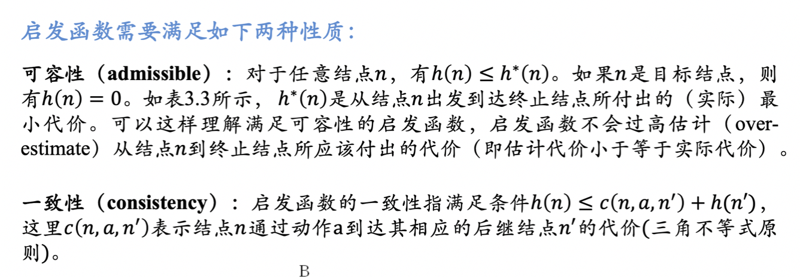

# AI人工智能笔记

## 逻辑推理

## 搜索算法

搜索是人工智能经常需要解决的问题，即在搜索空间中找到符合要求的结果。本节重点研究树形搜索空间或图形搜索空间，即可以搜索的状态之间有推进关系，可以用**树搜索/图搜索**表示搜索过程。图搜索相比于树搜索可能有回环。

一个优秀的搜索算法应该具有完备性(有解则必能找到)、最优性(找到的第一个解是最优解)、良好的时间和空间复杂度。

**树搜索**的框架如图，这是经典的**BFS**广度优先搜索。后续的算法都是在其上的优化，减少搜索开销。

### 启发式搜索

启发式(Heuristic)的含义是“利用事先得到的信息“。启发式搜索搜索问题中**使用启发信息来指导搜索方向**的方法。启发式信息是指那些从先前的经验或领域知识中获得的能够指示搜索方向的信息。启发式搜索可以用于寻找最优解或近似最优解的问题。

- **评价函数f(n)**

    这是启发式搜索的核心概念，n是节点，f(n)是对该节点的“评价值”，一般是“代价”含义，越小越好。每次搜索，都选择f(n)最好的相邻节点作为下一个步搜索的节点。如果f(n)是简单自然的评价函数，则通常称之为“贪婪算法”

- **A*算法**

    A*算法是启发式搜索的一种，所采取的f(n)形式是：

    

    所谓贪婪算法就是f(n) = h(n)的情况，这里加上了g(n)就变成了A*算法。可以解决某些贪婪算法不具有完备性的情况。

    **A*算法具有完备性、最优性也需要评价函数满足可容性、一致性**：

    

    其中h*(n)是实际最小代价，可以假设树空间已知、根据理论推理得到。c(n, a, n')是从节点n执行动作a到节点n‘的单步实际代价。

### 对抗搜索

对抗搜索又称博弈搜索，适合博弈问题。这种问题的特点是在一个竞争的环境中，智能体**(agents)**之间通过竞争实现相反的利益，一方最大化这个利益，另外一方最小化这个利益。

- 最大最小搜索Minmax Search

    

    注意这其实是一种DFS，对树的遍历顺序是**前序遍历**。最大最小搜索中，**MIN层取子节点最小值，同时被上一层MAX层筛选最大节点；MAX层取子节点最大值，同时被上一层MIN层筛选最小节点**。这是一种对树的全搜索、全遍历，不进行剪枝。

- Alpha-Beta剪枝搜索Pruning Search

    以下用A代替Alpha，B代替Beta。AB剪枝是对最大最小搜索的改进，进行剪枝，减少了不必要的搜索。

    

    其中b是每轮的选择树，m是树高。

    

### 蒙特卡洛树搜索

蒙特卡洛树适合那种搜索空间非常大、难以遍历求最优的情况，是一种基于数理统计的搜索算法。

主要有以下四个步骤：

## 统计机器学习

### 监督学习

### 无监督学习

## 深度学习

## 强化学习

