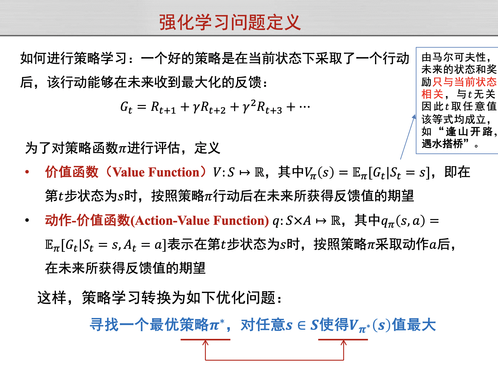

# AI人工智能笔记

## 逻辑推理

## 搜索算法

搜索是人工智能经常需要解决的问题，即在搜索空间中找到符合要求的结果。本节重点研究树形搜索空间或图形搜索空间，即可以搜索的状态之间有推进关系，可以用**树搜索/图搜索**表示搜索过程。图搜索相比于树搜索可能有回环。

一个优秀的搜索算法应该具有完备性(有解则必能找到)、最优性(找到的第一个解是最优解)、良好的时间和空间复杂度。

**树搜索**的框架如图，这是经典的**BFS**广度优先搜索。后续的算法都是在其上的优化，减少搜索开销。

- 启发式搜索

    启发式(Heuristic)的含义是“利用事先得到的信息“。启发式搜索搜索问题中**使用启发信息来指导搜索方向**的方法。启发式信息是指那些从先前的经验或领域知识中获得的能够指示搜索方向的信息。启发式搜索可以用于寻找最优解或近似最优解的问题。

    - **评价函数f(n)**

        这是启发式搜索的核心概念，n是节点，f(n)是对该节点的“评价值”，一般是“代价”含义，越小越好。每次搜索，都选择f(n)最好的相邻节点作为下一个步搜索的节点。如果f(n)是简单自然的评价函数，则通常称之为“贪婪算法”

    - **A*算法**

        A*算法是启发式搜索的一种，所采取的f(n)形式是：

        

        所谓贪婪算法就是f(n) = h(n)的情况，这里加上了g(n)就变成了A*算法。可以解决某些贪婪算法不具有完备性的情况。

        **A*算法具有完备性、最优性也需要评价函数满足可容性、一致性**：

        

        其中h*(n)是实际最小代价，可以假设树空间已知、根据理论推理得到。c(n, a, n')是从节点n执行动作a到节点n‘的单步实际代价。

- 对抗搜索

    对抗搜索又称博弈搜索，适合博弈问题。这种问题的特点是在一个竞争的环境中，智能体**(agents)**之间通过竞争实现相反的利益，一方最大化这个利益，另外一方最小化这个利益。

    - 最大最小搜索Minmax Search

        

        注意这其实是一种DFS，对树的遍历顺序是**前序遍历**。最大最小搜索中，**MIN层取子节点最小值，同时被上一层MAX层筛选最大节点；MAX层取子节点最大值，同时被上一层MIN层筛选最小节点**。这是一种对树的全搜索、全遍历，不进行剪枝。

    - Alpha-Beta剪枝搜索Pruning Search

        以下用A代替Alpha，B代替Beta。AB剪枝是对最大最小搜索的改进，进行剪枝，减少了不必要的搜索。

        

        其中b是每轮的选择树，m是树高。

        

- 蒙特卡洛树搜索

    蒙特卡洛树适合那种搜索空间非常大、难以遍历求最优的情况，是一种基于数理统计的搜索算法。

    主要有以下四个步骤：

    

    蒙特卡洛的重要思想是要给那些少被访问的节点一些“机会”

    定义UCB = 奖励总值/访问次数 + C*sqrt(2ln总次数 / 访问次数) 

    

## 统计机器学习

### 监督学习

监督学习是数据有标签的学习，常见的如回归、分类任务。

- 回归分析

    - 常见损失函数

        

    - 最小二乘法

    - 逻辑斯蒂回归

        

        
        
    - 解决过拟合的方法

        - 更多的数据
        - 正则(惩罚)项 regularization: penalty
        - 贝叶斯 bayesian: prior
        - 交叉验证 cross-validation

- 决策树

    - 信息熵

        

- 线性区别分析

- Ada Boosting

    **Ada Boosting**算法核心思想:将从这些标注数据出发，训练得到一系列 弱分类器，并将这些弱分类器线性组合得到一个强分类器。

    

    

### 无监督学习

监督学习是数据有标签的学习，常见的聚类、降维任务。

- K-Means聚类

    初始化质心 -> 计算距离、聚类 -> 根据聚类结果更新质心 -> 迭代直至满足条件

    

    评价指标：最小化每个类簇的方差

    

- 主成分分析PCA

    - 协方差与皮尔逊系数

        

    - PCA的目的（数据降维）

        

    - 映射矩阵求法

        

- 特征人脸方法

    

- 潜在语义分析

- 期望最大化算法

## 深度学习

- 前馈神经网络

    - 神经元

        

    - 激活函数

        作用：进行非线形变换，使得神经网络可以拟合非线形映射。

        常见的激活函数：

        

        softmax函数（适用于分类问题的激活函数）

        

    - 损失函数

        计算模型预测值与真实值之间误差，可以反馈给神经网络优化参数、减少误差。

        

        

        交叉熵损失函数多用于预测概率（包括判断性预测）。MSE和交叉熵损失都是越小说明预测得越好。

        

    - 梯度下降、BP算法

        

        利用偏导的传递公式可以求出导数。
        
    - 解决过拟合over-fitting的方法

        - Dropout

        - Batch-Normalization
        
        - L1范数，数学表示为‖W‖_1=∑2_(i=1)^N▒〖|w_i |〗，指模型参数**W**中各个元素的绝对值之和。
        
            也被称为“稀疏规则算子”（Lasso regularization）
        
        - L2范数，W中元素的均方

- 卷积神经网络

    

    - 卷积

        对于图像输入，设置若干卷积核（小矩阵），对图像进行扫描生成若干个特征图。卷积核起到提取图像特征的作用。

        卷积核中的参数也是学习的对象。

    - 池化

        为了减少全连接层参数数量，将图中每个小区域内方块的值合并为一个值，如取均值/最值等方式。

        

- 循环神经网络

    
    
- LSTM

    LSTM即长短时记忆网络，引入内部记忆单元和门，解决简单的RNN产生的梯度消失(vanishing gradient)的问题。

    有三种门：输入门input gate、输出门output gate、遗忘门forget gate

    

    

## 强化学习

- 强化学习基本概念

    智能体、环境、状态、动作、策略、奖励

    马尔可夫决策过程

    

    

- 基于价值的强化学习

    - Q-learning

        迭代公式

        

## 博弈

- 遗憾最小化算法

    

