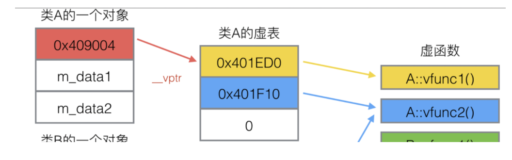
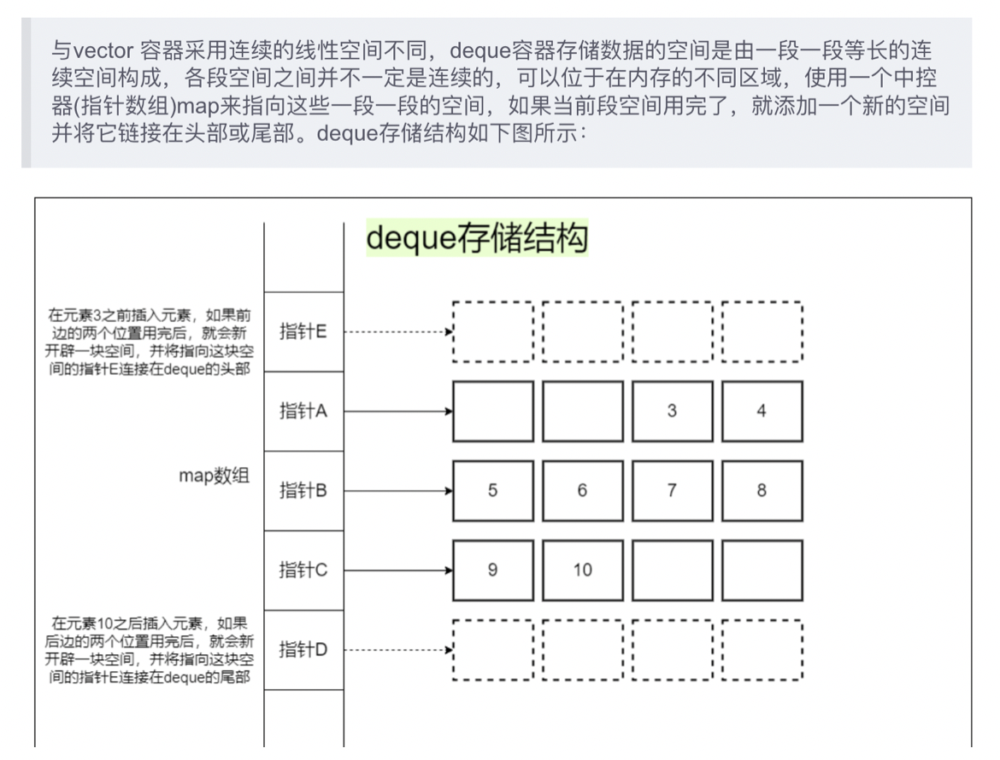
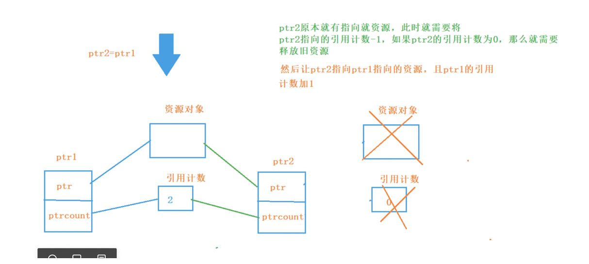
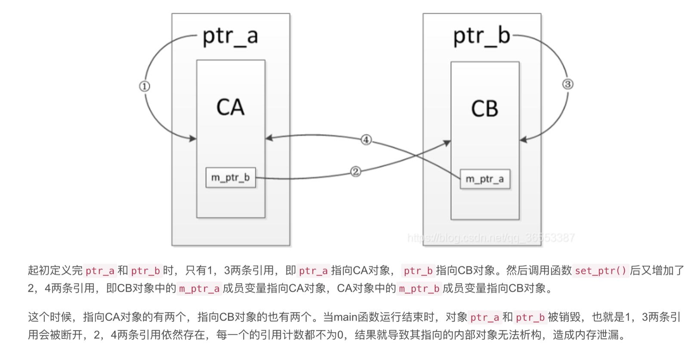
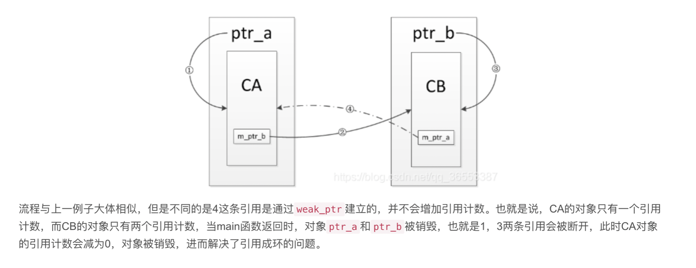

# C++

## C++机制

- **new和malloc有什么区别和联系？**

    new是C++操作符，而malloc是库函数。
    new一个类时，在调用的时候先分配内存，再调用构造函数，释放的时候调用析构函数；而malloc没有构造函数和析构函数，只是单纯开辟空间。
    malloc需要给定申请内存的大小，返回的指针需要强转；new会调用构造函数，不用指定内存的大小，根据对象类型自行计算，返回指针不用强转。
    new分配内存更直接和安全。malloc偏低层。
    new发生错误抛出bad_alloc异常，malloc返回null

    两者的联系：new的过程是先调用operator new函数，申请内存，然后进行构造函数、初始化等工作。

    其中operate new函数void *operator new(size_t);返回的void指针。这个函数是类的运算符函数，是可以被重载的。默认的operator new函数通过malloc实现内存分配。

    （delete和free的区别联系类似）

- **malloc和calloc有什么区别？**

    calloc的参数是数据个数和每个数据的大小，分配内存大小是两者的乘积。calloc一般适合分配数组类的对象，返回的也是数组指针。calloc会对分配的空间做0初始化（相当于先malloc在memset为0）

- **指针常量和常量指针的区别和使用场景？**

    - 常量指针(底层const)：形式为const*，表示无法通过该指针修改变量的值。

        常用于函数传参，表示不希望该函数通过这个指针修改对象，也就是这个对象对它而言是只读的。

    - 指针常量(顶层const)：形式为*const，表示指针本身是常量，也就是它所含的那个地址值不能改变，即指向的地址不变，该地址内容可变。

    赋值问题：指针常量本身不能被赋值（定义）。常量指针不能给非常量指针赋值：防止赋值的这个指针修改内容（否则与用常量指针传参的目的相违背）

- **指针和引用的区别和联系？**

    **引用背后本质上是一个匿名的、自动解引用的指针常量**。创建一个引用r本质上就是创建一个指向这个变量的指针常量，当后续用到r时，自动将其解引用处理，隐藏了地址信息。两者生成的汇编代码完全一样。从外在来看，引用就像变量的绑定别名。

    由于是指针常量，引用定义时必须初始化（否则无法后来让它指向某个值）。

    另外，引用也不能再指向引用，即没有多级引用，因为没有意义。

    引用上的运算符（比如自增运算符）是自动解引用后的运算，不是类似指针的运算。

    引用最常见的作用是函数传参：传递引用作为参数，与传递变量的指针常量的效果相同，但可以省去创造指针常量、在函数体内解引用等步骤。注意这种函数参数表要声明是引用传递，传过去的参数可以是变量本身，也可以是引用，如果是变量本身，在传参时会自动生成一个引用并在函数体使用。

- **static在各种情景下的含义？**

    static: 固定的存储空间

    - +（函数中）变量类型：这条变量初始化语句只在第一次调用时起作用，在全局静态区分配空间，作用域全局，默认初始化为0。
         初始化语句后续不再起被执行。
    - +（全局中）变量类型：即静态全局变量，只在本文件内可见。在主函数运行前就创建。
    - +（全局中）普通函数：静态全局函数，只在本文件内可见。在主函数运行前就创建。
    - +类的成员变量：即静态成员变量，所有类共享一份（可以通过实例或类名访问），每个实例不单独拥有该变量。生存周期与类的实例无关。在主函数运行前就创建。
    - +类的成员函数：即静态成员函数，所有类共享一份（可以通过实例或类名访问），无隐藏参数this指针，不能访问非静态的类成员（因为其存在与类实例无关）。在主函数运行前就创建。也没有意义被virtual修饰。

    访问问题：静态不能访问非静态（因为非静态对象可能不存在），静态可以访问非静态（非静态固定存在）。

- **const在各种情景下的含义？**

    const: 语法层面防止二次修改

    - +普通变量类型：必须初始化，初始化后其内容不能修改
    - +指针：*const（指针常量）：指针里面所存的地址不能变，即指向的变量不能变，变量本身的值可以变。（引用的本质）
            const*（常量指针）：无法通过指针解引用来修改指向的变量的值（指针值可以改、变量值可以通过其他方式改=）。（并不是const本义，特殊语法，但常用）
    - +引用：不可通过该引用修改变量的值。（但若原变量不是const，可以通过原变量直接修改）
    - +类的成员变量：该成员变量必须在初始化列表中赋值，不能二次修改（无论是外部函数还是类内成员函数）。
    - +在类的成员函数声明（尾部）：表明该成员函数不会修改成员变量（包括非const成员），本质是隐藏的this指针类型为const* 类，可用于重载
    - +类：常量对象，类的任何成员变量都不能被修改，只能调用由const修饰的成员函数。（因为不加const的成员函数都有修改成员变量的嫌疑）
    - +类指针（const *类）：无法通过该指针修改类的成员变量，也只能调用const成员函数
    - +函数参数：生成的形参是const类型（如果实参不是，会进行类型转化），通常是将指针/引用参数视为常量指针/引用，否则对于普通值传递的形参意义不大。
    - +普通函数（头部）：返回的是对应变量类型的const类型。

    赋值问题：<非><常量指针>不能指向const变量 （因为可能通过该指针修改const变量的值）。
    	 <非><常量指针>不能赋值给任何常量指针（否则相当于可以通过常量指针，利用类型转化的操作，访问其指向的值，违背了常量指针的初衷）。
    	 指针常量不能被二次赋值（定义）。

- **一些特殊关键字分别是什么含义？**

    - volatile：意味不稳定的，修饰变量，表示这个变量的值可能会被一些编译器所未知的原因修改，如操作系统、硬件、其他线程等。所以不做有风险的编译优化，每次都去内存取值。

    - mutable：修饰成员变量。const修饰的成员函数无法修改类内的成员变量，加了mutable则无此限制。常用于lamda表达式。

    - explicit：只用来修饰只有一个参数的类构造函数。表示该构造函数必须显示调用，防止隐式生成类对象。

        主要用来避免不希望发生的拷贝构造。

- **C++的类型转化运算符是怎么回事？**

    - 普通的(类型名)转化：只能高转低，如果需要强制转化，需要用到下面四个关键字。

    - 强制类型转化运算符：可以强制转化，属于c++关键字，用法是cast< B *>(exp) / cast< B& >(exp)，将exp的指针或引用转化为A类型。

        - static_cast：静态转化。编译时就能确定的转化。

        - dynamic_cast：将一个父类对象指针或者引用转换到子类指针或者引用, dynamic_cast用来检查两者是否有继承关系,因此实际上只接受基于类对象的指针或者引用的转换。这个操作有一定危险。
        - const_cast：用于去掉修改对象的const、volatile属性。最常见的是对常量指针或常量引用进行转化，生成一个非常量的指针或引用，可以修改对象内容。

        - reinterpret_cast：重新解释，最强、最不安全的强制转化，转化的类型之间可能毫不相关，用新的类型去解释内存内容。不检查类型集成关系，无法丢掉const。

- **内存泄漏是什么原因？怎样避免？**

    （在堆区）申请了一块内存，但是使用完后没有释放。如果内存泄漏本身是在循环体内产生的，那么可能随着时间推移产生越来越多的内存占用，最终使系统崩溃，危害很大。

    从产生原因出发，两种避免方式：

    1. 分配和回收必须精确匹配，new和delete精确匹配。
    2. 避免让一块内存不被任何指针指向，否则无法访问这块内存，自然也无法释放。比如可以使用智能指针。

- **什么是野指针，怎样避免？**

    **概念：**野指针就是指针指向的位置是不可知的（随机的、不正确的、没有明确限制的）;

    产生原因：释放内存后指针不及时置空（野指针），依然指向了该内存，那么可能出现非法访问的错误。或者一开始指针初始化的值就不对，指向了未知位置。

    避免办法：

    （1）初始化置NULL

    （2）申请内存后判空

    （3）指针释放后置NULL（重要）

    （4）使用智能指针

- **内联函数的概念，优点和缺点？**

    即inline修饰的函数，可以是全局函数也可以是成员函数。

    在编译阶段，编译器会将认为需要内联的函数在调用的地方直接等价展开，而不是通过函数调用、传参压栈出栈的方式执行。

    引入内联函数主要是解决一些频繁调用的小函数消耗大量空间的问题。

    通常情况下，在调用函数时，程序会将控制权从调用程序处转移到被调用函数处，在这个过程中，传递参数、寄存器操作、返回值等会消耗额外的时间和内存，如果调用的函数代码量很少，也许转移到调用函数的时间比函数执行的时间更长。而如果使用内联函数，内联函数会在调用处将代码展开，从而节省了调用函数的开销。

    注意较大较复杂比如包含循环语句的函数，不适合作为内联，因为会使代码段过长。另外递归调用（违背初衷）、访问静态变量的函数不能内联。最后，内联函数中不能有异常捕捉处理（会导致混乱）。

    需要说明的是，inline必须写在定义处，声明处写不写无所谓。另外，写了inline的函数未必真的就会内联，不写inline的函数也可能会被编译器自动内联，比如类的成员函数都默认加了inline。

- **定义常量时，define和const有什么区别？定义函数时，define和inline有什么区别？**

    首先define的替换是在预处理阶段完成了，进行的是简单的字符串替换，不涉及类型检查。

    定义常量时，const会给变量分配内存空间，类型安全。

    定义函数时，inline更类型安全、使用范围更广。

- **C++有几种作用域？静态局部变量，全局变量，局部变量分别在哪些作用域可见？**

    首先从作用域考虑：C++里作用域可分为6种：全局，局部，类，语句，命名空间和文件作用域。

    全局变量：全局作用域，可以通过extern作用于其他非定义的源文件。

    静态全局变量 ：全局作用域+文件作用域，所以无法在其他文件中使用。

    局部变量：局部作用域，比如函数的参数，函数内的局部变量等等。

    静态局部变量 ：局部作用域，只被初始化一次，直到程序结束。

    从所在空间考虑：除了局部变量在栈上外，其他都在静态存储区。因为静态变量都在静态存储区，所以下次调用函数的时候还是能取到原来的值。

    生命周期： 局部变量在栈上，出了作用域就回收内存；而全局变量、静态全局变量、静态局部变量都在静态存储区，直到程序结束才会回收内存。

- **形参和实参有什么区别？**

    - 实参：调用时实际传过去的参数，有具体数据和存储空间

    - 形参：函数声明/定义中出现的占位符，等待实参的传入。

        函数在接收到实参传递时，在函数栈上给每个形参分配空间、并被实参赋值，也就是说函数内形参是单独开辟的一个空间，里面存有实参的拷贝，而不是让函数操作实参本身。形参的修改对调用者对实参毫无影响。这是几乎所有语言的函数调用规则。

        在传参时可能会进行类型转化，即将实参转化为函数声明中形参的类型，转化不了将会报错。

- **C++的三种函数传值方式：值传递、指针传递、引用传递分别是什么含义？怎么用？**

    传值方式由函数声明中的参数列表决定。

    如果想传递类C的对象A进入函数f，假设A的地址是0x1234，A的内容是88。

    - 值传递

        参数是C Ac，将A直接传入f，会在函数内生成一个新的类C的对象Ac，调用C的拷贝构造函数，参数为A，生成Ac。如果没有合适的拷贝构造函数，编译将会报错。后面在函数中操作的都是这个Ac，A的值不受影响。

        这种方法通常不推荐，因为会浪费空间。

    - 指针传递

        参数是C* Ac，将A的指针传入f，此时函数栈生会生成一个类C的指针Ac，Ac的值跟传参的指针值相等，内容都是0x1234，后续可以用这个指针直接在函数内操作A。

    - 引用传递

        参数是C& Ac，将A或A的引用传入f，注意，传入的参数是引用，而引用的本质是匿名、自解引用的指针，此时函数栈上仍会生成一个指针Ap，内容是0x1234，并在外在表现为函数内有一个引用Ac可以用，Ac其实就是Ap，只不过自动解引用。因此指针传递和引用传递在这种情景下其实完全等价。许多语言，比如Java，隐藏指针概念，只提供这种传参方法。

    需要注意的是，这三种其实本质上还是值传递，都需要在函数栈上生成实参的拷贝，只不过拷贝的是对象本身/指针/引用罢了。一般来说对类使用引用传递更为简明、可读性好，但对于数组、内置数据类型、类型不明确的内存区域，则最好用指针传递。

    引用传递还有一个小问题，就是在把对象本身传给引用参数的函数时，代码读者看到这一行难以分辨这到底是值传递还是引用传递，也就不清楚这个函数会不会修改这个对象，必须再去看函数声明，容易引起误解。所以推荐引用传递时直接把引用作为实参。

- **什么是函数指针，怎么用？跟指针函数的区别？**

    - 函数指针：

        要想知道函数指针是什么意思，首先需要知道函数的内存存储结构是怎样的。函数本质上是代码段，放在进程块的代码区。每个函数在代码区都有一个入口地址。**函数指针所含的内容就是函数的入口地址**。也称指针指向这个函数。

        定义方式：ret (*p) （args...）;

        p是指向一个返回类型为ret、参数列表为args的函数。可以直接用函数名初始化/赋值。

        需要使用时，用*p即可代表函数本身，( *p)(参数表)与调用函数效果等同。

        函数指针可以提升程序的通用性，一个重要应用是**回调函数(callback)**，即把函数指针作为参数传给另一个函数f。回调函数并不是由实现方直接调用，而是在特定的事件或条件发生时由另外一方来调用的。适用于函数f需要他人视具体情况指定其内部该调用哪种函数的情况。

    - 指针函数

        这个概念相对简单，即返回值为指针类型的函数，比如malloc就是指针函数。

        需要注意，返回的指针不要是函数内部创建的局部变量的指针，否则函数返回后变量销毁，该指针成为野指针，十分危险。

        另外，也不推荐在函数内部new创建对象，并返回对象指针，因为这样可能难以保证new和delete配套，容易导致内存泄漏。

        

## OOP特性

- **解释一下多态和虚函数表？**

    虚函数是实现多态的技术。多态是OOP的重要特性之一，核心思想是**父类指针/引用指向子类对象**。

    多态是提高程序通用性、减少重复的重要方式，适合同样的行为，由不同对象去进行就会产生不同的操作，但又不想根据对象类型调用不同的函数。另外多态也是实现**接口**（interface）的重要方式：用户提出需求，就是函数调用需求，而接口制造者可以提供类来满足这些需求，同样的接口可以有不同的子类来实现implement，多态是提升程序隔离性的一个措施。

    函数重载其实也是一种多态，只不过称为静态多态。这里主要讨论的是动态多态，也称运行时多态，这种多态，一个对象调用虚函数时，编译时无法确定调用哪个函数，运行时才能确定，这种又称为动态绑定。

    动态绑定通过虚函数表的技术来实现。

    如果一个类含有virtual声明的虚函数，那么它的类内存结构的第一项是一个指针**vptr**，称为**虚表指针，指向的是虚函数表的首地址**。虚函数表是该类产生的一个配套数据结构，里面存有的是其虚函数的函数指针（可能采用的哈希表的结构）。

    

    

    根据对象调用虚函数的规则是：**根据vptr找到虚函数表，找到对应的虚函数指针，找到虚函数并执行。**

    **当子类继承父类时，会对vptr进行深拷贝，复制一份自己的虚函数表。这个子类的虚函数表里面的函数指针，如果子类没有重写该函数，那么保留不变；如果子类重写了该函数，那么虚函数表里的对应函数的指针替换为子类函数的指针。**

    如果一个父类指针p指向了子类对象，注意所谓“父类指针”，指的是对其指向的内存区域按父类的结构进行解释，父类指针本身不知道它指向的是子类对象，也不知道这块区域后面还可能有子类的独有成员。p在调用虚函数f时，遵循通用的函数调用规则，只不过它指向的vptr，是子类对象的vptr，自然也会访问子类的虚函数表、调用子类函数。

    可以看到，虚指针放在内存里的第一条，使调用成员函数的流程对父子类一致，是这个技术的重要思想。

    另外，有几点注意事项：

    - 至少包含一个虚函数的类一定有虚指针和虚表，无虚函数的不一定。
    - 虚函数表里只有虚函数，只有调用虚函数才会走vptr这套流程，否则正常在全局里找函数调用。
    - 如果父类有虚指针（有虚函数），那么子类必然也有虚指针，且继承的虚函数必然也是虚的（即使不声明为virtual，为了可读性建议声明）。子类虚函数还可以再被重写，如果不想让被重写，应该声明为final（c++11/java的用法）。
    - 构造函数不允许是虚函数，构造函数是虚函数没有意义（考虑父类指针指向子类对象的场景）。

- **虚析构函数有什么特殊性？**

    对于有虚函数的类（即可能被子类重写函数的、进行多态的类），一般认为需要将析构函数设为虚函数。否则如果析构函数不是虚函数，在父类指针指向子类对象时，析构父类指针，只会进行父类析构，释放父类资源，而不会析构子类、释放子类资源。除非类不涉及资源分配。但一般认为将可能被继承的类的析构函数设为虚函数是好习惯。

    注意构造函数和析构函数在多态上具有不对称性，根本原因在于“父类指针指向子类对象“这个多态的场景，构造是已经完成了的，而析构可能需要借助父类指针。

- **C++类的变量初始化/构造函数调用顺序是怎样的？**

    1. 基类的静态变量或全局变量；
    2. 派生类的静态变量或全局变量；
    3. 基类的成员变量（调用基类成员的构造函数）
    4. 基类的构造函数
    5. 派生类的成员变量（调用派生类成员的构造函数）
    6. 派生类自己的构造函数

    类内同一类型变量的初始化顺序由构造函数/初始化列表声明决定。

    如果变量是对象，析构顺序与构造顺序相反。

- **函数重载、重写(覆盖)、隐藏的区别？**

    共同点：都是同一作用域下的同名函数。

    - 重载overload：同名的函数具有不同的参数列表(参数的个数/类型/顺序不同)，从而可以在调用处根据参数列表区分出该调用哪个函数。返回类型不能作为重载的依据。

        注意，同一类内的两个成员函数，如果一个后面有const而另一个没有，则可以作为重载依据，因为他们的隐藏参数this指针一个是const而另一个不是。

    - 重写/覆盖override：子类重新定义父类的函数，重载函数要求函数名、返回类型、参数表都与父类函数一致。父类的函数必须声明为virtual。这是oop中多态的重要一环，用于“父类指针指向子类对象”时实现多态。

    - 隐藏hide：子类函数与父类函数名相同就成为隐藏，这种情况下，子类正常应该继承父类的那个函数被隐藏掉，无法通过子类去调用该函数。重写可以看作隐藏的一种，但大部分情况下如果单说隐藏，指的是同名但不重写的这种情况。

        注意这种情况下，**子类自己定义的函数不能跟继承的父类的同名函数通过不同的参数表重载。**父类函数被完全隐藏。

        一般来讲，要尽量避免这种情况（逻辑混乱），用虚函数重载相比于这种，几乎只有好处没有坏处。

    举例：A为父类，B为子类

    重载：A{ int f(int a); int f(int a, int b); }

    重写：A{ virtual int f(int a); }	B{ int f(int a); }

    隐藏：A{ int f(int a); }	B{ int f(int a); }

    ​			以下几种情况用A的参数表/返回类型调用f会报错，同理用父类指针指向子类对象时，也不能调用子类的函数。

    ​			A{ int f{int a}; }	B{ int f{}; }

    ​			A{ int f(int a); }	B{ void f{int a}; }

- **深浅拷贝是什么意思？**

    这里的拷贝指的是类的拷贝构造函数中的拷贝。我们知道类在内存中的结构是各个成员变量对齐后的内存排列。如果有成员变量是指针类型（或者引用，本质上是指针），那么它在类对象的内存块只占一个指针大小，它指向的对象可能很大，但是在另一个地方，不在类对象的内存块中。

    - 浅拷贝：对成员变量逐个相等赋值，包括指针（引用同理），这样如果一个成员变量是指针，那么拷贝后的新对象的指针也指向相同的对象，两者通过指针对该对象的操作是同步的。如果类模式是指针指向一个堆区对象，该堆区对象在析构时会delete，那么会导致重复delete的问题。此外，很多时候拷贝构造不希望两者共享一个对象。

    - 深拷贝：对于指向堆区的指针，在拷贝构造时并不是指针赋值，而是给新对象的指针新开辟一块区域，将被拷贝对象指针指向的区域内容复制到这块区域内（两块区域大小也相同）。这样拷贝出的对象完全独立。

    一般来说深拷贝更安全、更符合逻辑，较多使用。但深拷贝空间开销较大，特殊情况时，比如指针指向的对象是只读的，或者就希望两者共享对象，此时可以浅拷贝。

- **C++三种权限public、protect、private在各种情景下的含义？**

    - 类内部修饰成员变量/函数（前置冒号形式）：

        public：公有成员。该成员不仅可以在类内可以被访问，在类外也是可以被访问的，是类对外提供的可访问接口；
        private：私有成员。该成员仅在类内可以被访问，在类体外是隐藏状态，无法访问；子类会继承这些属性，但是无法访问。
        protected：保护成员。保护成员在类体外同样是隐藏状态，但是对于该类的派生类来说，相当于公有成员，在派生类中可以被访问。

        用法：public多修饰对外的函数接口或者一些公用常量。private修饰多数成员变量、一些仅供函数内部使用的功能性辅助函数，且对子类无用。protected修饰只对父类可见的属性。

    - 修饰继承处的父类，规定继承方式：

        public：基类成员在派生类中的访问权限保持不变，也就是说，基类中的成员访问权限，在派生类中仍然保持原来的访问权限；
        private：基类所有成员在派生类中的访问权限都会变为私有(private)权限；
        protected：基类的公有成员和保护成员在派生类中的访问权限都会变为保护(protected)权限，私有成员在派生类中的访问权限仍然是私有(private)权限。

        一般来讲都是public继承，如果子类希望把某些属性访问权限降低，可以使用private和protected。

- **什么时候必须使用成员列表初始化类对象？**

    当初始化一个引用成员时；
    当初始化一个const成员时（包括常量指针、指针常量，常量指针初始化跟引用初始化等价）；
    没有默认构造函数的类类型：因为使用初始化列表可以不用调用默认构造函数来初始化，而是直接调用拷贝构造函数进行初始化。
    如果类存在继承关系，**派生类必须在其初始化列表中调用基类的构造函数。**（可能是隐式的）
    初始化列表中的项目顺序是由类中的成员**声明顺序**决定的，不是初始化列表中的排列顺序决定的。

- **什么情况下会给类生成默认构造函数/拷贝构造函数？**

    惟有默认构造函数”被需要“的时候编译器才会合成默认构造函数。

    - 如果一个类没有任何构造函数，但他含有一个成员对象，该成员对象含有默认构造函数，那么编译器就为该类合成一个默认构造函数，因为不合成一个默认构造函数那么该成员对象的构造函数不能调用；
    - 没有任何构造函数的类派生自一个带有默认构造函数的基类，那么需要为该派生类合成一个构造函数，只有这样基类的构造函数才能被调用；
    - 含有虚表指针的类，即带有虚函数的类或虚继承了的子类：虚函数的引入需要进入虚表，指向虚表的指针，该指针是在构造函数中初始化的，所以没有构造函数的话该指针无法被初始化；

    ​    合成的默认构造函数中，只有基类子对象和成员类对象会被初始化。所有其他的非静态数据成员都不会被初始化。成员类对象按照它们的默认构造函数迭代进行构造，如果迭代过程中发现有一个类不存在默认（无参）构造函数，则会编译报错。
    ​    什么情况下不会默认生成构造函数：编程者自己至少写了一个构造函数的类。注意即使编程者没有写无参构造函数，也不会自动生成默认构造函数（此时编译器认为编程者不允许无参构造，提示不存在默认构造函数）。如果子类继承的父类是已经被写了构造函数的类，子类也不会自动生成构造函数（提升是无参构造函数是已删除的函数）。

    ​    注意，默认拷贝构造函数和默认构造函数的自动生成条件完全相同。

- **什么情况下会调用拷贝构造函数？**

    类的对象需要拷⻉时，拷⻉构造函数将会被调⽤，以下的情况都会调⽤拷⻉构造函数：

    - ⼀个对象以值传递的⽅式传⼊函数体，需要拷⻉构造函数创建⼀个临时对象压⼊到栈空间中。

    - ⼀个对象以值传递的⽅式从函数返回，需要执⾏拷⻉构造函数创建⼀个临时对象作为返回值。

    - ⼀个对象需要通过另外⼀个对象进⾏**初始化**。类里面的类成员可能会迭代初始化。

        注意拷贝构造函数的结构是**A(const A& a)**，这里传参的时候是传的是引用，不能传值，否则将自陷逻辑循环：传值的时候需要一个还没建立起来的构造函数。

    注意：类对象赋值时，默认（不重载=）是成员变量一一赋值，而不是拷贝构造。

- **哪些函数不能是虚函数？**

    - 构造函数：虚构造函数没有意义，且构造函数需要初始化vptr。
    - 内联函数，内联函数表示在编译阶段进行函数体的替换操作，而虚函数意味着在运行期间进行类型确定，所以内联函数不能是虚函数；
    - 静态函数，静态函数不属于对象属于类，静态成员函数没有this指针，因此静态函数设置为虚函数没有任何意义。
    - 友元函数，友元函数不属于类的成员函数，不能被继承。对于没有继承特性的函数没有虚函数的说法和意义。友元函数在它所属类内可以是虚函数。
    - 普通函数，即非成员函数，没有虚函数的概念。

    前三个记住即可，后面两个显然。

- **析构函数什么时候会被调用？**

    生命周期：对象生命周期结束，会调用析构函数（比如函数的局部变量在退出函数时，堆区程序在程序结束时）。

    delete：调用delete时，会删除指针类对象。

    包含关系：类A包含类B的对象作为成员，A析构时B也析构。（析构先B后A，析构的是两个”嵌套“的类对象）

    <千万注意：如果是B类包含了A类的指针作为成员对象，B析构时，A指针指向的对象不会析构！>

    继承关系：类B继承类A，类B对象析构时，调用A的析构函数析构A的部分（析构先B后A，本质上是析构一个类对象）
    
    

## STL

- **STL大全？**

    顺序容器：

    vector 底层数据结构为数组 ，支持快速随机访问
    list 底层数据结构为双向链表，支持快速增删
    deque 底层数据结构为一个中央控制器和多个缓冲区
    stack 底层一般用list或deque实现，封闭头部即可，不用vector的原因应该是容量大小有限制，扩容耗时
    queue 底层一般用list或deque实现，默认情况下，如果没有为queue实例化指定容器类，则使用标准容器deque。
    priority_queue 的底层数据结构一般为vector为底层容器，堆heap为处理规则来管理底层容器实现

    关联容器：

    set 底层数据结构为红黑树，有序，不重复
    multiset 底层数据结构为红黑树，有序，可重复
    map 底层数据结构为红黑树，有序，不重复
    multimap 底层数据结构为红黑树，有序，可重复

    unordered_set 底层数据结构为hash表，无序，不可重复

    unordered_multiset 底层数据结构为hash表，无序，可重复

    unordered_map  底层数据结构为hash表，无序，不可重复

    unordered_multimap  底层数据结构为hash表，无序，可重复

- 关联容器的有序意味着什么？

    - key必须是可比较的对象。
    - “顺序”指的是key从小到大的顺序

    - 迭代器按顺序访问

- **map、set怎么实现的，有什么区别？**

    map和set都是**关联容器**，根据是否允许重复、底层用红黑树还是哈希表（是否无序）、是map还是set可以分为8种。

    - 是否重复：好理解。对于不可重复的容器，重复插入只保留新元素，旧元素被删掉。

        对于multimap，不提供at方法，也没有重载[]运算符（即无法直接通过key得到value），multimap的find函数返回的是第一个满足条件的键值对的迭代器，可以用count函数得到某个key对应的键值对数目，如果是有序的，那么相同key的键值对是排在一起的，可以用find返回的迭代器往后移动count-1次得到key对应的所有的value。（从这里可以看出，unordered_multimap其实应用很有限）

    - 红黑树/哈希表：底层实现方法。采用哈希表的STL前面有unordered_前缀，容器内元素无序。

        红黑树实现的优点：有序，空间开销小。

        红黑树缺点：查找没有那么快，稳定O(logn)。key必须可比较

        哈希表实现的优点：查找极快，如果是无重复，则接近O(1)。

        哈希表缺点：无序，空间开销大，扩容时若rehash则较为耗时。

        没有顺序要求、且不太可能冲突时，建议使用unordered的容器。

    - map/set：map存的是key-value，set只存key。

        两者的主要用途都是快速查找，set只会告诉你找没找到，而map还可以告诉你跟它绑定的那个value是什么。map功能更强。

    - 共同点：适合查找。

    - STL红黑树实现细节：采用改进的红黑树。

    - STL哈希表实现细节：使用开链法解决哈希冲突，用hash bucket实现。扩容机制与vector类似。

- **map[]和find函数查找的区别？**

    1. map的下标运算符`[]`（重载的[]operator函数）的作用是：将`key`作为下标去执行查找，并返回对应的值；**如果不存在这个`key`，就将一个具有该key和值类型的默认值的项插入map中。**（有风险）
    2. map的find函数：用`key`执行查找，找到了返回该位置的迭代器；如果不存在这个`key`，就返回尾迭代器。

- **vector底层是怎么实现的，怎么扩容？**

    - 数据结构

        vector首先是线性存储的，占用的连续的空间（即底层是数组）。内部维护了三个迭代器（指着吧），分别是start、finish、end_of_storage，分别指向头部、数据段尾部、存储空间尾部，start<=finish<=end_of_storage。

        vector创建时会预先分配一些空间，增删改类似于数组操作，操作时改变statr、finish指针位置。

        插入即是尾加，注意删除元素并不会整体移动被删元素后的元素来避免中间有无效空间。

    - 扩容机制

        vector跟普通数组最关键的区别就是可以更智能地扩容。当插入元素导致元素所占空间和总空间相等时，即finish和end指针重合时，需要重新分配空间以便能存更多元素。新分配的空间总大小/原空间大小称为**扩容因子**。不同编译器下扩容因子不同，vs是1.5，g++是2。一般认为1.5的增长方式更有利于内存重复利用。

        注意，扩容并不是在原有空间后继续开辟新空间，而是**另找一块足够大的空间（能满足扩容要求），将原有数据拷贝过来**，并释放原有空间。所以这种情况下三个指针值都变了。可以看到扩容的代价是比较大的。

        扩容因子如果太大，容易造成空间浪费；如果太小，则容易导致频繁扩容、拷贝内存，影响性能。最好的方式是用户根据程序逻辑自行决定扩容时机，即使用resize/reserve预先分配空间（resize相比于reserve还有缩小空间的用途）。

    - 优点缺点：

        - 优点：尾加快、支持随机访问，遍历快。

        - 缺点：vector在删除时留下空位，有空间浪费。因此不适合频繁在上面增加、删除的情况。另外，vector的查找是线性时间的，不适合查找需求。

- **deque怎么实现的？**

    deque，即双端队列，是另一大顺序容器，stack、queue都可以基于deque实现。

    

    中控器，即指针数组的存在，可以使得扩容时直接增加一个指针、指向新开辟的区域即可。代价了是多了一些指针操作，访问略慢（但也没慢多少）。相比于链表，随机访问速度明显快（无需线性访问，可以直接计算定位）。

    - 优缺点（主要对比于vector）
        - 优点：**适合大部分插入都发生在头部或尾部的情况**。扩容更快（不需要复制）
        - 缺点：随机访问较慢，迭代器当作稍慢。不支持手动扩容。

- **迭代器有什么用？为什么有了指针还需要迭代器？**

    Iterator（迭代器）模式又称游标（Cursor）模式，用于提供一种方法**顺序访问一个聚合对象中各个元素**, 而又不需暴露该对象的内部表示。
    或者这样说可能更容易理解：Iterator模式是运用于聚合对象的一种模式，通过运用该模式，使得我们可以在不知道对象内部表示的情况下，按照一定顺序（由iterator提供的方法）访问聚合对象中的各个元素。
    由于Iterator模式的以上特性：与聚合对象耦合，在一定程度上限制了它的广泛运用，一般仅用于底层聚合支持类，如STL的list、vector、stack等容器类及ostream_iterator等扩展iterator。
    迭代器和指针的区别：
    迭代器不是指针，是类模板，表现的像指针。他只是模拟了指针的一些功能，通过重载了指针的一些操作符，->、、++、–等。迭代器**封装了的指针**，是一个“可遍历STL（ Standard Template Library）容器内全部或部分元素”的对象, 本质是封装了原生指针，是指针概念的一种提升，提供了比指针更高级的行为，相当于智能指针，他可以根据不同类型的数据结构来实现不同的++，–等操作。
    **迭代器返回的是对象引用而不是对象的值**，所以cout只能输出迭代器使用取值后的值而不能直接输出其自身。

    迭代器体现了oop的封装特性。

- STL容器的元素是独立的吗？容器赋值/初始化是什么含义？

    实现需要明确，容器内部并不是维护了一系列元素的指针，指向插入时的传参的那个对象。而是容器维护了自己的一块空间，空间中包含插入对象的信息，容器自身可以对外提供接口访问元素。这就意味着

    - 容器中的元素是独立的，比如vector.push_bash(a)，vector中的a和传进去的a是独立不相关的，插入时发生拷贝。
    
    - 容器赋值/初始化是深拷贝，两个容器不可能共享自己的内存空间。
    
        

## C++11特性

### 智能指针

- **智能指针有几种？干什么用的？底层怎么实现？**

    - 为什么需要智能指针：普通的指针在new、delete分配、释放空间时，特别是在逻辑复杂大型项目里，很难做到百分百保证匹配，很容易导致内存泄漏。另外，普通的指针也可能导致重复释放等问题。让程序员去控制这种内存分配的底层业务也是不太合理的。智能指针可以帮助实现资源的自动释放，是一种 RAII (Resource Acquisition Is Initialization) 的技术

        c++关键字实现：

        创建模式为ptr<类型>  p(new 类型())，p就是智能指针，且p是一个类。另外智能指针可以用普通指针直接赋值。

        智能指针本质上是一个模版类，有一个成员变量T*，也就是真正的数据指针。类重载了 *、->等运算符，使得可以像普通指针一样操作，但是不需要手动对指针delete，智能指针可以自动控制。

        最简单的情况是析构函数里delete掉指针，但是如果有两个智能指针同时指向同一数据，即其成员变量是同一指针，那么会出现重复析构的问题。导致多个智能指针指向同一数据，有三种情况：智能指针拷贝构造、智能指针相互赋值、不同智能指针被同一个普通指针赋值/初始化（实际中，尽量避免用普通指针初始化、赋值智能指针）。

        对此有多种解决办法。

    - auto_ptr(已被c++11抛弃)：采用管理权转移的思想：当auto_ptr A赋值或者初始化auto_ptr B时，**A的内部指针会被自动转化为nullptr**，即废弃A。这种方法风险高，并且可能出现没有被指针指向的内存空间，已被抛弃。

    - unique_ptr：独占式、严格拥有，同一时间只能有最多一个智能指针指向该对象。方法是**将智能指针的赋值重载函数和拷贝构造函数直接禁用掉**，不可能出现两个智能指针指向同一对象的情况。

        这种方法有两个缺陷：一是指针不能赋值、构造，导致灵活性非常差，适用于指针使用相对静态的情况。二是如果用相同的普通指针对unique_ptr进行赋值/初始化，仍可能出现两个unique_ptr指向同一个对象的情况，所以还要手动避免这样的操作。

    - shared_ptr：共享拥有，多个shared_ptr可以指向同一个对象，对象和相关资源在最后一个指向它的shared_ptr被销毁时释放。内部采用**引用计数**机制实现，是比较复杂的一种。

        shared_ptr允许多个智能指针指向同一对象，但它的析构并不一定会delete内部指针，而是将引用计数减一，只当引用计数降为0时才真正delete。引用计数是一个堆上的数据，由shared_ptr里的成员变量_ptrcount指向，跟数据对象绑定。修改引用计数内部加锁，实现线程安全。

        - shared_ptr拷贝构造：直接浅拷贝，引用计数+1

        - shared_ptr重载赋值：p2 = p1；分为两种情况

            

            - 情况1：p1和p2指向的是相同的数据（即内部指针相同，甚至干脆是自赋值），此时不需要任何操作，注意此时不需要更改引用计数，因为p1和p2本来就指向的是相同数据！
            - **情况2**：p1和p2所指的数据不同，此时需要依次进行以下操作
                1. p2所指向的数据引用计数-1，如果引用计数变为了0，则delete掉p2所指的数据。
                2. 让p2的内部指针指向p1所指的对象，_ptrcount指针也指到p1所指的引用计数。
                3. p1、p2所指的引用计数+1

        - shared_ptr析构：将所指的引用计数减1，如果引用计数变为了0，则delete掉所指的数据。

        ```c++
        //shared_ptr代码(简化版)	
        template <class T>
        class my_shared_ptr{
        public:
        	my_shared_ptr(T* _ptr): ptr(_ptr){
            ptrcount = new int(1);
            mt = new mutex;
          }
        
          my_shared_ptr(my_shared_ptr<T>& sp): ptr(sp.ptr), ptrcount(sp.ptrcount), mt(sp.mt){
            addCount();
          }
        
          ~my_shared_ptr(){
            Release();
          }
        
          my_shared_ptr<T>& operator=(const my_shared_ptr<T>& sp){
            if(ptr!=sp.ptr){
              Release();
              ptr = sp.ptr;
              ptrcount = sp.ptrcount;
              mt = sp.mt;
              addCount();
            }
            return *this;
          }
        
          int use_count(){
            return *ptrcount;
          }
        
          T& operator*(){
            return *ptr;
          }
        
          T* operator->(){
            return ptr;
          }
        
        private:
          void addCount(){
            mt->lock();
            ++(*ptrcount);
            mt->unlock();
          }
        
          void Release(){
            mt->lock();
            --(*ptrcount);
            bool delete_flag = false;
            if((*ptrcount)==0){
              delete_flag = true;
              delete ptrcount;
              delete ptr;
              ptrcount = nullptr;
              ptr = nullptr;
            }
            mt->unlock();
            if(delete_flag){
              delete mt;
              mt = nullptr;
            }
          }
        
        private:
            T* ptr;
            int* ptrcount;
            mutex* mt;
        };
        ```

        

        注意shared_ptr同样不应该由普通指针进行初始化/赋值，否则一样可能导致问题。

        - shared_ptr**循环引用**问题：

            类之间可能存在循环引用的情况，即互相拥有对方的指针，这种情况可能发生在不同类之间（不推荐这种写法），也可能发生在同一个类之间（最典型的就是双向链表的节点类）。

            

            循环引用导致的问题是：**可能导致对象存在内部相互指向、外部无人指向的“孤立”情况**，导致无法释放空间。

    - weak_ptr：weak_ptr 是一种不控制对象生命周期的智能指针, 它指向一个shared_ptr管理的对象. 进行该对象的内存管理的是那个强引用的 shared_ptr. weak_ptr只是提供了对管理对象的一个访问手段。
        weak_ptr设计的目的是为配合 shared_ptr而引入的一种智能指针来协助 shared_ptr 工作, 它只可以从一个 shared_ptr或另一个 weak_ptr对象构造, 它的构造和析构不会引起引用记数的增加或减少。weak_ptr是用来解决shared_ptr相互引用时的死锁问题,如果说两个shared_ptr相互引用,那么这两个指针的引用计数永远不可能下降为0,资源永远不会释放。它是对对象的一种弱引用，不会增加对象的引用计数，和shared_ptr之间可以相互转化，shared_ptr可以直接赋值给它，它可以通过调用lock函数来获得shared_ptr。

        

### 右值引用

- **什么是右值引用？跟左值引用的区别？跟移动语义、完美转发有什么关系，有什么作用？**

    - 左值和右值：

        - 左值：有内存地址和空间的一个数据对象。可以获取地址，可以赋值。比如所有变量、指针/引用。
        - 右值：一个表示数值的表达式，没有实际的内存空间，相当于中间结果。比如字面常量、运算表达式（的返回值）、函数的返回值(非左值返回类型)，右值不能出现在赋值=的左边。注意，右值也有类型（变量类型的类型），但不能看作变量。

    - 右值引用：

        右值引用就是给右值起别名，用法：右值类型 && 引用名 = 右值;。如int&& p = 10;

        由于右值并不存在内存地址，右值引用的底层原理并不像左值引用一样是匿名的指针，它能起到保存中间值的效果，所以底层可能是专门有维护保存了的右值的区域（比如寄存器组或特殊的内存区域），右值引用指向这个区域的对象。

    - **移动语义**

        之前说过，很多类对象的拷贝构造函数设为深拷贝，这是一种大多数情况下比较合理的做法，因为让两个对象共享一块存储区域是不太合理的。也就是说深拷贝是为了防止复制对象之间产生关联。

        - std::move函数

            ```c++
            move(_Tp&& __t) _NOEXCEPT {
              typedef _LIBCPP_NODEBUG_TYPE typename remove_reference<_Tp>::type _Up;
              return static_cast<_Up&&>(__t);
            }
            ```

            这是c++11的utility库中的函数，作用是将左值引用转化为右值引用。注意move函数本身不进行任何移动、变更内存空间的操作。move转化出的右值，是来源于左值的右值，这点跟普通右值有区别。从外在表现看，move转化出的右值引用跟左值引用、乃至左值的外在体现上没有区别，但是类型是特殊的“右值引用”，意味着可以用于函数重载。**给函数重载（特别是移动拷贝函数和移动赋值函数）提供类型参数，是move的重要作用**。

        - 移动拷贝构造函数、移动赋值函数

            对于拷贝构造函数、赋值函数，一般做法是进行深拷贝，这可能涉及到大量的数据复制。注意如果给他拷贝/赋值的原对象在完成后就不会再用，那么其实完全可以将原对象“移动”到被赋值对象上。

            以移动拷贝构造为例，一般类似是：

            ```c++
            A(A&& a){
              //将a的数据移动过来
              this.ptr = a.ptr;//...
              //释放a
              a.ptr = nullptr;
            }
            ```

            c++11中，STL的容器基本都默认提供了移动拷贝/赋值函数。

            ``` c++
            a = new A();//a实现了移动拷贝构造
            A b(std::move(a)); //move将a转化为右值，用于重载，使得可以调用A的移动拷贝构造函数
            //无法正常访问a，但是可以访问b
            ```

            就是一个移动构造的例子。注意声明移动构造/赋值函数时，需要加上nonexcept关键字，表示这是一个不会抛出异常的操作，如果不加，系统可能会去选择执行普通的拷贝构造函数。

            然而这种基本不会用到，也不是实际的用处，因为直接一直用a就好了，完全没必要生成b。实际上，移动语义在以下情形中起作用。

        - 函数的传参

            有时，给函数传的那个参数，希望它是调用处的一个临时值，不希望它在调用函数中长期有效。

            比如，myVec< A >的添加操作，假如有如下需求

            ```c++
            myVec<A> v;
            for(int i = 0; i < 10; ++i){
            	A* temp = new A(i);
            	v.push_back(*temp);
            }
            ```

            这种情况，myVec的push_back可以有2种写法，各有缺点

            ```c++
            void push_back(A a);//需要复制*temp到函数内的a
            void push_back(A& a);//myVec中的数据和外部的temp一致，且难以控制空间释放。
            ```

            此时最好的办法是：

            ```c++
            void push_back(A a);
            int main(){
              myVec<A> v;
              for(int i = 0; i < 10; ++i){
                A* temp = new A(i);
                v.push_back(std::move(*temp)); //移动拷贝构造temp给a
                //temp已经无法访问
              }
            }
            ```

            这种写法保证了灵活性：如果想要temp在后面依然可以访问，不用move就行了，void push_back(A& a)形式只能绑定数据，不能后面拥有独立的temp。相当于通过写不写move可以达到A a的传参或A& a的传参目的。

            注意：A的右值引用可以传值给A、A&&的参数，但是不能传给A&的参数。

            传给A时，调用移动拷贝构造函数，最为常用。

            传给A&&时，是右值引用的值传递。

        - 函数的传返回值

            当函数需要返回一个A的对象时，需要将函数内生成的返回结果拷贝赋值/构造给接收处的值。可以发现函数内这个对象马上就要失效，这次拷贝是没有必要的。

            比如：

            ```c++
            //原始
            A getA(int i){
              A* a = new A(i);
            	return *a;
            }
            int main(){
            	A a(getA(1));//如果编译器不优化，getA生成的对象将拷贝给a
            }
            ```

            **可以通过移动语义避免这次拷贝**

            ```c++
            //正确！推荐这种方法
            A getA(int i){
              A* a = new A(i);
            	return *a;
            }
            int main(){
            	A a(std::move(getA(1)));//避免了a生成时的拷贝构造，直接用返回值移动构造
            }
            ```

            注意，不能采用这种方法

            ```c++
            //错误！
            A&& getA(int i){
            	return std::move(A(i)); //A(i)生成函数栈上的临时对象，会被销毁，返回的右值引用未定义
            }
            int main(){
            	A a(getA(1));
            }
            ```

            除非是（不推荐）

            ```c++
            //正确但不推荐
            A&& getA(int i){
              A* a = new A(i);
            	return std::move(*a); 
            }
            int main(){
            	A a(getA(1));
            }
            ```

            不推荐的原因：除了只能返回堆上对象外，灵活性也稍差。

            灵活性：用A直接作为返回值，如果接收处不用move，那么可以让这个对象依然可用。这里跟传参是类似的。

            A a(std::move(getA(1)));这种写法其实非常常见，相当于对函数的结果做了一次重命名而不需要复制，比如在队列等容器等使用中，如果需要取出一个容器等元素然后马上把它从容器中删掉，相当于将容器的元素“移动”到外部的变量中，那么就非常适合移动语义。

        总结一下：右值引用出来以后，并不是直接使用右值引用**去减少拷贝，提高效率**。而是**支持深拷贝的类**，**提供移动构造和移动赋值**，这时这些类的对象进行**传值返回**或者是**参数为右值**时，则可以用移动构造和移动赋值，**转移资源**，**避免深拷贝**，**提高效率**。

        

    - **完美转发**（perfect forwarding）

        这是右值引用除了移动语义外的另一大重要作用，使得函数模板能够将参数原封不动地转发到其它函数中。完美转发主要用于解决**模板中的参数类型保持一致**的问题，它可以让我们在不知道函数调用时参数的具体类型的情况下，仍能够正确地将参数传递给被调用函数。

        我们知道，右值可以作为函数重载的依据，具体表现为：

        | 接收参数类型(形参) / 传参类型(实参) | A / A&，传左值(引用)             | A&&，传右值引用，即传move(A)                                 |
        | ----------------------------------- | -------------------------------- | ------------------------------------------------------------ |
        | f(A)，接收值传递                    | 可以(值传递，拷贝构造)           | 可以(值传递，**移动构造**，调用处对象失效)                   |
        | f(A&)，接收左值引用                 | 可以(左值引用传递，函数内可改值) | 不可以                                                       |
        | f(A&&)，接收右值引用                | 不可以(f是函数模板除外!)         | 可以(右值引用传递，跟把A/A&传给f(A&)的效果是类似的，调用处对象不失效。不常用) |

        - A / A&作为传递参数时，不能以接收参数是A还是A&为依据进行重载

            （不存在将A默认匹配到f(A)，或者默认将A&默认匹配到f(A&)的说法，A和A&作为实参本质上一样）

        - A&&作为传递参数时，不能以接收参数是A还是A&&为依据进行重载

            （不存在将A&&默认匹配到f(A&&)而非f(A)的说法）

        - 对于某种实参，如果一类形参可以接受，另一类形参不能接受，那么显然可以把形参类型作为重载的依据

        为了实现完美转发，规定了两条规则：

        1. **如果函数模板的参数是T&&，那么它既可以接受左值，又可以接受右值（普通函数只能接受右值）**
        2. std::forward< T >(参数)用于 转发参数，如果传进来的参数是左值，则当作左值看待，如果是右值，当作右值看待（相当于move）。

        

        在 C++ 中，只有模板函数的右值引用参数可以绑定到左值引用、右值引用和纯右值（临时对象）。这是因为当调用一个模板函数时，编译器会在实例化时根据函数的参数类型推导出实参的类型，并将实参隐式转换为与形参类型匹配的类型。因此，当模板函数接受右值引用参数时，编译器会将左值引用隐式转换为右值引用，使得可以接受左值实参。

        而普通函数则不具备这种能力，因为在调用普通函数时，实参的类型已经确定，而不是在实例化时根据函数参数类型进行推导。因此，普通函数不能将左值引用隐式转换为右值引用，也就不能接受左值实参。

        ```c++
        //forward源码
        forward(typename remove_reference<_Tp>::type& __t) _NOEXCEPT {
          return static_cast<_Tp&&>(__t);
        }
        ```

        一个完美转发的经典例子是：

        使用完美转发之前的代码

        ```c++
        void func(int& i){
          cout<<"left ref "<<i<<endl;
        }
        
        void func(int&& i){
          cout<<"right ref "<<i<<endl;
        }
        
        void func_trans(int& ii){
          func(ii);
        }
        
        void func_trans(int&& ii){
          //func(ii)无法调用func的右值版本，ii虽然形参是右值，但在函数内部当作右值看待！
          func(move(ii));
        }
        
        int main(){
          int a = 1;
          //func_trans的参数类型可以作为重载依据
          func_trans(a);
          func_trans(8);
        }
        ```

        使用完美转发之后的代码

        ```c++
        void func(int& i){
          cout<<"left ref "<<i<<endl;
        }
        
        void func(int&& i){
          cout<<"right ref "<<i<<endl;
        }
        
        template <class T>
        void func_trans(T&& ii){//函数模板的右值形参可以接受左值实参！
          func(forward<T>(ii));//根据传进的是右值还是左值决定起move作用(产生右值)还是无作用(保持左值)
        }
        
        int main(){
          int a = 1;
          func_trans(a);
          func_trans(8);
        }
        ```

        需要理解的几个点：

        1. 为什么普通函数f(A&& a)的右值形参不能接受左值实参？也搞完美转发这套？即为什么不能

            ```c++
            void func_trans(int&& ii){//让普通函数的右值形参也可以接受左值实参？
              func(forward<int>(ii));//根据传进的是右值还是左值决定起move作用(产生右值)还是无作用(保持左值)
            }
            ```

            答：c++11中，**forward的行为是在编译时确定的**，这点非常重要，可以理解为编译完成时forward处已经被替换成了move操作（右值）的或者无操作（左值）。**函数模板在编译时针对不同的类型会生成不同的函数体**。完美转发是c++11实现的特殊语法，所以上述函数模板func_trans编译完成后实际上可以理解为生成了完美转发之前的代码里的两个func_trans（甚至第一个func_trans的参数都不是右值引用），只不过forwrd可以将两者合并到一起写罢了。而普通函数不可能在编译时根据forward的变化分裂成两个函数，所以不能用完美转发。

            这个点非常关键，**右值、左值都是编译时确定的概念**，forward不可能在运行时动态地根据输入是左值还是右值决定自己的行为，必须编译时确定。

            所以可以看到，函数模板所谓“右值形参接受左值实参“只是一种语法形式，并不是真正的接受，因为其编译后生成的函数其实参数还是左值引用。而让普通函数右值形参接受左值实参没有任何语法意义。

        2. 那普通函数f(A&& a)，接受右值实参，还到底有什么用？

            答：**作为重载依据，可以让左值右值传进函数的行为不同**。（比如就不用完美转发，就用上面的第一种写法）

        3. 为什么普通函数f(A&& a)在函数内部不能把a直接当作右值处理，还得继续再里面写move？

            答：**灵活性**好一些。可以在f内用move再次转成右值。如果直接当成右值，就没办法再转化成左值操作了。

        4. forward是不是必须在函数模板里使用，<>里必须是模板参数T？

            答：目前看来是的，否则没有意义。但是并不禁止，forward< A >(a)的作用似乎跟move(a)相同（A是a的类型）。


### 其它C++11特性

- **lambda表达式是什么意思？**

    是一个语法塘，用来满足函数式编程的需求。

    用一些奇怪的语法格式表示匿名函数，而不正式定义函数。

- **auto的特点和使用注意事项？**

    auto是c++关键字，用于创建变量时声明变量类型，且变量类型根据后面的初始化的值推导得到。

    - auto是占位符，而不是真正的类型，因此不能做类型转化、sizeof、函数模版类型之类的操作。

    - 用auto声明的变量必须初始化，否则报错。

    - 定义在一个auto序列的变量必须始终推导成同一类型，不允许auto x = 1,y = "ss"; 的写法

    - const问题：auto会忽略初始化表达式的顶层const，如果需要auto定义的变量是顶层const，需要用const auto声明。

        注意对于常量指针（底层const）初始化auto的情况，auto变量仍然是常量指针。

    - 引用问题：用引用初始化auto变量，变量不是引用而是该类型本身。如果想生成引用，应该用auto&。

        注意auto&会保留顶层const和volatile属性。

    auto常用于遍历STL容器，可以用auto代替冗长的迭代器类型。

    此外，还有auto遍历，for( auto x : container)可以遍历容器，不过需要注意几点：

    - 容器必须是可迭代的，因为这个写法底层是迭代器遍历。
    - 这种写法是只读的，x其实是容器元素的拷贝。
    - 如果想要写（真正访问容器元素），需要用auto&遍历，此时跟迭代器遍历、用*it访问等价。

- **nullptr代替NULL有什么好处？**

    NULL在c++中被宏定义为整型常量，值为0。

    NULL的问题在于，对于重载函数，f(char *)和f(int)重载，调用f(NULL)时，会调用f(int)。这显然不太符合逻辑，因为NULL应该被看作指针而不是整数。

    nullptr是c++11定义的关键字，它既不是整型也不是指针类型（不是宏定义）。底层是std::nullptr_t类，表示空指针，可以转成任意类型的指针类型。

    注意nullptr没有0这个”值“，是一个代表空指针的抽象概念，不能当作整型常数一样给整数赋值为0或者与0比较。但是可以作为布尔表达式、可以用!nullptr表示真。

    一般认为尽量使用nullptr，这样可以让重载更安全。但注意不要像对NULL一样，把nullptr简单当0处理。

- **什么是列表初始化？**

    - c++11允许用{}初始化数组元素：int array1[] = {1,2,3,4,5};

    - c++11扩展了这一语法，{}可以用来初始化自定义对象，而不用显式调用构造函数。

        对于STL容器，也可以用初始化列表初始化里面的元素，而不用一个个插入。

        存在嵌套类用嵌套初始化列表的语法。

- **final与override关键字是什么意思？**

    这是两个c++新增的关键字。

    - final修饰类（class A final）：表示类A不能被继承。

    - final修饰虚函数（virtual void fun() final）：表示这个虚函数不能被重写，如果有它的子类重写了该虚函数将会报错，。为什么不能重写还要定义成虚函数？这是因为此时多数是被迫成为虚函数，即它本身是某个子类继承重写来的虚函数，而又不像再被重写。

    - overridel修饰虚函数（virtual void fun() override）：检查性标识，表示这是一个重写函数，如果它并没有重写父类的虚函数，将会报错（即在父类中没有同名的虚函数）

        注意override不是“必须被重写”，而是“必须重写了”，所以不能说final和override是相反的关系。


## C++多线程并发

### 线程创建与运行

- 线程怎么**运行**起来？**join函数和detach函数**分别是什么含义？

    程序一定有一个main主线程，其它线程都是在此基础上生成的。

    例子：f() { thread t(run); }

    当用std::thread t(run)创建线程时，线程自动加入就绪队列，随时可以运行（与join或detach的调用无关）。这个线程的运行部分是run，run的返回就意味着线程的结束。当在生成t的函数f里，t变量销毁、调用其析构函数时，如果此时t对应的线程没有调用过detach，也没有结束，那么这个线程会被强制终止（危险行为）。

    注意thread类型的变量t并不是线程本身，线程本身其实是执行流，t只是线程创建者f管理它的一个容器/接口。

    - thread::join: 

        - join的作用：“**等待汇合**“，f会在调用join处**阻塞**，直到线程t执行完毕才继续执行。

        - join的位置：join前面的部分可以跟线程t并行执行，但后面的部分必须等t执行完毕才能执行，是需要等待线程结果的部分。

    - thread::detach：

        - detach的作用：**“剥离”**，剥离后线程t的运行跟f相互**独立**，这意味着f中t变量的销毁不再会导致线程的终止。另外f也不能再调用t.join进行阻塞。detach执行后，线程会变味“守护线程”，除了自动执行完毕外，如果主线程执行完毕，它也会终止，但是不会受f的影响。

            从本质上看，或许可以理解成废弃了变量t这个线程容器/接口，无法通过t对线程进行控制（比如不能通过t的析构终止线程）

        - detach的位置：使用detach意味着 f 和线程t全部部分都可以并行执行。detach的位置一般认为无所谓，只要在变量t销毁之前调用即可。

        - detach的风险：如果线程t没有正常执行完毕，可能会导致资源未释放。

            

    什么时候用join：f需要等待线程t完成某些工作才能继续，可以用来实现简单的同步。

    什么时候用detach：f的执行与线程t无关，t应该独立。

    两者无法混合使用：调用处join后意味线程已经执行完，而detach后无法调用join。

    严重不建议join和detach都不使用，否则线程t可能会因为f中t变量的销毁而异常终止，容易导致未定义行为。

    
    
- **线程传参**的形式和机制是怎样的？怎样理解**std::ref** ？（难）

  线程的运行函数可以有参数，参数需要线程生成出提供，方法是在thread创建的时候，初始化参数列表的第一个是线程函数名，后面则依次是传递的参数，这也是线程通信的一种方法。
  
  然而，写法简单不意味着背后的机制简单，远远不像想象中“直接给函数传参”这么简单。由于线程有着自己的存储空间，这里面其实涉及到了存储空间的转移问题。具体的代码需要看thread类的构造函数实现
  
  ```c++
  thread::thread(_Fp&& __f, _Args&&... __args)
  {
  		//...
      typedef tuple<_TSPtr, typename decay<_Fp>::type, typename decay<_Args>::type...> _Gp;
      unique_ptr<_Gp> __p(
              new _Gp(_VSTD::move(__tsp),
                      _VSTD::__decay_copy(_VSTD::forward<_Fp>(__f)),
                      _VSTD::__decay_copy(_VSTD::forward<_Args>(__args))...));
      int __ec = _VSTD::__libcpp_thread_create(&__t_, &__thread_proxy<_Gp>, __p.get());
  		//...
  }
  ```
  
  ```c++
  void* __thread_proxy(void* __vp)
  {
      // _Fp = tuple< unique_ptr<__thread_struct>, Functor, Args...>
      unique_ptr<_Fp> __p(static_cast<_Fp*>(__vp));
      __thread_local_data().set_pointer(_VSTD::get<0>(*__p.get()).release());
      typedef typename __make_tuple_indices<tuple_size<_Fp>::value, 2>::type _Index;
      _VSTD::__thread_execute(*__p.get(), _Index());
      return nullptr;
  }
  ```
  
  ```c++
  void __thread_execute(tuple<_TSp, _Fp, _Args...>& __t, __tuple_indices<_Indices...>)
  {
      _VSTD::__invoke(_VSTD::move(_VSTD::get<1>(__t)), _VSTD::move(_VSTD::get<_Indices>(__t))...);
  }
  ```
  
  ```c++
  int __libcpp_thread_create(__libcpp_thread_t *__t, void *(*__func)(void *),
                             void *__arg)
  {
    return pthread_create(__t, nullptr, __func, __arg);
  
  ```
  
  当使用 `std::thread` 创建线程时，需要将要执行的函数以及其参数传递给构造函数。**这些参数被打包到一个 `std::tuple` 对象中**，并传递给线程的构造函数。
  
  线程的构造函数使用 `std::invoke` 来调用要执行的函数，并将参数元组作为参数传递。这样，参数元组就被展开为一个参数列表，然后传递给要执行的函数。
  
  `__invoke_proxy` 函数是一个内部函数，它的作用是调用 `__invoke` 函数来执行要执行的函数，并传递参数元组。它的实现非常简单，只是一个包装器：
  
  ```c++
  _VSTD::__invoke(_VSTD::move(_VSTD::get<1>(__t)), _VSTD::move(_VSTD::get<_Indices>(__t))...);
  ```
  
  在这个实现中，`__invoke_proxy` 接受一个参数元组 `t`，并将其作为参数传递给 `__invoke` 函数。这个函数调用 `__invoke` 来执行要执行的函数，并传递 `t` 的尾部元素作为参数。（尾部元素是 `t` 中除第一个元素外的所有元素）
  
  **`std::invoke` 内部使用了 `std::enable_if` 和其他一些模板元编程技巧来实现不同类型函数的调用。**
  
  `std::enable_if` 是 C++11 标准库中一个非常有用的类型萃取技术，用于在编译期根据某个条件选择是否启用某个函数的实现。在 `std::invoke` 内部，根据不同类型的函数和参数，使用了多种不同的类型萃取技术，来实现对不同函数类型和参数类型的处理。
  
  其中`std::enable_if`内部包含了std::is_reference_wrapper的判断，从而可以根据传参的变量类型决定是否进行副本拷贝还是以引用方式对待。**如果是副本拷贝，会以移动的右值引用形式传入线程函数；如果想让参数是左值引用，必须在thread构造函数实参处配合c++11的std::ref一起使用。**
  
  简单来说，thread构造函数在接受参数时，并不知道线程函数希望以引用形式调用还是以值传递形式调用，因此无法确定内部的参数是应该拷贝副本还是引用，必须通过实参处的std::ref显示声明为包装器，
  
  配合thread类内部的invoke->enable_if->std::is_reference_wrapper的流程来进行判断。
  
  此外thread类还有利用完美转发等技术，使得传参形式灵活多样。
  
  
  
  所以：如果以这样的形式传参
  
  ```c++
  void run(A &a){}
  A a = 1;
  thread t(run, a);
  ```
  
  那么，run会收到一个A的右值引用，前面知道，左值形参无法接受右值实参，报错。
  
  必须用```thread t(run, std::ref(a));```显示声明以引用包装的形式传入thread的构造函数中。
  
  需要注意的是，`std::ref` 不支持将常量变量或者临时对象包装成 reference_wrapper 对象。因为常量变量无法通过引用修改其值，而临时对象在函数调用完毕后就会被销毁，因此将它们按引用传递可能会导致未定义的行为。
  
  此外，还需要注意使用 `std::ref` 时需要保证被包装的变量的生命周期要长于函数或对象的使用期限，否则可能会导致悬空引用或者访问已经被销毁的对象的错误。
  
  （这套机制其实非常复杂，没有完全解释清楚）
  
  

- 怎样移交线程的**归属权**？

    利用thread t生成线程，那么这个线程的拥有权属于持有变量的线程（如果没调用t.detach()）。thread的赋值本质上是移交线程归属权。通常分为两种情况（从下到上 / 从上到下）：

    1. 函数创建线程，但函数本身不等待线程完结，而是将其归属权交给该函数的上层调用者（相当于生成线程的“工具函数”）

    2. 想要创建一个函数，专门负责等待某个线程的结束，或与之交互，此时需要将所属权交给该函数的线程。

    一般来讲，**线程类thread的赋值一定是移动赋值**，随意拷贝线程会出现严重的逻辑错误。

    另外，被赋值(非初始化赋值)的线程会执行析构，要确保被赋值的线程对象已经结束或detach过。

    情况1示例：

    ```c++
    std::thread create_thread(){
    	thread t(run);
    	return t;
    }
    
    void get_thread(){
    	thread t = std::move(create_thread());
      t.join();
    }
    ```

    情况2示例：

    ```c++
    void wait_thread(thread t){
    	//do something
    	t.join();
    }
    
    void throw_thread(){
    	thread t(run);
    	f(std::move(t));
    }
    ```

    
    
- 什么是线程安全类型？哪些类型是线程安全的？STL容器中是线程安全的吗？

    线程安全类型指的是在多线程环境下能够安全地进行访问和修改的数据类型。在并发编程中，线程安全是指多线程访问共享资源时，不会发生数据竞争、死锁等并发问题。这里的类型通常可以是一个类，类内部可以通过维护一个mutex等方法来保证内部各个方法之间的线程安全性。

    需要注意的是，这里的线程安全指的是单个接口方法之间的线程安全、无竞争。对于一个类的连续多个逻辑上连贯、物理上分离的操作，必须通过外部控制维护其整体性，类似数据库中的事务，无法通过内部设计避免。除非：对外提供的接口就不支持外部的分离操作，这种是“强”线程安全。

    - 原生数据类型-短：对于int,short,char,BOOL等小于等于4字节的简单数据类型。可以认为是线程安全的。如果无逻辑上的先后关系，多线程读写可以完全不用加锁。这跟底层指令有关，其实为了安全最好也加锁。
    - 原生数据类型-长：对于大于4字节的简单类型，以及4字节的flaoat，比如double,__int64等，并非线程安全，多线程读写必须加锁。
    - 用于维护同步互斥等功能的原语类型本身是线程安全的，比如mutex、condition_variable等。
    - 原子类型是线程安全的。这需要用atomic等技术实现

    - **旧的STL容器都不是线程安全的**，即内部没有通过mutex等方法进行并发控制的机制。STL是C++11之前就有的，并没有在C++11引入多线程机制后支持线程安全。
    - C++11后给一些STL容器增加了线程安全版本：比如std::basic_string，std::array。还有一些在旧STL容器基础上增加Allocator参数，比如std::vector<T,Allocator>。用起来更复杂。
    - 其它标准库中的类也大多不是线程安全的。

    对于线程不安全的类型，在外部使用时、调用其接口方法时，必须在**外部利用mutex**等方法进行手动并发控制。


### 互斥

- 怎样的数据是互斥的？

    如果不加锁，可能被多个线程同时访问的共享数据。这部分数据所在的代码段称为临界区（critical section）。这部分数据常见的有全局变量、共享堆区变量、共享资源等。

- 互斥锁mutex的原理是什么，如何理解？

    - 作用：std::mutex是c++的一个类，实现的是一个互斥锁，可以用来在互斥访问临界区的数据。

    - 基本写法：

        ```c++
        mutex mu;
        mu.lock();
        //临界区，访问互斥数据
        mu.unlock();
        ```

        mutex变量通常是多个线程共享的，当一个线程对mutex进行lock（获得锁）后，如果没有unlock，线程不能再去对mu执行lock。如果有线程运行到mu.lock()处发现mu已经被lock，那么该线程会被**阻塞**。这意味着这个线程会在lock处等待，直到其他线程释放该锁。注意，mutex阻塞处是**让权等待**。被阻塞的线程会主动降低优先级。

        unlock函数的调用会导致**某一个**因lock而等待的线程被**唤醒**(wake)。这些都是基于操作系统有不同的实现方式。

    - 底层原理：

        千万注意，**mutex不是对互斥数据本身上锁**，而是锁自己本身。锁跟数据之间没有必然的绑定联系，而是靠临界区的代码组织形式实现互斥访问。从数据自身的角度，并不知道锁的存在。

        底层是：基于操作系统的系统调用，os可能通过软件方法、硬件原子指令、信号量等方法实现。对外表现为对同一个mutex对象不能多次获得没有unlock的锁。（对于不同mutex有一些区别）

    - try_lock()方法：

        此外，mutex还有一个常用方法：

        `bool try_lock();`

        try_lock会尝试获取锁，如果获取成功，返回true，效果跟lock一样；如果失败，不阻塞当前线程，而是立即返回false。一般的写法是：

        ```c++
        mutex mu;
        //通常在某个大循环内，间歇性请求锁
        if(mu.try_lock()){
        	//临界区，访问互斥数据
          mu.unlock();
        }else
        {
          //其他工作
        }
        ```

        也可以:

        ```c++
        mutex mu;
        while(mu.try_lock()){
        	//临界区，访问互斥数据
          mu.unlock();
        }
        ```

        这种写法是非阻塞地获取锁。

        try_lock适合尝试访问而不是必须访问临界区的情况，比如短暂请求。注意一点的是，调用try_lock时可能会出现竞争条件，结果是，如果进入临界区，一定能保证不冲突。但获取锁失败、没进入临界区不代表当时一定有其他线程持有锁（？）

    

- 各种**mutex**有什么区别和使用场景？

    - **mutex普通互斥锁**：如上，最简单的互斥锁。适用于很多场景，开销最小。

    - **timed_mutex定时互斥锁**：可以选择增加超时参数，用来解决一部分死锁问题。可以与后面的锁类型结合使用。

        此外，定时锁额外多了两个方法接口：

        (一下Time代表模版类：const std::1::chrono::time_point<_Clock, _Duration> &t，是一种时间段/时间点的表示方法)

        - bool try_lock_for(Time t): 在指定的**时间范围内**尝试获取互斥量的独占访问权。如果获取成功，则返回 `true`，否则返回 `false`
        - bool try_lock_until(Time t): 在指定的**时间点前**尝试获取互斥量的独占访问权。如果获取成功，则返回 `true`，否则返回 `false`。

        普通mutex的t r y_lock可以立即为try_lock_for(0) ?

        注意，timed_mutex解决死锁的思路是：给try_lock增加等待时间，使其代替lock的作用（但是没法实现阻塞、让权等待），超时放弃。try_lock_for、try_lock_until的目的跟lock类似，跟try_lock不类似，原理和允许模式则刚好相反。（有点绕？）

    - **recursive_mutex递归互斥锁**：**允许同一个线程多次获取同一个锁**。此时锁的操作模式类似栈，多次lock中，每个lock必须有一个unlock匹配，无法一次unlock掉所有锁。即如果一个线程lock某个锁两次，unlock一次，那么其他线程依然无法获得锁。

        recursive_mutex适用于可能出现同一线程两次进入临界区、访问相同数据的情况，常见于**临界区中递归调用访问临界区的函数**，递归进入另一个临界区的情况。递归锁的方法接口与mutex一致，但开销会相对大一些。

        虽然递归锁可以解决函数递归调用的问题，但是这种设计方式一般来讲不推荐，模块耦合性会增大。

    - **shared_mutex读写锁**：

        这是c++14新引入的锁，需要包含头文件<shared_mutex>。

        shared_mutex提供了两种锁级别：共享锁(读锁)、独占锁(写锁)。

        尝试获得独占锁：lock() / try_lock()

        尝试获得共享锁：lock_shared() / try_lock_shared

        释放独占锁：unlock()

        释放共享锁：unlock_shared()

        两者的关系是：如果没有独占锁，那么可以任意获得共享锁。一旦有独占锁，那么必须只能有独占锁，否则无法获得。

        一般写法是：

        ```c++
        shared_mutex sm;
        
        sm.lock_shared();
        //临界区的读部分
        sm.unlock_shared();
        sm.lock();
        //临界区的写部分
        sm.unlock();
        ```

        注意，有几个细节

        - shared_mutex不存在“锁升级”的概念，即同一个线程内lock_shared后不解锁，直接再lock，是不可以的，会阻塞，而不是“把读锁升级成写锁，没有这种说法。
        - shared_mutex不是递归的，自身独占锁和其他锁也会冲突。C++标准库没有提供递归读写锁
        - shared_mutex用共享锁锁住的部分应该对临界区是只读的。

    

- **Lock类型**：lock_guard, unique_lock, shared_lock是干嘛的？

    这三个标准类都是利用RAII技术，在局部，**对全局的mutex进行包装访问**、保证锁释放、避免死锁的技术。

    - lock_guard

        - lock_guard是一个标准库mutex的模版类，构造函数是`explicit lock_guard (mutex_type& m);`即接收一个mutex对象.

        - 这个mutex的类型是模版，可以是上面提到的这些mutex，但必须是互斥锁，**不能是读写锁shared_mutex**.

        - 在lock_guard的构造时，会调用锁对象的lock函数。当其析构时，会自动调用锁对象的unlock函数。

        - 因此lock_guard作用是将mutex对象的lock、unlock转化成了自己的构造、析构，这是一种**RAII**技术，好处是不用担心在临界区内，**因为异常抛出、条件分支等原因忘记mutex的unlock函数的调用**，导致锁不释放从而引发死锁等问题，因此被认为是一种更**安全**、更推荐的写法。当然，lock_guard的生命周期应该刚好涵盖临界区，如果太晚析构可能导致锁释放不及时影响性能。
    
        - lock_guard不要跟mutex的lock和unlock混用。
        - lock_guard除了析构函数，没有任何public方法。用法非常简单，开销比较小。不支持try_lock。

        常见写法：
    
        ```c++
        void f(){
          //其它
          {
            mutex m;
            lock_guard<mutex> lg(m); //lg的构造了m.lock()
            //临界区...
            //(内部可能出现异常、跳转等，lg必定会在某处析构)
            
            //临界区结束,lg自动析构，m.unlock()
          }
          //其它
          return;
        }
        ```

    - unique_lock

        unique_lock是对lock_guard的改进/变体，可以覆盖lock_guard的功能，但有一些额外功能：

        - unique_lock可以随时手动调用包装的mutex的lock、unlock函数，**更为灵活**（也更危险一些）。

        - unique_lock可以通过提供第二个构造参数(标准库中的结构体类型)来实现一些功能

            - 第二个参数是std::adopt_lock

                表示包装的mutex对象之前在本线程里已经lock过了（没解锁），不需要再在unique_lock的构造函数中lock。

            - 第二个参数是std::defer_lock

                表示包装了一个没有加锁的mutex，构造函数中不会给mutex加锁，而是“延迟”在后面手动上锁。注意defer和adopt都是构造函数不加锁，但adopt是在前面已经手动加过了。
	            
                可以在后面配合mutex自身的try_lock、try_lock_for、try_lock_until使用。
            
            - 第二个参数是std::try_to_lock
            
                此时unique_lock的构造函数回去进行try_lock而非lock，即lock失败不会阻塞。
            
            - 第二个参数是时间点/时间段
            
                进行try_lock_until / try_lock_for
            
            从本质上讲，unique_lock类有两个成员变量：mutex和owns，分别是包装的mutex、是否持有mutex所有权。
            
            | 构造函数形式 / 成员变量行为 | mutex                            | owns                   |
            | --------------------------- | -------------------------------- | ---------------------- |
            | mutex单参数                 | lock()                           | true                   |
            | mutex, adopt_lock           | 不lock（无行为，之前被lock过）   | true                   |
            | mutex, defer_lock           | 不lock（无行为，之前没被lock过） | false                  |
            | mutex, try_to_lock          | try_lock()                       | try_lock是否成功       |
            | mutex, 时间点               | try_lock_until(时间点)           | try_lock_until是否成功 |
            | mutex, 时间段               | try_lock_for(时间段)             | try_lock_for是否成功   |
            
            析构函数是:
            
            ```c++
              ~unique_lock()
              {
                  if (__owns_)
                      __m_->unlock();
              }
            ```
            
            
            
        - 允许等待互斥锁时中断当前线程？
        
        - 提供了mutex, owns_lock, release, swap等方法。
        
            - release：返回管理的mutex指针。lock释放了mutex，不再对其再有拥有权。即无法通过lock操作mutex，包括析构时的自动unlock。
            - owns_lock: 返回布尔值，表示lock是否持有mutex到拥有权，即是否由它决定mutex的lock与unlock。如果此值为真，该mutex的unlock会在lock的析构中进行。
            - mutex：返回其包装的mutex本身。
            - swap：交换两个lock对象的所有权。
        
    - shared_lock
    
        shared_lock是共享锁版本的锁包装器，几乎没有什么区别。
        
        需要注意的就是，通过shared_lock对shared_mutex进行时上锁、解锁操作，比如构造/析构函数中、显示调用lock、unlock中，都是进行共享锁操作，即调用lock_shared和unlock_shared。无法通过shared_lock进行互斥锁操作。
        
        如果需要互斥锁操作，需要用unique_lock。
    
    - 重要的概念说明：
        - 锁包装器lock_guard, unique_lock, shared_lock，一定要记住本质上是**包装器**，不是锁本身，也不是锁的外在替代品。**mutex通常是线程之间共享的变量，而包装器则通常是线程的局部变量，是局部访问全局mutex的RAII机制**。
        - 对于非shared_mutex，必须用unique_lock包装（因为它们没有lock_shared）。而shared_mutex，即可以用unique_lock包装，也可以用shared_lock，取决于该线程代码段想通过独占还是共享的方式上锁，也就是内部调用的是lock还是lock_shared
        - “拥有权”onws是包装器lock的重要概念，也是unique_lock, shared_lock的成员变量之一，含义是：当前是否通过这个lock包装器对锁进行上锁，也就是锁的拥有权是否属于这个包装器。
    
    

### 同步

- **条件变量condition_variable**的原理和使用方法？

    同步是线程并发中的重要概念，即一个线程需要另一个线程完成某些操作后才能继续执行，即有顺序要求，常表现为资源需求关系，即著名的生产者-消费者问题。

    在编程中，这种**需求关系**通常可以表现为一个**条件表达式**，或者是一个**谓词(**predicate，返回值为bool类型的可调用对象比如函数)。所以线程需要在某处判断条件是否成立，从而决定是否继续运行下去。最自然的想法是在该处设立**循环条件判断**语句，如果不符合条件重新进入循环。这种方法的缺点是需要线程不断检查条件，依靠cpu调度让其它线程把资源产生出来，效率非常低。（这某种程度上也可以看作条件变量最简单的实现）

    ```c++
    int S = 0;
    mutex mu;
    
    void consumer(){
      unique_lock<mutex> ul(mu);
    	while(S <= 0){ //always check the condition (cost cpu)
       	ul.unlock();
        ul.lock();
    	}
    	//do something
      S--;
    }
    
    void producer{
      unique_lock<mutex> ul(mu);
      //do something
    	S++;
    }
    ```

    所以引入了条件变量condition_variable:

    ```c++
    int S = 0;
    mutex mu; //注意这个mutex既保护了S又保护了cv
    condition_variable cv;
    
    void consumer(){
      unique_lock<mutex> ul(mu);
    	cv.wait(ul, [] { return S > 0; }); //block if not available, enter the waiting queue
    	//do something
      S--;
    }
    
    void producer{
      unique_lock<mutex> ul(mu);
      //do something
      S++;
    	cv.notify_one(); //wake up the thread at the top of the waiting queue
    }
    ```

    

    - 条件变量和信号量的关系：一个condition_variable代表一个条件（而不是一个抽象的信号量），这个条件背后可能与一个或若干个信号量有关。条件变量比单纯的信号量表示方法更灵活，因为它不只可以表示资源数相关的条件，还可以表达任何形式的其它条件。条件变量和信号量通常都是线程共享的数据。

    - 条件变量和mutex的关系：

        - condition_variable通常是线程之间的共享变量，但由于它本身通常在unique_lock作用的代码段中，因此一般不需要额外的mutex去保护。（另外它本身好像其实就是线程安全的）
        - condition_variable无法保护其它临界区内容，因此通常需要配合mutex使用。
        - **condition_variable的wait函数的第一个参数是unique_lock(包装了mutex)的引用**，这是因为wait函数中如果发现条件不成立，会阻塞线程。此时如果代码段在临界区（实际上基本上必然在），那么一般是前面有一个lock，**希望线程被阻塞时，释放锁**，让其它线程也可以访问临界区，因此wait中可能需要利用前面这个unique_lock的引用进行解锁操作。

    - 条件变量背后的数据结构：**等待队列waiting queue，是因等待这个条件而被阻塞的线程的队列**。注意等待队列的顺序并不一定是按wait引起的进入时间的顺序决定的，不能保证出队顺序，编程者应该当作随机。

        

    - wait方法：wait方法的一般用到的参数是一个unique_lock和一个predicate。

        ```c++
        condition_variable::wait(unique_lock<mutex>& __lk, _Predicate __pred)
        {
            while (!__pred()) //do nothing and return if __pred() == true
                wait(__lk);
        }
        ```

        而单参数的wait，即确定需要阻塞的情况下，伪代码大致是（根据os而不同）

        ```c++
        condition_variable::wait(unique_lock<mutex>& __lk)
        {
        		lk.unlock(); //释放锁，其它线程可以访问调用处后续的临界区
          	push current thread id into the waiting queue; //notify根据等待队列决定哪个线程被唤醒
            block(); //阻塞，会被notify唤醒
          
          	//此时线程已被notify重新唤醒
          	lk.lock(); //恢复锁
        }
        ```

        注意一点：while (!__pred()) 这句话里用while而非if是有必要的，因为notify只是表示条件**可能**被满足，是程序员手动跟条件的更改进行匹配的，实际中很可能唤醒后经过一系列操作回到循环处时，谓词又不满足了。

    - wait_for和wait_until方法：

        额外有一个时间段/时间点的参数

        `bool wait_for( std::unique_lock<std::mutex>& lock, const std::chrono::duration<Rep,Period>& rel_time, Predicate pred );`(wait_until类似，以下以wait_for举例)

        wait_for在规定时间范围内等待、可以被notify唤醒。一旦超过了时间范围，则放弃等待，把自身从等待队列中移除，转而执行其它部分的代码。

        注意：try_lock相当于try_lock_for的时间段约为0，而wait相当于wait_for的时间段为∞。两者逻辑相反。

    - notify_one方法：

        ```c++
        void condition_variable::notify_one() noexcept
        {
            if (__imp__ == nullptr)
                return;
            __imp__->__notify_one();
        }
        
        void condition_variable::impl::__notify_one() noexcept
        {
            // 如果等待队列不为空，就唤醒队首线程
            if (!__waiters.empty())
            {
                auto thread_id = __waiters.front();
                __waiters.pop_front();
                // 唤醒指定线程
                __thread_pool.wake_up_thread(thread_id);
            }
        }
        ```

        这个函数没有参数，功能是唤醒等待队列队头的线程并把它从等待队列移除。这个线程一定是之前因为wait而block的线程。前面说过，**唤醒不意味着条件必然满足、wait处线程继续执行，只是再次检查的一个提醒标志**。如果wait处检查发现依然不满足条件，那么会**重新加入**等待队列。notify的作用只是**提醒检查**。

    - notify_all方法：

        与notify_one的区别在于`if (!__waiters.empty())`改成`while(!__waiters.empty())`，即唤醒每一个等待该条件的线程而非一个。

        - 什么时候用notify_one：确定此处条件的改变最多影响一个线程，比如一次生产/消费单个资源的生产者/消费者问题。

        - 什么时候用notify_all：条件的改变可能导致多个线程都可以继续执行，比如master线程完成资源初始化，让所有worker线程开始工作。此时必须使用notify_all，否则会导致一些线程一直在无意义等待。

            理论上讲notify_all可以覆盖notify_one的功能，因为对于notify_all，如果处理的是单个线程被影响的情况，后面被唤醒的线程会发现条件依然不满足（第一个被唤醒的线程导致的），那么会重新进入等待队列。

            因此**除非确信最多能真正唤醒一个线程、不会出现无意义等待**（此时用notify_all可能导致线程反复进入等待队列效率低），否则用**notify_all是更安全的。**

    - 变体condition_variable_any：

        通过前面可以发现，condition_variable需要配合由unique_lock及其包装的mutex来使用，无法配合lock_guard或shared_mutex使用，自然也无法配合shared_mutex。这导致condition_variable的灵活性不强。即只适用于临界区的严格互斥的情况，**不适合与读写锁结合。**

        condition_variable_any与condition_variable的接口基本一致。但它的wait函数的参数可以是任意的Lock类型。

        作为代价，condition_variable_any内部除了条件变量本身，还有一个shared_mutex。在condition_variable的wait中，由于它一般就位于严格互斥的临界区中，所以不会同时有两个线程调用condition_variable的wait，因此不需要在内部对自身进行互斥保护。而condition_variable_any可能位于临界区的读代码段，可能有多个读线程试图wait，此时需要条件变量类的内部锁来保证互斥。

        

- **future**的原理和使用方法？

    future的作用是**等待一次性事件发生**。适用于异步任务情景。所谓异步，指的是是一个任务在开始执行后，并不会立即得到结果，而是在任务完成后，通过回调函数、消息通知等方式通知应用程序获取结果。与之相对的是同步操作，同步操作指的是一个任务在开始执行后，必须等待任务完成并返回结果，应用程序才能继续执行其他任务。

    简单的说，**同步是阻塞并等待完成，异步是完成后通知**。条件变量只能解决同步问题，它的wait函数会阻塞，而条件变量的“通知”notify指的是通知阻塞处重新检查是否条件满足可以继续。C++提供std::future和std::async来支持异步编程。

    没有完全搞懂future和异步编程机制。

    

### 原子操作

- 什么是原子类型、原子操作？底层如何实现？

    - 背景与需求

        追究互斥一节，之所以要互斥，是因为临界区的线程共享数据可能同时被多个线程读写。更准确的说，如果有一个线程在写该数据，而有其它线程同时在它写的过程中读/写该数据，则可能产生**未定义**的行为。究其原因，每个数据在C++的内存模型里都是一个对象，**对象本质是内存中的一块存储区域**，程序根据变量类型会对其区域中的内容进行解释。如果将对象的写操作看作一个有一定时长的过程，即存在“修改到一半”这种状态，那么这个状态如果被其它线程读到，修改到一半的内容则通常是未定义的。因此才需要外部的互斥锁保证不可能读到修改到一半的状态。

        然而锁开销较大，如果能从根本上解决问题，即用更底层的方式让对象的“修改到一半”的状态不可见，使其对外表现为修改像是瞬间完成一样，或者说进行的是“原子修改”，原子意味着整体性，那么就可以避免数据竞争的问题。

        然而对对象的修改通常会表现为一条条C++语句，即使是double a = 1.1这种简单的语句，转化为汇编也可能是很多条指令，线程的切换很可能在这些指令之间进行。当然，有一些底层系统保证了像int i = 1这种语句代表的指令序列是一条，或者是不可中断的，但无法可靠依赖。所以需要C++提供机制保证修改的原子性。

    - 底层实现原理

        可能通过**硬件原语**实现，如果数据类型较为复杂(比如**超过16字节**)，会用**锁实现**。用锁实现某种程度上已经失去了使用atomic的意义。可以用is_lock_free函数来判断是否用锁，这跟平台有关，编译时可以确定。

        原子变量的访问将被赋以一个时间序列，逻辑上将以这个顺序进行访问。有一些函数可以指定访问的顺序(强制次序)，因此有memory_order这个参数(可以缺省表示自动生成的次序)。**内存次序是比较复杂的**一块，本节简略处理。

    - 原子变量的限制

        - **原子变量禁止互相拷贝赋值和拷贝构造**。原因是拷贝必须从来源处读值，然后复制到目标对象中，这个过程牵扯到两个atmoic对象，不可能两者都原子化完成。但是，T类型可以赋值给atomic< T >，atomic< T >也可以赋值给T类型，构造也是。

    

- 如何使用atomic 

    - 定义原子变量的方法是`atomic< T > var`。其中T类型是有要求的，必须是**标量类型**（可以看后面）。对于T是原生类型的情况，通常还可以表示为`atomic_T var`，即有一个别名。

    - 有一个特殊的原子类型为：`atomic_flag`，没有模版参数，是最简单的原子类型，它的底层原理和接口跟其它原子类型不太一样，主要用于标志位、实现自旋锁互斥等，略过，以下说的都是`atomic< T > var`类型的原子变量。

    - 原子变量平时可以当作普通T类型变量看待。此外，作为一个封装类，还有一些常用方法

        - `bool is_lock_free()`: 该原子类型的实现是否通过互斥锁。通过硬件原语实现时返回false，一般此时才有意义。
        - `void wait(T, memory_order)`:  只对atomic_flag有意义，表示等待其变为true，类似条件变量
        - `void notify_one() / void notify_all()`:  只对atomic_flag有意义，提醒被wait阻塞的线程检查
        - `T load(memory_order)`: 原子地获得原子对象的值
        - `void store(T, memory_order)`: 原子地以非原子对象替换原子对象的值
        - `T exchange(T, memory_order)`: 读-写-改，T2 = a.exchange(T1)表示a的原本值被T2读取，然后被写成T1的值。这个操作整体是原子化的。相当于T2 = a.load(), a.store(T1)的整体化。可以代替test_and_set()。

        

- atomic< T >中的T可以是哪些类型？为什么有一些不行？

    可以是所有原生数据类型。如果是用户自定义的类，必须满足

    `std::atomic<T>`模板参数`T`必须是满足以下要求的**标量类型**（scalar type）：

    1. TriviallyCopyable类型：`T`必须是一个**可平凡复制**（TriviallyCopyable）的类型，这意味着`T`的复制操作必须可以通过简单的字节复制实现，不能有用户定义的复制构造函数、析构函数或赋值运算符等。也一般**不要有深拷贝**的存在。
    2. StandardLayout类型：`T`必须是一个**标准布局**（StandardLayout）的类型，这意味着`T`没有任何虚函数和虚基类，其所有非静态数据成员都具有相同的访问控制权限，并且其基类和成员变量按照一定规则布局。本质上是不能有虚指针。
    3. TriviallyDestructible类型：`T`必须是一个**可平凡销毁**（TriviallyDestructible）的类型，这意味着`T`的析构函数必须是一个平凡的析构函数，即没有任何操作。这其实是为了保证销毁的原子性，不要带出其它东西。

    如果`T`是一个非标量类型，那么不能直接使用`std::atomic<T>`，而是需要使用其他的同步机制来确保线程安全，比如使用互斥量、条件变量等。

    可以看到，T的要求还是比较苛刻的，不能重载复制构造函数、赋值运算、析构函数，也不能有虚指针。STL容器都不是标量类型。事实上基本上所有标准库的类都不是标量类型。只有原生类型和用户定义的一些简单结构体/类才是，而且通常不能太大（不超过16字节），否则相当于加锁，意义不大。

    

- atomic相比于用mutex，有哪些好处和缺点？

    - atomic的优点：

        1. 更高的性能：`std::atomic`的原子操作通常比互斥锁的加锁和解锁操作更快，因为它们通常是基于硬件原语实现的，而不需要进入内核态和用户态的切换。
        2. 更少的上下文切换：使用`std::atomic`不需要线程之间的上下文切换，因此不会因为互斥锁的竞争而导致线程上下文的切换，从而减少了线程的上下文切换次数，提高了程序的效率。
        3. 更少的资源占用：使用`std::atomic`不需要创建互斥锁对象，因此减少了内存的消耗。此外，使用`std::atomic`还可以减少互斥锁在运行时的消耗，例如锁的初始化和销毁等。
        4. 更容易使用：相比于互斥锁，`std::atomic`的使用更为简单和直观。不需要加锁和解锁，可以直接使用原子操作来完成数据的读写和修改。

        其实主要就是单个简单对象利用硬件原语维护原子性比用mutex的**时间、空间开销都要小**。

    - atomic的缺点：

        1. 不支持复杂的数据类型：见上一条
        2. 只能保证单个变量的原子性：`std::atomic`只能保证单个变量的原子性，不能保证多个变量之间的操作的原子性。如果需要对多个变量进行操作，仍然需要使用互斥锁等同步机制来保证线程安全。事实上，如果需要对多个变量的修改都加锁，且它们都在同一块代码段，**那么把这个一块代码段整体加mutex，可能比给每个变量定义成atomic性能还要好一些**。
        3. 可能存在ABA问题：由于`std::atomic`使用CAS（Compare and Swap）等硬件原语实现原子操作，因此可能存在ABA问题，即一个线程将变量的值从A修改为B，然后又修改回A，此时另一个线程读取到的值仍然是A，但实际上变量已经被修改过了。为了避免ABA问题，可以使用带有时间戳的CAS操作，或者使用`std::atomic_compare_exchange_strong_explicit`等带有内存顺序参数的原子操作。
        4. 可能会导致性能下降：由于`std::atomic`的实现通常涉及到硬件层面的操作，因此在一些极端场景下，可能会导致性能下降。例如，在高并发的情况下，多个线程同时访问一个变量，会导致硬件原语的竞争，从而影响性能。

        其中第1、2条是主要原因，也是atomic使用场景的严重局限性所在。


