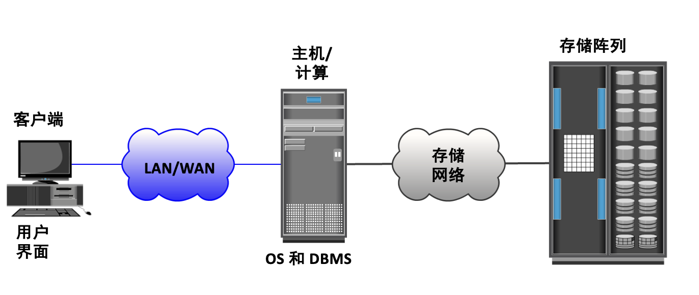
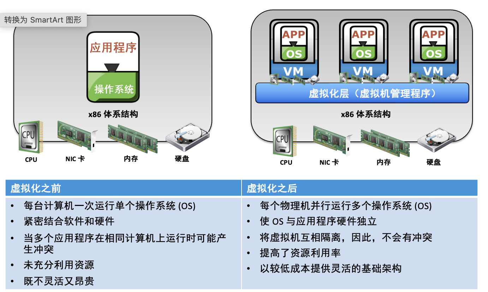
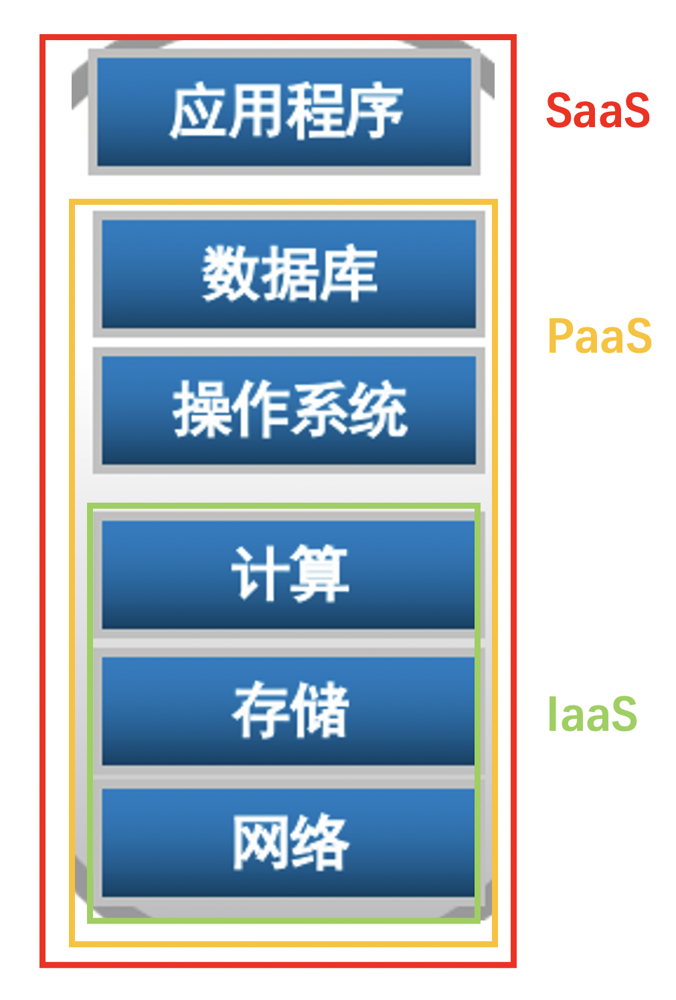
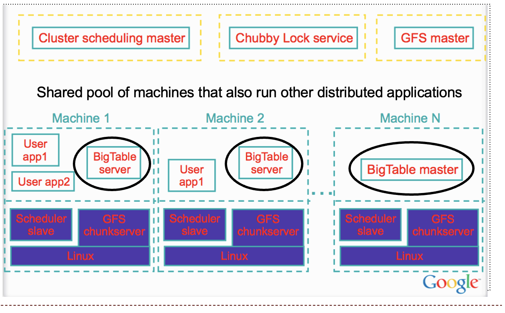

# 云计算学习笔记

- 结构化数据与非结构化数据？

    - 非结构化数据：数据结构不规则或不完整，没有预定义的数据模型。

        非结构化数据占数据的大部分，如消息、文档、网页、图像、音频视频、邮件等。

    - 结构化数据：按照固定格式和规则组织的数据。

        最常见的就是数据库中的数据，可以以二维表的形式展现。

    - 对待区别：两者在存储、处理上都有明显区别。

- 什么是数据中心？

    它是包含存储、计算、网络和其他 IT 资源以提供集中式数据处理功能的设备。

    一般包括：应用程序、数据库、主机/计算、网络、存储。是提供数据服务的软硬件整体。其中各个部分都可能虚拟化。

    

- 什么是计算虚拟化？

    

    它是一项掩蔽或抽象化物理计算硬件的技术，支持对单个或群集物理机并行运行多个操作系统 (OS)。每个运行的OS需要经过一个中间的虚拟化层才能访问硬件，虚拟化层需要保证不同OS在硬件上的隔离。硬件利用率、灵活性提高了。

- 常见的存储介质？

    - 磁带：低成本长时间，适合保存备份性质的数据。
    - 光盘：适合小型单用户计算环境，容量和速度有限。
    - 磁盘：流行存储介质，容量大，支持随机读写。随机访问速度慢，适合读连续数据块。
    - 闪存/固态驱动器SSD：半导体介质，高性能低功耗，随机访问速度快。有写寿命。

- RAID：见数据库笔记

- 什么是云计算？

    一种支持随时随地对可配置计算资源（如服务器、存储、网络、应用程序和服务）的共享池进行方便的按需网络访问的模型，只需进行最少的管理工作或服务提供商交互，即可快速调配和发布这些资源。

    云计算有如下几个关键概念/特征：

    - 按需调配资源
    - 通过网络访问
    - 资源共用
    - 虚拟化

- 云计算的三类：IaaS, PaaS, SaaS各有什么含义区别？

    首先aaS都是“as a service”的缩写，“即服务”的意思。

    

    - IaaS：I = Infranstructure, 基础架构即服务。

        向用户提供基础架构组件，如服务器、网络、存储设备等。

        注意基础架构不止是硬件，还包括网络带宽、存储池、标识池、虚拟IT资源(虚拟机 (VM)、虚拟存储卷、虚拟网络)等。

        面向仅需要底层架构的部署者。

    - PaaS：P = Platform，平台即服务。

        还对用户提供操作系统、数据库、中间软件等平台软件组件。

        面向的是应用开发者。

    - SaaS：S = Software，软件即服务。

        向使用者提供了利用在云基础架构中运行的提供商应用程序的功能。

        面向最终用户。

    - 联系：三者只是大致分类，无明显界限，很多云服务都是三者的结合。

- 什么是BigTable？

    

    BigTable是Google开发的一种**分布式，高性能，基于列存储的NoSQL数据库系统**。它可以处理海量数据并提供快速而可靠的访问。BigTable的设计目标是满足对大规模、高并发、多维查询和事务支持的需求。

    BigTable的数据模型类似于一个多维的映射表，其中每个元素由行键、列键和时间戳三个部分组成。所有的数据都被按照行键排序，这样相关的数据可以被存储在相邻的位置上，方便进行批量操作。同时，BigTable支持动态地添加或删除列族和列，并可以在列级别上控制访问权限。为了保证高性能和可扩展性，BigTable采用了许多优化策略，如基于内存的索引，数据压缩，负载均衡和数据分片等。此外，BigTable还可以与其他Google的分布式系统，如GFS、MapReduce和Chubby等配合使用，提供更加完整的解决方案。

- 什么是SSTable？

    SSTable（Sorted String Table）是一种基于磁盘的**数据存储结构**，它被广泛应用于现代的分布式数据库系统中，如Apache Cassandra、LevelDB等。SSTable可以看作是一个有序的键值对序列，所有的数据都被按照键进行排序。

    在SSTable中，数据被分成多个块（block），每个块包含一段连续的键值对。每次写入操作都会生成一个新的块，并且按照键的大小顺序排序，这样就可以保证在读取操作时能够快速地定位到所需的数据。当块的数量达到一定阈值后，SSTable会将多个块进行合并，并创建一个新的大块来替换它们。这个过程被称为压缩（compaction），以减少磁盘空间的使用和提高读取性能。

    SSTable的优点是在读取操作时非常快速，因为所有的数据都是有序的，可以通过二分查找等方法快速定位到所需的数据。同时，由于SSTable采用了压缩技术，可以大大减少磁盘空间的使用。但是，在写入操作时，由于需要不断地创建新的块，可能会导致性能下降。因此，在实际使用中，需要根据具体的场景和需求来选择SSTable或其他的数据存储结构。

