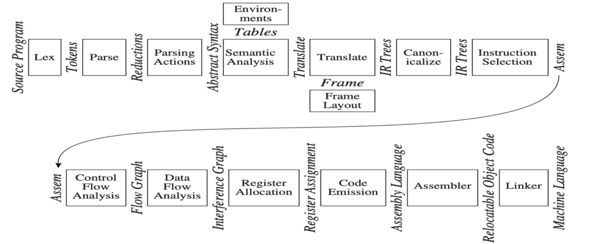
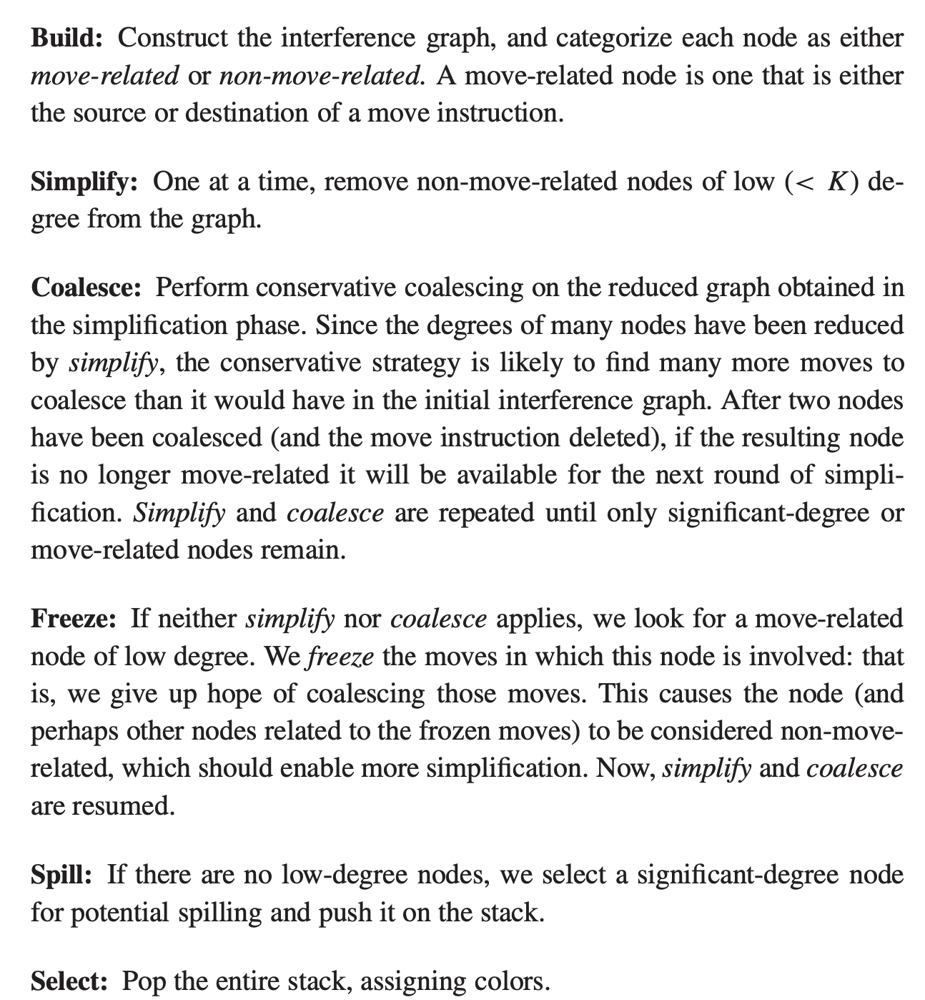

# 编译原理

## 1. 整体流程

## 2. Lex 词法分析

- 正则表达式及其向NFA的转化

    

- **NFA转化成DFA的算法**

    基本思想：NFA的状态子集作为DFA的单个状态，可以无条件转换的NFA状态合并在一起（闭包思想）。

- **DFA简化(最小化)的算法**

    基本思想：合并不可区分的节点。
    
    所谓AB不可区分，是指对于任何从节点A出发能被接受的串，从B出发一定也可以被接受，反之亦然，即从两者出发接受的字串集是相同的。不可区分的节点可以合并，原本在两个节点之间的边变成合并节点上的环。一般从终止节点往前合并。
    
    
    
    

## 3. Parsing 语法分析

- CFG上下文无关文法

    - 二义性的判断与消除
    
        **消除左递归**可以避免二义性、允许LL分析、减少LR分析中的冲突。套路固定：

        
    
    - First, Follow, Nullable集合的计算和意义
    
        
    
    - 包含关系
    	
    
    
    
    包含原则：LL(k) < LR(k), LL(k) < LL(k+1), LR(k) < LR(k+1), **LR(0) < SLR < LALR(1) < LR(1)**

- LL(0)

    可以直接从S线性推出的文法，条件苛刻，几乎不考虑。

- **LL(1)**

    

    根据First、Follow、Nullable集合在解析表中填入规则。LL(k)又称predictive parsing。

    注意，LL也就是自上而下的语法解析器，必须对CFG进行消除左递归。

- LR(0)

    

    LR类是自底向上的推导，需要构建状态转移图DFA。

    此类解析表中可能存在s-r冲突，r-r冲突。注意没有s-s冲突这种说法，因为接收到某个字符后的状态转化已经由DFA确定了。

- **SLR**

    注意LR(0)如果某个DFA节点中包含dot在最后的情况(比如节点k中的S->a.)，那么解析表中对应**整行**都会有对应的reduce。在LR(0)的基础上，SLR记录每个非终结符的Follow Set，只有S的Follow包含x时，解析表中k行的x一列，才会填入S->a.的reduce编号。

    SLR是提前看一个symbol但不考虑上下文的LR(0)，**SLR和LR(0)的DFA完全相同**。解析表可能不同，即reduce会变少。

- **LR(1)**

    

    LR(1)不像SLR那样机械记录Follow，而是动态记录下一个symbol。DFA状态可能很多。

    应该对CFG进行**消除(提取)左因子**，可以减少状态数量、可能避免s-r冲突。

- **LALR(1)**

    LALR对LR(1)的DFA中那些**左侧规则相同、只有右侧symbol不同的节点进行合并**，减少状态数和解析表的大小。

    但是可能在解析表中引入新的r-r冲突（不会引入s-r冲突）。

    LALR(1)是Yacc用的解析方法。

- 错误恢复

    

## 4. Abstract Syntax 抽象语法

- 递归下降法的语义栈
- 抽象语法树AST

## 5. Semantic Analysis 语义分析

- 符号表

    命令式(imperative)符号表: 覆盖

    函数式(functional)符号表: 不覆盖。

    二叉树可以用来实现空间高效的函数式符号表。

    

- 声明与类型检查

## 6. Activation Record 活动记录

- 栈帧

    栈帧的结构：

    

- 静态链

    static link的含义：

    在允许嵌套函数的语言中，内部的函数需要访问外部函数的栈帧。

    实现这种技术的方法之一就是静态链，即调用内部函数时，传给内部函数一个指针，指向调用它的那个外部函数(的栈帧)。如此调用过程将形成静态链，可以向上逐层追溯访问外部函数的栈帧。

    除了静态链外还有全局维护的嵌套层次显示表等方法。

- 栈帧变量

    栈帧的变量有些可以且应该放在寄存器里，加快访问，另一些则必须存在存储器中（有自己的内存地址），以便其他栈帧访问。

    只有以下情况，才需要将栈帧变量法放入存储器中

    - 对该变量存在**取址**操作
    - 该变量是数组。隐含有取址操作
    - 该变量被嵌套在当前函数(过程)内的其他函数(过程)访问（即作为内部函数的实际参数）
    - 无法放
        - 变量值太大无法放入单个寄存器
        - 需要存放它的寄存器有其他特殊用途，如传递参数
        - 变量太多寄存器不够用，需要“溢出spill”到存储器中

    其他情况下默认放到寄存器中。传入的参数和函数返回值都优先放到寄存器中。

    

## 7. IR 中间代码

- 中间表示方法

    节点类型包括CONST, NAME ,TEMP, BINOP, MEM, CALL, ESEQ, MOVE, EXP, JUMP, CJUMP, SEQ, LABEL.

- 常见转换模式

    

    

## 8. Block and Trace 基本块和轨迹

- 规范树

    - 条件

        满足以下两个条件的IR树称为规范树（canonical tree）

        - 没有SEQ或ESEQ

        - CALL节点的父节点一定是EXP或MOVE

    - ESEQ上移

        消除ESEQ的方法是将其一级一级地往上提升，直至可变为SEQ节点。

        

    - 将CALL移到顶层

        

    - 线性语句表

    

- 基本块

    - 含义

        基本块是一个语句序列，控制只能从这个序列的开始处进入并从结尾推出，即不能中途插入或离开。

        - 第一个语句是一个LABEL
        - 最后一个语句是JUMP或CJUMP
        - 中间没有其他的LABEL，JUMP或CJUMP
        
    - 划分方法

        划分相当简单，从头到尾扫描语句序列，划分出一个新的基本块有三个情况

        - 当前语句是LABEL，从下一条语句开始一个新的基本块
        
        - 当前语句是JUMP/CJUMP语句，从下一条语句开始一个新的基本块
        
        - 当前语句可能在其他位置跳转来到(可能需要观察后面的语句)，从本条语句开始一个新的基本块

- 轨迹

    轨迹是程序执行期间可能连贯执行的语句序列，可由基本块按序组成。

    基本块本可以任意组织，但是良好的轨迹应该让CJUMP之后紧跟其false标号条件。
    
    

## 9. Instruction Selection 指令选择 

- 覆盖(tiling)，最佳覆盖，最优覆盖

    - 指令覆盖

        一个计算机指令通常可以完成一个或多个动作，这对应于IR树的一段树枝(树型)，可供选择的树型也叫瓦片(tile)。指令选择的任务就是用树型的最小集合来覆盖一棵树。

        

        

        可以看到同一棵树有不同的覆盖方法。

    - **最优**覆盖 **optimum** tiling

        瓦片的代价之和是最小的覆盖。

    - **最佳**覆盖 **optimal** tiling

        不存在两个相邻瓦片能连接成一个代价更小的瓦片的覆盖。

        如果某个树型可以分割成几个较小组合代价的瓦片集合，那么应该在开始时就将这个树型从瓦片清单中去除。

        最优覆盖一定是最佳覆盖，一般来讲难以直接追求最优，而是追求最佳覆盖。指令集越精简，两者差别越小。

- 指令选择算法
    - **Maximal Munch**
    
        **从树的根节点开始寻找能覆盖它的最大瓦片**，然后对未覆盖的部分，看作子树重复这个过程。
    
        这是一个逆序生成的算法，先用瓦片覆盖的后执行。能生存最佳覆盖。
    
    - 动态规划
    
        自底而上。先计算子节点的代价。
    
        能找到最优覆盖，但算法代价较大。
    
    - 树文法
    
        
    
    - 算法代价
    
        maximal much和动态规划的算法代价都是
    
        与 **(K' + T') N / K** 成正比
    
        K: 平均每个匹配的瓦片有K个非叶节点
    
        K': 给定的子树中为确定匹配哪个瓦片而需要检查的最大节点个数
    
        T: 不同的瓦片的数量
    
        T': 平均而言，每个树节点可以匹配的树型个数
    
        N: 输入树存在N个节点
    
        动态规划代价的正比常数要比maximal munch大。

## 10. Liveness Analysis 活跃分析

- 数据流图、**活跃性计算算法**

    活跃：变量活跃的含义是当前的值可能在后面的某条路径(存在一条即可)上会被用到（在重新def之前被use）

    def, use, in ,out的定义与计算。(如果需要反向迭代来加速，先算out再算in)

    def/use：节点中定义(赋值)/使用了的变量集合

    in：在该节点入口活跃的变量集合

    out：在该节点出口活跃的变量集合

    

- 冲突图

    注意两个变量冲突并不完全等价于两个变量存在公共活跃的区域。如果两个值能确定相等，那么即使它们都活跃，也可以不冲突。

    这种“确定相等“就是MOVE指令的情况。

    

## 11. Register Allocation 寄存器分配

- 冲突图上的图着色算法

    构造-简化-溢出-选择，可能需要合并

    - 简化：其实就是给变量分配一个寄存器

    - 合并的是传送边连接但没有受抑制（没有冲突边）的两个节点，它们可以赋同一个寄存器，同时还可以删掉代码中对应的传送指令。

        合并（coalesce）时需要防止合并后图变成不可着色，可以采用两种保守策略：

        - Briggs（推荐）：合并a和b的条件：a和b结合的节点ab的高度数(度>=K)邻节点个数小于K。

        - George：合并a和b的条件：对于a的每一个邻节点t，要么t和b已冲突，要么t是低度(度<K)节点

        注意合并其实优先于简化，对于有move指令连接的变量，暂不将其简化，除非没办法合并也没法简化其他节点，此时可以将这条传送边“冻结freeze”，放弃合并转而尝试简化。注意冻结跟受抑制的区别。

    - 溢出：无法简化或合并时，将一个变量移除图，potential split，这个变量可能需要分配存储器存储。乐观着色策略意味着此时仍然尝试继续进行染色，最后观察被溢出的节点能否着色。如果不能，说明发生了actual split，需要重写代码(restart)，将那个变量写入存储器中访问。

    

    

- 预着色

    预着色的节点之间两两冲突。但是预着色节点如果跟普通变量不冲突，那么也可能可以给普通变量用，即预着色节点能够(跟普通节点)合并，但不能简化或溢出。

## 12. Garbage Collection 垃圾收集

程序变量和对分配的记录会构成一个有向图，应该找到那些不可能再被访问到的垃圾内存，进行回收。

- 标记-清扫式(mark and sweep)收集

    

    一个比较自然的想法，从根节点（变量）出发，经过的路径上的变量都是可到达的，可以用DFS来遍历标记。

    没有被标记的那些变量就应该被回收，在标记过程结束后，清扫过程将没被标记的变量在空闲表中串起来，以便回收。

    

    清扫阶段较为简单，DFS标记阶段存在改进方法。

    - 显式栈 explicit stack

        DFS作为递归算法，最大递归深度可达到最长路径，而如果存在环路则可能遍历长度大于整个堆的大小。

        我们通过显式栈来实现DFS而非递归函数。

        

    - 指针逆转 pointer reversal

        不额外维护栈，而是用逆转指针的方法实现回溯。

        

        

- 引用计数(reference count)

    对于每个field，需要有一个动态维护的引用计数表明有多少指针指向它，到0时意味着可以回收。

    引用计数存在循环引用、编译开销大等缺点。

- 复制式(copying)收集

    设置一个from space和to space，可以from space满是进行空间转移，基本操作是转递(forward)。这样可以让to space的空间是紧凑、无碎片的。

    

    

    

