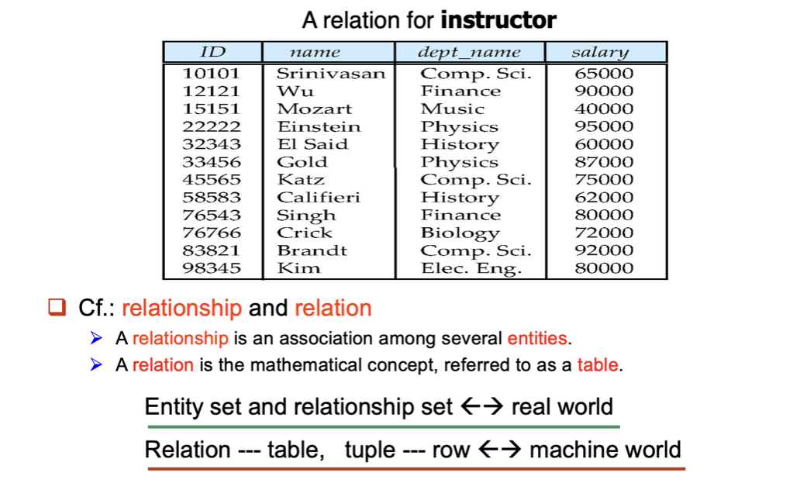
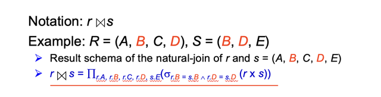
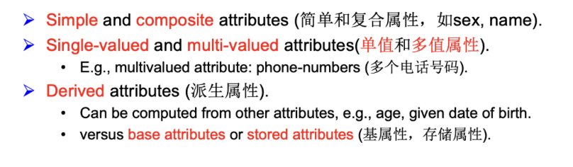
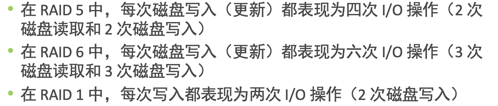
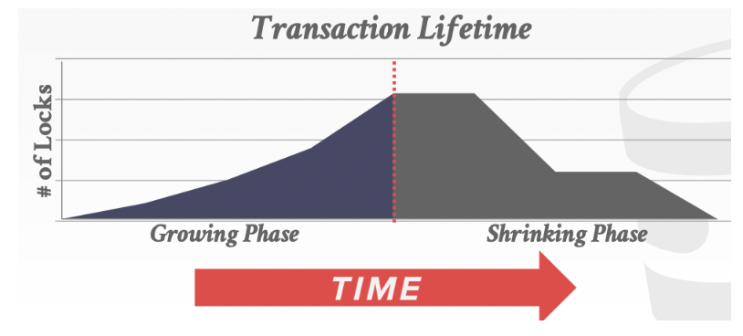
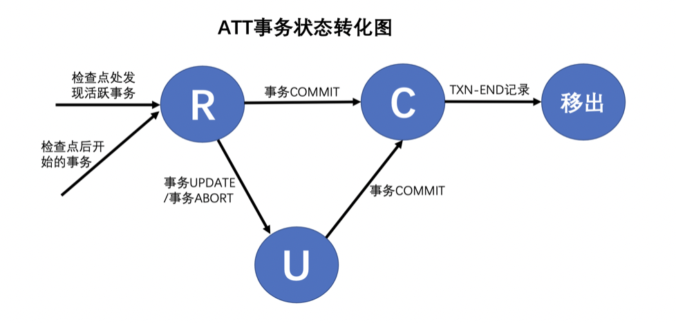

# << 数据库系统笔记 Database System Notes >>

JerryG

此笔记基于CMU-15445，CMU-15721，以及浙大数据库课程。

## < 关系型数据库理论模型 Theoretical Model of Relational Database >

### 关系表

关系模型(Relation model)是一种数据存储的逻辑模型。一个关系型数据库由若干个关系（relation）组成，每个关系由一个表（table）表示。关系表有行和列，每一列对应的是一个属性（attribute），每一行对应一个实体（entity）。关系表可以记录现实事物信息。从数学角度来讲，关系表是属性集的笛卡尔积的子集。

其中属性列表决定了表的架构（schema，可能还包含一些属性约束），而一个包含了若干个实体的具体的表则确定了一个instance。

### 关系代数

关系代数是一套定义在关系表上的二元运算（操作数、运算结果均为关系表）。基本的元操作有六种：

关系代数是SQL查询的理论基础，熟悉它可以帮我们写出准确的SQL查询语句，也有助于查询优化分析。

需要说明，改名运算之所以必要，是为了解决一张表与自己关联时的表达麻烦。

此外，还有一些衍生的运算：

其中自然连接比较重要

两个表进行笛卡尔积，并且要求共同的属性的值必须相同。自然连接对应的其实就是关系表的合并操作，是关系型数据库的重要特征。

此娃，还有聚合函数（Aggregate Function）

聚合函数生成的表有新的属性，属性值由聚合函数产生，聚合函数一般用到原表整个表的信息。

### E-R模型

关系表、连接是数学上的概念，在逻辑上还需要一套理论来建立模拟现实的模型。

- 属性的类型

    

- 键/码：Key

    super key超码：关系表的某个属性集，可以唯一决定数据表的一个实例（一行）。不加说明时码指超码。

    candidate key候选码：一个最小的超码。注意这里的最小不是指属性的个数，而是该超码的任何属性子集都不能作为超码。一个关系表可能有多个候选码，这些候选码的属性数可能还不一样。

    primary key主码：人为选择的一个候选码，作为主码

    需要强调的是，码的定义中“决定”的意义是设计逻辑上的，而不是针对某个具体的表。比如一个表只有一条实例，并不是说任一个属性集合都是超码，而是要看设计的逻辑意义。一个具体的数据表可以排除一些属性集作为码的可能性，但并不能决定哪些是码。

- E-R设计模型

    E-R模型是关系型数据库最重要的设计模型

    - E-entity-实体表：表示一种具体的事物，如人、产品、房间等。
    - R-relation-关系表：表示事物之间的关系，如师生关系、购买关系、所属关系等，依赖于实体表而存在。

### 设计范式Normal Form

- 设计目标：使数据库减少冗余、易于修改和维护一致性。如果对某个实体的某个属性的删改会导致连锁反应、引起数据库较大的调整甚至需要人工介入，则认为数据库设计不佳。这里是SQL理论部分的难点。

- 依赖：略

- 设计范式

    - 1NF：Domain is atomic. 域具有原子性，在信息提取的意义上不可分割。这里的域可以暂时理解为属性。

        常见的非原子性属性有：复合属性、多值属性、复杂类型如对象属性、将多个信息整合到一个值的属性（并且后续使用时会拆分读取信息）。

        非原子性的域的坏处：存储冗余、修改复杂。1NF是关系型数据库的基本要求，不要自作聪明在属性上集成信息。

    - 2NF：非主属性**完全依赖**于候选码，而不能只依赖于候选码的一部分属性真子集。

        或者说：实体的属性完全依赖于主关键字。所谓完全依赖是指不能存在仅依赖主关键字一部分的属性，如果存在，那么这个属性和主关键字的这一部分应该分离出来形成一个新的实体，新实体与原实体之间是一对多的关系。

    - 3NF：如果有非超码非平凡决定了另一个属性集，则被决定者的每个相对于决定者的额外属性都必须在某个候选码中。

        或者说：所有数据元素不但要能唯一地被主关键字所标识,而且它们之间还必须相互独立,不存在其他的函数关系

    - BCNF：如果存在非平凡的决定关系，那么决定者一定可以决定所有属性（即一定是超码）。

        此条强调：如果有依赖/决定关系，那么就决定彻底，而不要只决定一部分属性。

    - 消除关系：

        0NF -> 1NF: 消除域内依赖								1NF -> 2NF: 消除对主码的部分依赖

        2NF -> 3NF: 消除对主码的传递依赖				 3NF -> BCNF: 消除对候选码的部分依赖和函数依赖

        满足后者必须也自然满足前者。

- 不满足设计范式的ER模型的纠正流程：数学方法，流程化，略。

### SQL语法

略

## < 数据存储 Data Storage >

### 存储介质

尽管存特殊场景下小型数据库可以将数据存储在内存中，大多数数据库都需要持久、非易失的存储，需要将数据存储在磁盘（disk）中。

磁盘现在含义比较广，可以泛指非易失的存储部件。以前多用磁带实现，现在SSD开始流行。在数据库运行时，需要将磁盘中的数据载入内存再进行操作，这里就涉及到了不少优化。

磁盘有如下特点（SSD等先进存储方式可能不完全是这样）：

非易失non- volatile：断电等情况下不会失去所存的数据，适合持久存储。

价格低容量大：相对于内存价格低、容量大，适合存储大量数据。

寻址极慢：读取数据通常分为找到数据首地址、读取一块区域。前者，即寻址，对磁盘来说速度**极**慢（相对于内存运算等操作）。

适合连续读取：在找到首地址后，读取连续的一块区域内容是相对(寻址)较快的。**因此磁盘适合一次读取较多的连续内容、减少寻址次数，而非常不适合依次读取非连续的多个数据块。**

由于磁盘的特殊性，

为什么不能用OS的文件系统代替数据库的功能（文件系统的局限性）

- OS文件系统的设计并未为关系型数据库的数据特点进行特别设计，性能远不够
- 文件系统难以支持数据库的事务、并发的需求（并发控制的层次也不一样）
- 文件系统没法满足数据库系统的安全、权限需求
- 不同OS的文件系统难以对外提供一致的SQL接口

文件系统更多的是将一个文件看成整体，对里面的内容无差别对待，而数据库则需要对数据文件所表达的内容设计一套访问、维护规则。

多磁盘的并行技术：

考虑有多个磁盘的情况，不同磁盘可以独立、并行地读写。那么为了提高读写效率，可以将统一块数据拆分成多个写入多个磁盘的对应位置，这样可以实现读写的并行。

- 比特级拆分：把同一个字节的八个比特分别放在八个磁盘上。这样读写一个字节同时在八个磁盘上只读一个字节即可。由于磁盘的寻址时间远大于读连续内容的时间，这种效率未必比单磁盘好。

- 块级拆分：以某个固定大小的块为单位进行拆分。效率更好。

    

### RAID

Redundant Arrays of Independent Disks(独立磁盘冗余阵列），是一种磁盘的数据组织结构，用来防止数据出错所带来的问题，同时还要保证成本和效率。

分条(striping)、镜像(mirror)、奇偶校验(parity)是RAID的三个关键技术，不同类型RAID是在这上面的进行修改。

**RAID0**: 分条集。无任何冗余。但采取分条技术：

所谓分条技术，指的是磁盘阵列中，每个磁盘都分为若干条带，读写数据时，同时读写不同磁盘上同一对应位置上的条带，达到并行访问的目的。

比如A作为逻辑上整体的一块数据，物理上被分散地、并行地写到不同磁盘上的同一对应位置条带上。

**RAID1**: 镜像磁盘。每个磁盘都有个存储系统内容镜像磁盘。这跟分条思想是独立的。

RAID0+1: 由条带集组成的镜像集。先分条再镜像。

**RAID1+0:** 由镜像集组成的条带集。先镜像再分条。

RAID2: Memory-Style Error-Correcting-Codes (ECC) with bit striping.

RAID3: Bit-Interleaved Parity额外设置一个纠错磁盘，其数据是数据盘对应位置比特异或的结果。

RAID4: Block-Interleaved Parity额外设置纠错盘，只不过本是按比特对应数据，而是按块。多个数据块之间通过某种运算形成纠错盘的数据块。吞吐率比RAID3高。

**RAID5**: Block-Interleaved Distributed Parity

RAID3和RAID4虽然有检错功能且只需要一个额外磁盘，但是有一个重大缺点：纠错块对应的恰好是块级拆分中同时读写的块，这就导致并不能真正“同时读写“，否则纠错块无法正确计算，导致并行能力下降。

RAID5的纠错块分布在各个数据磁盘中，没有专门的纠错磁盘，并且纠错块的位置是错开的。

Block writes occur in parallel if the blocks and their parity blocks are on different disks. 

**RAID6**: 又称P+Q冗余策略。类似RAID5，但是加了额外的冗余信息防止多个盘出错。可以纠正两个盘同时出错的情况。

**RAID5对RAID2, 3, 4具有全方面的优势，所以RAID2, 3, 4已经基本被完全淘汰，RAID0,1, 1+0, 5使用较多，适用于不同场景。**

注意有一个例外：RAID3将奇偶校验放在单个磁盘，大型顺序读写性能可能更好。

RAID技术可能导致写损失（增大IO次数），校验/镜像会影响存储容量利用率/。

### Buffer Pool

- 基本概念

    buffer pool(内存池)，是磁盘区内容在内存中的缓冲区域。类似于内存的内容存在cache中，内存池可以理解为磁盘和内存之间的cache。不同的是，内存池的结构和替换策略可以由程序设计控制，而不必像cache一样只能靠硬件直接控制，因此灵活性更好。

    由于磁盘的特性，内存池通常将磁盘中较大的一块数据整体搬运到内存中，者类似于cache将内存中一个block作为cacheline搬运到cache里面。这个“一块数据“在内存池中成为**页(page)**，比如4096字节。页是内存池管理的基本数据单元，其内部的数据细节处理不由内存池负责。page一般认为是磁盘中的概念，在内存的buffer pool中，有着一个个与page大小相同的、等待搬入page的内存区域块，这种区域块称为frame(帧)，为了方便有时跟page混用。

    当数据库需要访问某个磁盘页时，如果已在内存池中，则字节读取对应帧的内容即可，否则需要先搬运磁盘页进入内存池某个frame再进行操作。如果内存池已满，需要替换出某个frame，这个frame里面的页如果被写过则称为脏页(dirty page)。脏页被替换前需要先写回磁盘。我们制定的替换策略应该尽可能减少页的载入和写回。

    另外注意，操作系统对磁盘文件的读取有自己的一套内存池机制，数据库的内存池是相对独立的。

- 替换策略

    由于磁盘页被搬入内存池的位置(哪个frame)可以由程序控制，不需要像cache完全相连和组相连那样页有固定的对应帧位置。可以认为buffer pool默认是“全相连”的。因此关键就在于合理的替换策略。替换策略最常见的是LRU(Least Recently Used)，选择最长时间没被访问过的页面优先替换。

    此外还有clock替换策略。LRU策略需要每个page有个最近访问的时间戳，clock算法则不需要。

    

- 多线程/分布式buffer pool

    需要考虑buffer pool的并发访问/数据一致性的问题。

### 存储格式

- 数据页的类型

    数据库的数据类型主要有数据表、索引、元信息(又称目录catalog)三种。其中数据表是着一条条记录，索引也按特定格式组成，这些数据都以页为单位存储。元信息页则负责记录这些信息页之间的关系（如表的首页、表和索引的对应关系、索引首页等等），此外还有元信息的元信息页...

    注意在真正的磁盘上，还有更为底层的元信息页，负责记录信息页的位置、存在性信息。这部分对buffer pool是隐藏的。

    具体而言，磁盘数据库文件中的某一页，可能是：

    - 磁盘级元信息页：用于记录磁盘页的分配情况和使用情况，这部分对内存池隐藏，内存眼中的连续磁盘页仿佛跳过了这些元信息页，这些元信息页本身也会进入内存，但不是buffer pool，而是由disk manager所分配的。这种页的特殊性有时会给并发、日志相关的事情带来麻烦。注意可能还有记录元信息页分配情况和使用情况的元信息页，如果文件无限大，理论上元信息页层级可以无限高（另一个角度讲，文件大小有限跟系统设计的元信息页层级数有很大关系）。以下的所有页，都是磁盘信息页，被元信息页所管理，都需要进入buffer pool才能被操作。

    - 关系表信息页：内含表内的若干个记录，可能还有剩余空间、上/下一页等信息。

    - 索引节点页：根据索引类型不同文件结构不同。

    - 数据库目录页：即catalog页，如记录数据库的表名和表首页、索引首页(比如使用B+树索引时，目录页会记录B+数根节点的页号)的对应关系，还比如表的属性结构信息，还比如用户信息、权限信息、统计信息等。目录页也是非常重要的，结构多变。

    - 其它功能页：上面三种页是真切的数据页。根据文件组织结构的不同，可能需要其它具有管理功能性质的页。

        

- 表页的组织结构

    一个文件由若干个磁盘页组成，需要某种结构来组织这些页，来方便空闲页的分配、有空位置的页的选择插入等。

    - **堆文件/流水文件Heap File(重点)**

        记录可以在页的任何位置，只要有空间。

        - 链式结构

            最简单的模式是链表结构，每个页存有逻辑上上/下一页的指针(即页号，注意这里链表的概念是在磁盘中的)。注意这个模式需要一个额外的header page，分别存着数据页链表和空闲页链表的首页指针。注意是两个链表。

            

        - 目录结构

            

            系统维护目录页，目录页由若干个entry组成，每个entry是固定大小的，记录页号和对应页剩余空间的大小。由于页可能非常多，一个目录的entry可能不足以对应所有页，因此目录页需要多个，也以链表的形式连接。

            这种结构的好处是可以较快找到剩余空间足够的页进行插入，而不需要遍历页。

        

- 表记录的存储结构

    - NSM(N-ARY存储, 行存储)

        行存储指的是文件中按记录连续存储，文件中就是一条条记录。

        优点是插入删除修改速度较快、适合需要整个tuple的查询。

        缺点是当只需要访问部分attribute时，效率较低。

        - 定长记录

            可以按类似数组的结构存储，较为简单。

            

            实际上除了特定结构的表，记录多数情况下不定长，这种结构可能会浪费空间。

        - **slotted-page分槽页**(不定长记录)

            

            在一个表页中，不定长的tuple从后往前连续存储，而页首部先是头部信息，然后是slot array。头部信息是定长的，包含页的基本信息、tuple数量、剩余空间大小等。slot array从header末尾开始，随着tuple增加从前往后生成，第一个slot对应位于末尾的第一个tuple，如图以此类推。每一个slot是定长的，记录其对应的tuple的偏移(tuple头部在页中的位置)。最后一个slot对应最后一个tuple(页中最前的tuple)，这之间是free space(蓝色的部分)。

            

            插入tuple时，先在header检查剩余空间字段是否足够大(要满足slot+tuple的空间大小)，如果可以插入，则分别在前、后插入slot和tuple，slot的偏移根据最后一个tuple的偏移和新tuple的大小确定。如果空间不足，则检查下一个页看能否插入(可以设计诸如堆堆数据结构确保先插入到剩余空间最大的页中)。

            如果需要删除tuple，可以直接将slot和tuple的字段消除：分别向左、向右平移填补空缺即可。也可以在slot中添加valid字段，如果删除设为失效，在后面某个时间点一起消去所有无效slot和tuple(定期重整)，这样可以减少数据拷贝粘贴。

            slotted page的优点是插入较快(可以根据header直接定位到插入位置)、空间利用率很高。缺点是删除、tuple的查找是线性的，效率一般，另外不太适合支持数据跨页。slotted page不仅在数据库，只要是定长页存储不定长记录这种模型，分槽页都是非常好的数据结构。分槽页广泛用于数据库的表存储中。

    - DSM(列存储)

        Decomposition Storage Model又常称为column store，在page中，连续存储数据表的某一个attribute在整个表中的值。

        优点是适合只需要部分属性的查询，较适合OLAP的需求。

    - 大Field的存储方法

        有时tuple的属性值可能所占空间非常大，比如BLOB类型等，这种在当今存储各种各样的工业界数据库是非常常见的。这种大数据，很可能大小超过一页(几千个字节)，理论上就无法存入分槽页，甚至说根本无法按页。这种Field可以采用**外部存储**的方法，用单独的外部文件存储数据内容，而数据表页的记录对应field位置则只添入该外部文件的指针即可。当然，这种存储的缺点说DBMS难以直接操作外部文件中的数据，不利于保证数据的事务一致性。
        
    - 顺序文件Sequential File

        记录按search key的顺序存储。每个记录需要记录下一条记录的位置。维护成本较高。
        
    - 散列文件Hashing File

        哈希表对某属性映射，根据哈希值决定页中的位置

    - 聚集文件Clustering File Organization

        不同表的记录可以在同一文件中。

- 索引文件结构

    视索引类型而定，需要精巧设计好并在编程时精细控制索引页的访问。

- 日志文件结构

    日志文件独立于数据库文件，采用相对独立的文件结构，未必分页(因此其实不应该在本节讨论)，一般存储在stable storage中。一般情况下不进入内存，更不会进入buffer pool，属于备份型数据。

## < 索引 Index >

### 索引的作用

- 基本概念

    索引(index)是一种用来加快查找的数据结构。对于数据存储，有两个关键概念：数据值和数据位置。计算机很容易根据数据位置获取到数据值，却难以直接根据数据值定位数据位置，索引就是通过维护另一套数据结构，来根据数据值快速定位数据位置。

    索引是根据数据值找到数据位置的，这个数据值未必是整个数据的值，往往是一条记录的一个或若干个属性值，这个属性又称为键(key)。索引的目的就是建立键和数据位置的关系。一个键和一个数据位置(指针)组成一个index entry。

    注意有一些数据结构中索引跟数据存储是结合的，比如节点存有值和指针的二叉树，这种方式不太适合数据库管理(并不绝对，也有不少结合存储的)。因此数据库中，多让索引和数据存储分离，索引是文件的另一个区域单独维护的，在末端有指向数据区域的指针。由于索引的数据值长度一般远小于整条记录长度，索引区大小往往远小于数据区大小。

    索引可以极大加速查询，当然也要为此付出代价，那就是数据本身发生改变时需要对索引也进行修改，也就是索引的“维护”，只不过在查询远多于修改时，这种维护是利大于弊的。
    
- 顺序索引和散列索引

  - 顺序索引Ordered indices：前面说索引可以根据键值定位数据位置，顺序索引不仅能够做到这点，还能保证最底层的entry按索引值的顺序排序，可以实现范围查询。即使查询的键值不存在，也可以定位到最近的键值所在entry进行开区间范围查询。顺序索引以B+数为代表，可以在数据文件不按序存储记录的情况下(事实上也没办法，因为可能有按不同属性排序的需求)实现快速的范围查询。顺序索引又分为稠密索引和稀疏索引。
      - 稠密索引Dense index：每个key都在索引entry中出现。
      - 稀疏索引Sparse index：只有一部分key在索引entry中出现，对于没出现的key，若想查询，按顺序索引定位到最近的entry所指的数据位置，然后扫描后面的记录，结果必定在这个entry和下一个entry所指的区域之间。稀疏索引不仅要求索引是顺序的，还要求表文件也是顺序文件，按key值排序记录，条件苛刻较少使用（除非是按主键排序的顺序文件的主键索引）。
  - 散列索引Hash indices：以哈希索引为代表，底层entry无序，不支持范围查询。
  
- 多级索引Multilevel Index

  ​	
  
  把内层索引文件看作顺序数据文件一样，在其上建立外层的稀疏索引。外层索引也就是索引的索引。
  
- 聚集(cluster)索引和非聚集索引

  
  
  在数据库的索引里面，可以建立一种特殊的索引，叫主索引（primary index）。即主键上的索引，主键可以看作行的逻辑标识符，不允许重复、不允许修改，与tuple一一绑定。一般的数据库都会建议或默认生成主索引。其他的索引又称辅助索引(secondary index)，即其他键上的索引，这种索引可能设计键值的修改、键值可能重复。
  
  - 聚集索引
  
      主索引节点直接就是tuple数据，数据和主索引在一起存储。表文件本身就是一个主索引文件。
  
      辅助索引的叶节点不直接指向tuple，而是记录对应tuple的主键值，用它来代表tuple指针。当需要定位这个tuple时，还需要根据主键值在主索引里再查一遍。
  
      聚集的意思是数据行按照某个列的值进行排序并存储的过程。聚集索引就是按照索引列的顺序来聚集（排序）数据行并存储的一种索引方式。
  
      - 优点：
          1. 缓存友好：不需要额外的索引页作为叶节点，访问的是同一页。
          2. 如果tuple的位置发生变化，辅助索引不需要修改叶节点（非聚集索引中需要修改tuple指针），只需要主索引修改即可。这对一个主索引、很多歌辅助索引的情形，是比较友好的。
      - 缺点：
          1. 查询理论上慢：查询时需要遍历两次B+树，速度稍慢。
          2. 维护索引代价大：主键如果选择不当，或者插入顺序不当，将导致主索引结构需要经常改变，性能差。
          3. 辅助索引叶节点存主键值的空间开销通常比存tuple指针的开销大。
  
  - 非聚集索引
  
      主索引和辅助索引的叶节点都是指向tuple的指针，两者地位相同。
  
      - 优点：查询快、易维护、节省空间。
  
      - 缺点：缓存不友好；tuple位置变更时，需要修改所有索引的叶节点指针。（是否可以用逻辑指针，比如tupleID解决？）

### B+树索引(重点)

B+树是一种树形数据结构。一个n-B+树有以下特点

- 每个非根非叶的节点有$\lceil n/2 \rceil$到n个孩子，也就是指针数，键值数是这个数减1（见节点示意图）。
- 非根的叶节点有$\lceil (n-1)/2 \rceil$到n-1个键值（与第一点其实等价）。
- 每条根节点到叶节点到路径长度相同，即B+树是平衡树。
- 根节点如果不是叶节点，则至少有两个孩子。如果根节点就是叶节点，它可以含有0到n-1个键值。
- 只有叶节点内部的指针才指向真正的数据(数据库中表现为数据表的tuple位置)。

指针数比键值数多一个，这是因为最后一个指针已经没有后面加一个键值的必要(不会靠它比较)，但其实这种不对称的感觉会给编程带来一些困惑，所以为了编程简单加上一个Kn也不是不行。

索引中的键值是可能相同的，此时根据查询目的决定返回所有结果还是第一个。另外，在键值可能重复的情况下，一个Key后面可以跟着多个指针（设计上会更复杂）。

- 查询：从上往下，非根节点中，找到**第一个大于等于查询键值**所在位置的指针(如果都小于查询键值，则用Pn)，往下查询，直到叶节点并找到对应数据。
- 插入：直接插入到应在的叶节点中，如果节点大小超过B+树要求，则分裂，分裂可能向上递归。
- 删除：找到叶节点位置并删除，如果节点太小，则合并，合并同样可能向上递归。删除时即使没有合并，节点键值也可能需要修改。
- 修改：与查询类似，但是在搜索路径上如果看到原键值，需要修改为新键值。

以上操作实际上有更多算法细节，有编程难度。

采取B+树的原因：

- 相比于二叉树，如AVL树/红黑树：这些数据结构多适用于内存中的操作，由于磁盘分页的特性，决定以一页为一个树节点是合理的做法，而二叉树节点理论上很小。虽然理论上二叉树性能最好，但是考虑到磁盘不像内存那样随机访问节点很快，数据库采用二叉树作为索引不太现实。

- 相比于B树：B树将指向数据的指针直接存在每个节点，不像B+树那样只存在叶节点中。**设计较为复杂**(插入、删除算法比B+树还要复杂)、工程上一般不去实现，且性能相比于B+树并没有好多少(微乎其微，还可能因为编程问题更慢)。另外，B+树的数据都在叶节点上，不像B树那样分散，因此**顺序访问、范围查询性能优于B树**。

- 相比于哈希索引：支持范围查询。但是B+树定点查找可能没有哈希索引快。

    

### Hash索引

- 哈希函数

    给定一个对象(可以是任何东西，可以只利用其二进制内容)，哈希函数可以将其映射成一个较大的整数。这种函数可以保证两个不同的对象映射到相同数字的概率非常低(几乎不可能)。常见的哈希函数有murmurHash、crc-64、cityHash、XXHash、FarmHash等。哈希函数有验证、索引等功能。

- 静态哈希static hashing

    最简单的哈希索引是一个定长的哈希表，有若干个entry，每个entry里面有键值哈希函数值modN(以下简称哈希值)和数据值(数据库里表现为tuple指针)。其中N是哈希表能容纳的最大entry数。在查询时，直接计算哈希值定位到对应entry获取tuple指针即可。其中entry的键值起验证作用，如果查询键值和entry键值不同，说明发生了碰撞(多数情况下不是哈希函数值相同，而是它们模n相同)。这种情况下就设计到碰撞策略(见后面)。哈希表的删除操作可以采用墓碑策略或者整体移动策略。

    对于键值允许重复的情况，每个entry不直接存数据值，而是存一个指向数据值链表的指针。

    

- 碰撞/冲突处理策略（静态）

    - **Open Addressing(开放地址法)**：静态哈希经典冲突处理策略：给后进来的key找其它的位置。

        - Linear Probing

            遇到碰撞时，往后依次看，将entry存入第一个能插入的空闲位置。查找时如果发现键值对不上，则向后扫描每个entry，直到找到匹配的情况(会较大程度上影响性能)。

        - Quadratic Probing

            不是像Linear Probing一样依次尝试便宜1、2、3的位置，而是按递增平方尝试，偏移依次是i^2（i=1，2，3）。可以证明如果表大小是素数，且至少半空时，最终一定可以插入成功（其实数据库中很少用）。

        - Double Hashing

            第i次尝试的偏移 = i*hash2(x)，x是键值，hash2是另一个哈希函数（注意这根rehash不是一回事）

    - Rehashing

        静态哈希表空间不够，或者接近满、碰撞过于频繁几乎失去索引作用时，重新开辟新的哈希表(比如大小为两倍)，废弃之前的哈希表，重新对所有原有元素进行哈希插入。这种方法给了动态哈希一定的启示。

    - Robin Hood

        是Linear Probing的一种改进，并不是无脑退后后进来的entry，而是进行一定的平衡。entry中额外记录了该位置和该键值本应该直接进入的entry位置的偏移距离。在插入后发现碰撞，依次检查后面的entry时，如果发现该entry不空闲且偏移距离字段比自己的（这里指假设自己占用这个entry，自己的偏移距离字段值）小，那么占用该entry，被挤出的这个键往后继续进行此操作。

    - Cuckoo Hashing

        使用多张(固定大小)哈希表，每个哈希表采用不同的哈希函数。插入时，检查每个哈希表是否可以直接按哈希值插入(不进行probing)，如果可以则直接插入，如果都不行，随机找一个哈希表，将碰撞的entry挤出，自己进入该位置。被挤出的entry，进行rehash重新进行此步骤(不要尝试rehash到自己原来所在的哈希表不然会死循环)。可以证明此步骤有限(但可能进行很多次迭代)。

        这种方法的好处是每个键一定可以在某个哈希表的entry上直接映射到无需probing，因此查询和删除复杂度都是O(1)。但是插入可能需要花费较多时间，类似“一劳永逸”的策略，适合查询多于插入的情况。

- 动态哈希dynamic hashing

    前面这些方法哈希表的大小都是固定不可变的，即使是rehashing，重新hash所有元素也是花费极高的，无非是再做一次静态哈希。静态哈希扩展性差，一旦元素接近满，碰撞会极大地增多严重影响性能。因此设计动态扩展大小的哈希表就很有必要。

    - **Chained Hashing(开链法)**

        

        此时哈希表的“大小”其实也是固定的，只不过entry里存的不是键值和数据值，而是指向**bucket**的指针。bucket是哈希值相同的“真entry”，真entry存的是键值和数据值(tuple指针)。bucket一般是定长的，若干个定长的bucket通过链表相连接（如图，bucket满、生成新bucket在尾部的过程称为分裂split）。此时查询时只需要扫描检查bucket即可，不需要考虑碰撞问题。

        当然，这种方法并没有从本质上解决哈希表的扩展性问题，hash函数mod的那个N一直没变。如果数据不断增多，最终bucket链表长度较长，大多数时间花费在依次扫描每个bucket上，索引作用减弱。

        开链法虽然虽然简单，但却非常常用，许多工程实际实现直接或间接使用了开链法处理哈希冲突。后面的几种算法可以看作开链法的改进。

    - **Linear Hashing(线性哈希)**

        

        为了防止bucket链表过长，在哈希表上维护了下一个分裂的bucket的指针。bucket分裂时，被该指针指向。给定键值，通过多哈希找到正确的bucket，低层hash找不到用高层hash找。

        这个模型中，哈希表大小可以线性扩展，且扩展过程中不需要rehash已有元素。但是，当元素增多时，时间大多花费在尝试不同的hash函数上，特别是用到高层hash的键值，将花费较多时间，查询时间极为不稳定。

    - **Extendible Hashing(重点)**

        这是一个非常精妙的数据结构，可以在实现哈希表的动态扩展的同时，不需要rehash、空间利用率高、查询性能稳定优秀。
        
        
        
        （该图中哈希函数不是mod取余，而是取前若干位）
        
        可扩展哈希是chained hasing思想的一种改进，当bucket溢出时，不在后面延长链表，而是改变哈希表的模式。
        
        有两个概念：哈希表的全局深度(global depth)，bucket的局部深度(local depth)。局部深度不超过全局深度。哈希表的大小(指向bucket的指针数)是2^GD。
        
        当有一个键值需要映射时，先计算其哈希函数值hash(x)，去mod2^全局深度找到其指向的bucket。可扩展哈希表在维护的过程中可以保证，bucket里面的键值哈希函数值mod2 ^ 该bucket的LD的余数都相同，且每个bucket恰有2 ^ (GD - LD)个指针指向它。
        
        初始时，可以认为GD是1，哈希值为0和1的entry的两个指针指向两个空bucket，LD也都是1。在后面向bucket插入的过程中，如果出现bucket溢出的情况，bucket分裂为两个，然后根据LD和GD的关系进行操作
        
        - 溢出的bucket原LD < GD：分裂出的两个bucket的LD是原bucket的LD加一，哈希表大小不变。原来有2 ^ (GD - 原LD)个指针指向原bucket，现在这些指针被等分为两部分，分别指向两个新bucket。原bucket里的所有entry + 新插入的entry都需要根据新的LD进行插入，具体表现为检查原来这些指针entry的哈希函数值mod2 ^ 新LD，根据这个值选择分配到两个bucket之一中。
        
        - 溢出的bucket原LD = GD：此时LD和GD需要同时加一，哈希表大小扩展为两倍，但是对哈希表原有的部分不需要做出任何改变，新开辟出的“下半区”，将指针根据规则依次指向到已有的bucket(不包括分裂的两个新bucket)，具体表现为“对称”分配：下半区指针指向的旧bucket和其上半区“对称”位置指向的bucket相同，所谓“对称”指的是mod2 ^ 旧GD相同(上图中mod可以理解为取左边若干位)。
        
            对于新分裂的两个bucket，策略LD < GD的相同。注意这两个bucket一定是分别被上半区、下半区“对称”位置的指针分别指向，且里面的entry同样需要重新分配。
        
        可扩展哈希的删除策略比较复杂，暂略。
        
        可以看到Extendible Hashing的精妙之处在于，扩展哈希表的同时不需要扩展bucket，也不需要修改非分裂bucket的内容和原油的指针指向规则，只需要修改一些深度字段变量、设置一些新的指针指向，这使得扩展的空间浪费和时间消耗大大降低，是一种比较精细的扩展方法。
        
        

- 哈希索引的缺点

    - 如果数据库使用哈希索引，一般都是Extendible Hashing，其它hash方法的扩展性难以满足数据库可能存储大量数据的需求。Extendible Hashing的编程难度不小（不是主要问题）。
	- 并行性比B+树略差，不利于并发控制。
    - 性能未必比B+树好
	- 最大的问题：不支持范围查询，无法用于排序。
    
	所以实际数据库中，采用B+树做索引数据结构的情况居多。
    
	

### LSM索引

Log Structured Merge日志结构合并树是一种近些年新兴的索引结构，用的越来越多不能忽视。以merge为主要操作，分层多层树。是一种牺牲部分读性能来获取高写性能的索引，适合于写多余读、大规模写入的情况。

- 具体原理细节：

    - 简介

        当有新的数据需要插入到LSM索引中时，首先会将数据插入到一个称为memtable的内存表中，memtable通常是一个基于跳表、B+树或其他数据结构实现的有序键值对集合。当memtable的大小达到一定的阈值时，它会被冻结并写入到磁盘上的SSTable文件（Sorted String Table）。SSTable文件是一种只读的文件，由多个数据块组成，每个数据块包含一定范围内的键值对。SSTable文件通常是使用一些压缩算法进行压缩以节约存储空间。

        在LSM索引中，有多个不同层次的SSTable文件。最新的SSTable文件被称为L0层，其中的数据是最新的，而较老的SSTable文件会被合并到更高的层次。为了合并SSTable文件，LSM索引采用了一种称为merge的过程。在这个过程中，LSM索引会从不同层次的SSTable文件中选取若干个文件，合并它们并生成一个新的SSTable文件。这个过程会一直持续，直到合并到最高层，生成的SSTable文件称为合并后的SSTable文件。

        在查询时，LSM索引会先查找memtable，如果memtable中没有需要的键值对，则会从L0层开始，逐层查找直到找到目标键值对。在查找过程中，如果有多个SSTable文件包含相同的键值对，那么LSM索引会使用合并策略来确定哪一个SSTable文件的数据是最新的，并返回其中最新的键值对。

        需要注意的是，由于数据可能被写入多次并被存储在多个SSTable文件中，因此LSM索引的查询性能相对较低，特别是对于范围查询和随机访问。为了提高查询性能，LSM索引通常会与Bloom Filter等数据结构相结合，以便更快地判断某个键值对是否存在于LSM索引中。

    - 具体（待补充）

- LSM优点：

    - 高效的写入性能：LSM索引的写入性能与数据量无关，而且写入的数据可以追加到磁盘上的日志文件中，无需修改磁盘上的数据，因此写入性能非常高。

    - 插入只需用到连续的IO操作即可
    - 叶节点是满的，避免空间浪费，空间利用率高。

- LSM缺点：
    - 查询性能相对较低：由于查询需要扫描多个日志文件，因此LSM索引的查询性能相对较低，特别是对于范围查询和随机访问。
    - 读写放大：LSM索引的写入操作可能会导致磁盘上存在多个版本的数据，这些数据需要被合并和压缩，因此读写操作的成本可能会相对较高。
    - 写放大：由于LSM索引需要不断合并和压缩磁盘上的数据，因此写入操作可能会导致数据量的增加，从而占用更多的磁盘空间。

- 另一种方案Buffer Tree

    

    树的节点上有插入内容的缓冲区，在合适时间真正执行插入。

    

### Bitmap索引

bitmap索引是一种较为特殊的索引，有特殊的适用场景：键值的取值可能非常有限（较少、固定的可能取值），比如性别、班级、等级这类属性。

具体方法是：维护若干个比特串，每一行比特串代表的是一个属性取值的分配情况，比特串长度是表中记录的数量。

第i行比特串里的第j个比特位是1，表示表中第j行记录的键值取值位第i个可能的键值Ki，否则表示不是。此时若想查询某个键值Ki的全部记录，只需要取出第i个比特串里所有比特位为1的位置对应的表行即可。从此原理也可以看出为什么bitmap要求键值的有限取值，否则比特串数量将非常多或者无限，没有意义。

除了键值取值可能少这个基本要求外，bitmap较适合键值重复较多、多键查询的情况(多键查询只需要将多个键所得的比特串进行位运算操作即可，非常方便)。当然bitmap还是适用少数情况，但这种思想十分常用(比如磁盘页的管理也用到了)。

### 索引的并发控制(简介)

首先说明，这里的并发控制跟后面与事务有关的逻辑并发控制不是一个层次的东西。这里主要的问题是如何给索引的数据结构加latch(注意不是lock)，使索引的物理并发访问效率更高。

由于一张数据库表上可能很多查询都需要访问同一个索引，索引的物理并发程度比表页的要高的多，应该设计一下物理并发控制的细节。由于这部分某种程度上更像是属于OS的内容，本节仅为简介。

- **系统latch**的常见实现有三种(物理数据锁，属于更底层的、OS的范畴)：

    - Blocking OS Mutex

        

    - Test-and-Set Spin Latch

        

    - Reader-Writer Latch

        

- **哈希表的latch**方法有两种
    - Page Latch：粒度是页，每个页有自己的读写锁，保护整个页的内容。线程修改数据时，需要对整个页进行上锁。
    - Slot Latch：粒度是哈希表的slot，锁的是单个slot。

- **B+树的latch**方法：

    B+树的并发问题来自两方面：

    1. 两个线程**同时读写同一个树节点**；
    2. **两个线程一个在改变树结构(split/merge)，另一个在读写数据，后者也在改变树结构**。B+树由于涉及到树结构，并发控制相对复杂。
    
    注意，以下“子节点”指B+树需要访问的那个节点，在上面进行查询或者插入删除操作。
    
    - 悲观策略
    
        基本思想是：访问节点时，给子节点和父节点都上锁，**给父节点上锁是为了防止结构修改，但如果认为父节点是“安全safe”的，就可以释放父节点的锁**。安全节点是其子节点在更新时不会spliy/merge的节点，比如进行插入操作，父节点未满；或者进行删除操作，父节点比半满要多，这些情况下父节点就是安全的。
    
        在查询时，查到子节点时，子节点当然上锁，但可以释放父节点锁；在插入/删除时，父子节点都上锁，只有发现父节点在对应操作下是安全的，才将其锁释放。
    
    - 乐观策略
    
        上面这种算法是悲观的，总是预设可能会split/merge所以给父节点先加锁预防。实际上split/merge是较少的情况，可以用乐观策略改进。
    
        乐观策略下不给父节点加锁，只给子节点加锁。如果在插入/删除时发现父节点是not safe的，此时该次线程访问已无法保证没有并发问题，放弃这个线程访问的所有操作、取消掉所有锁，重新用悲观策略运行这个线程的访问。

索引并发访问还要一些其他细节，略。此外，包括目录页、磁盘元信息页也有物理并发控制的问题，也可能额外设计需要解决。

## < 优化与执行 Optimizer and Executor >

数据库的主要功能是执行SQL语句操作数据。有些SQL语句是对DBMS本身的设置、用户权限分配相关的，有一些则是创建/删除 表/数据库这种比较简单的，这种可以单独简单处理。另外一些SQL，则是涉及到**关系表记录的增删改查**，对于这种SQL语句，数据库的处理过程一般是（重要流程）：

-----------------------------------------------------------------------------------------------------------------------------------------------------------------------------------

**`SQL` ->语法解析(parser) -> `语法树` -> 绑定器(binder) -> `逻辑计划树` -> 查询计划优化(optimizer) -> `物理计划树` -> 查询执行(executor) -> `真正操作数据库`**

-----------------------------------------------------------------------------------------------------------------------------------------------------------------------------------

计划Plan是将SQL的语法树进行语义分析，转化为**逻辑计划树**的过程，逻辑计划树经过优化器优化后再丢给执行器生成物理计划树。

SQL是声明型语言declarative language，结果语义分析逻辑计划树，**逻辑计划树以关系代数、算子的形式**交代了该按如方式、顺序访问数据、得到结果，但是不关系获取数据的具体方式。**Parser和Planner的实现偏向编译原理内容，不是DBMS重点关心的**。DBMS关心如何将逻辑计划树进行优化以及如何执行。

- 逻辑计划树和语法树的区别联系：
    1. 语法树不含语义信息，逻辑语法树有算子、关系代数等语义信息。
    2. 一般而言，SQL语法树会对应一个直接逻辑计划树，与SQL内的逻辑顺序相同，比如join顺序等。
    3. 语法树/直接逻辑计划树相对于逻辑计划树是**1对多**的关系，最终的逻辑计划树只保证能得到SQL想要的结果，不一定按其逻辑顺序进行，比如join顺序。

- 物理计划树与逻辑计划树的区别和联系：

    1. 物理计划树会**表明数据的访问方式**access method，比如是顺序扫描表还是索引访问。这与数据的物理存储方式有关。

    2. 逻辑计划树相对物理计划树也是**1对多**的关系。

        

### 查询优化Optimizer

查询优化是将SQL解析、语义分析的直接逻辑计划树进行优化、生成物理计划树的过程，使得理论上执行开销尽可能最小。Optimizer是数据库系统中最复杂多变的部分，本节偏向介绍。

- **规则性(启发式)优化 Heuristics / Rules**

    通过**固定、静态的规则**进行理论上的优化，比如按照某些规则重写SQL、优化逻辑计划树等。这种方法会检查catalog，但不会用到数据本身的信息，比如数据表的大小等信息。

    - **逻辑查询优化 Logical Query Optimization**

        将逻辑计划树转化为结果上等价、过程上更优的计划树。

        

        - 拆分合取谓词 split conjunctive predicate

            将多个条件and的条件算子拆分成若干个条件算子。越上层处理的表越小。

        - 谓词下推 predicate pushdown

            条件筛选尽量靠下、先进行，这样上层的其它算子操作的表行数就相对较少。

        - 连接代替笛卡尔积 replace cartesian products with joins

            笛卡尔积转化为条件连接，尤其是自然连接。笛卡尔积空间时间消耗非常大，而join算法在DBMS中多有专门优化设计。

        - 投影下推 projection pushdown

            与谓词下推类似，让投影操作尽量靠下、先进行，能让上层临时表的列数少，对空间友好。

        注意以上优化顺序可能有优化顺序的要求！

    - 嵌套子查询 Nested Sub-Quries

        子查询类似笛卡尔积，存在双重循环，应该想办法避免。

        - 重写rewrite：应该尽量将子查询重写为join计算。
        - 分解decompose：对于子查询与外查询无关的情况，应该把子查询表作为临时结果暂时储存起来，给每一次外查询直接用，而不是每一次外查询都生成这个子查询表。

    - 表达式重写 Expression Rewriting

        表达式expression可以是SQL的一部分，最常见于WHERE条件中。可以对表达式进行简化重写，加快筛选。几种措施举例：

        - 对于认定为不可能或者必然的表达(恒为false/true)式，不去检查，省去了筛选算子
        - 忽略不必要的表达式
        - 对可以合并的表达式，如条件表达式等，进行合并

        

- **基于成本估计的优化 Cost-based Search**

    optimizer较难，本节尤难，所以这里只是简要介绍。

    之前的规则性优化是静态的，没有利用数据本身的信息。比如：inner join中应该让小表作为左表，这一简单的行为就无法通过规则性优化解决，因为需要利用数据表行数多少这个信息。另外也没有利用索引等信息。

    成本估计优化是思想是：对于物理计划，**构建一套估计其执行成本的模型**。optimizer先生成**多套**物理计划，**选择**估计成本最低的作为输出交给executor；当然，也可以想办法直接生成估计成本低的计划。

    - 成本的含义

        - 物理成本Physical Cost：CPU周期数、I/O次数、缓存命中率、内存消耗等。与硬件紧密相关，可能不方便通过计划树直接进行估计。
        - 逻辑成本Logical Cost：算子的输入输出的大小，是相对可控、易估计的成本。
        - 算法成本Algorithm Cost：算子算法的复杂度成本

    - **基于统计的成本估计 Statistics** (结果集大小估计)

        基本思想是DBMS给每个表维护一个统计表，这个表相对较小，也需要持久化，记录的是该表相关的一些统计信息。

        - **单表条件估计**

            估计单表上执行条件筛选的结果行数。

            N of R：表R的行数

            V(A, R)：表R的属性A不同值的个数

            SC(A, R) = N / V(A, R)：选择基数，可以在假设A值近似平均分布的情况下，用来估计A为某个值的行数。

            对于复杂条件筛选算子，可以根据条件类型、按照逻辑估计结果集大小。

            

            SC总是假设近似平均分布，如果想要更精细的估计，可以采用以下两种方法

            - 直方图Histogram

                

                维护直方图信息，尤其适合帮助实现范围条件的估计。依然假设了同一个bucket内近似均匀分布。

            - 素描Sketch

                是一种关于数据集的近似统计数据的概率数据结构，基于随机取样sample，可能效果更好。

        - **多表join估计**

            估计多个表之间进行连接join之后的结果行数。

            

            

            

    - **计划枚举 Plan Enumeration** (join方式)

        对于单表来说，物理计划比较简单，选择顺序扫描、二分查找、索引扫描等方法即可。

        涉及到多表join时，需要根据数据表的特性、索引类型等决定join方式。在表(包括临时表)的大小都可以估计后，可以利用这些信息。

        DBMS的做法是，尝试不同join方法，每个join方法作为candicate plan候选计划，其成本可以估计。最终选择总成本最低的候选计划。join算法根据某些步骤上的区别可生成多种候选计划，具体而言join的区别体现在三个步骤：

        - 选择join顺序

            

            首先排除需要笛卡尔积的情况，然后根据表的(估计)大小信息，选择估计成本最低的方式。一般的原则是：小表尽量作为左表，避免大表之间的连接。

            有一类如System R的系统，只考虑左深连接left-deep join。

        - 选择join算法

            **算子的具体算法也是物理计划树相比逻辑计划树多出的重要内容**！join中即选择两个表之间用nested loop join，sort-merge join还是hash join。虽然一般hash join较好，但某些情况下也可能选择前两者(join一节有说明)。

        - 选择access method

            选择表的访问方式是顺序访问/索引访问之类。

        每一步的选择都会影响候选join计划的成本估计值，最终选择成本估计最小的join方式。

        

        

-----------------------------------------------------------------------------------------------------------------------------------------------------------------------------------

从这里开始介绍查询执行。先介绍常见的执行算子的算法，再介绍执行模型、访问方式、并行执行等内容。

### 查询执行-Sorting and Aggregation

排序(ordering)在数据库中指的是按某一指定的顺序(通常时按某一属性的顺序)排序输出（可以理解为要求 按顺序输出tuple指针）。排序的需求除了显示的ORDER BY语句，还可能是DISTINCT、聚合(GROUP BY)等SQL语句下的隐式要求。此外，还可能是在构建B+树、执行join算法等过程中，先对表进行排序可以使算法更快，排序是优化的一部分。

在讨论数据库的排序时，一般**假定是disk-oriented DBMS**，即数据无法全部放入内存中。否则，直接用快排等经典排序即可。在面向磁盘存储时，需要考虑IO特性设计出合理的排序算法。注意，这里说的“数据无法全部放入内存中”不只是指没法把整个数据表放入，而是还包括**无法放入<排序属性，行号>所形成的表（即KV表）**。

另外，如果排序方式是直接按某一属性排序，且在该属性上建有维护如B+树的顺序索引，那么排序只需要依次返回B+树叶节点包含的行号即可。这种情况比较简单，下面都是默认不存在这样的索引。

- **Top-N Heap Sort** Top-N堆排序

    这是一种适合解决找到排序前N个这样的问题的算法，SQL中表现为ORDER BY * LIMIT BY N，**N通常是相对整个表来说较小**、可以看作常数的一个值。

    以找到**最大的前N个**举例，方法是构建一个**大小固定为N的最小堆**，n条数据中的前N个作为堆的初始化数据。将后面的n-N个数据当作流数据看待，每新来一个数据x，检查它是否大于堆顶元素，如果大，说明堆顶的那个元素不可能是前N个最大的了，那么把它换成x，然后对堆顶的x进行percolate down操作(复杂度O(logN))。直到第n个元素。最后堆中的N个元素就是最大的N个。

    时间复杂度为O(nlogN)，n是数据总量。乍一看跟先排序后提取N个的O(nlogn)差别不太大，但topN堆排序的优势在于：**空间复杂度固定为O(N)、适合处理流数据、适合处理找到前N个的问题**。

    当然，这种算法也有局限性：前N个元素内部的大小关系无法直接得出，还需要依次pop出堆，复杂度O(NlogN)。更重要的是，它的应用场景有限，N必须是较小的常数，如果N=n，那么需要在内存中维护很大的堆，这对disk-oriented DBMS来说是不可能的了，因此无法用于全排序。

- **External Merge Sort** 外部归并排序

    外部归并排序是解决内存达不到O(n)级别时的排序问题的最常见算法。需要指定一些参数：

    k：k-way External Merge Sort。是算法本身的一个参数

    N：数据被分为block块。DBMS语义下被称为分成N个page。

    B：内存的block最大数量。DBMS语义下是buffer pool中的page数量。

    n：数据总量，平均每个block/page有n/N条数据。

    M：内存中能存放的最大数据量。M = B * (n / N)。

    

    流程示意图如上。首先，我们先不关注内存的大小和分配问题，只观察每一轮磁盘的内容变化：

    **pass0是sort阶段**，将disk中每B块page整体作为一个set，都进行了内部的排序。**从pass1开始，就进入了merge阶段**，page1是将每k个set合并成一个大的块，这个大块是kB个page大小且有序。后面每一轮都是以k的倍数合并更大的块。容易得出merge阶段需要进行log(k)(ceil(N/B))个pass。

    那么就产生了如下几个点：

    - 图中的数据指什么？

        一般认为是KV对：<Key, TupleID>，即比较的键值和行号。当然也可以直接是tuple本身，但会更占空间。

    - B块大小的内存在sort阶段是怎样工作的？

        每次读入磁盘中的B块数据，对其整体进行内部排序（可能采用快排等内存排序方式），然后将这B块数据整体作为一个set输出到磁盘中。一共需要进行N/B次，产生N/B个有序set。这个过程可能存在一些优化空间，但不是很重要，因为最多产生一个pass、2N次IO。

    - 如何借助内存实现k-way merge？k的大小如何选择？

        

        这是外部归并排序的关键所在。merge阶段，需要对k个set，merge成一块有序数据。方法是用**优先队列(堆)**：以从大到小排序为例，维护一个大小为k的最大堆。每个set有一个读指针，堆中的内容就是这k个读指针所指的数据，初始化后，每次需要将堆顶顶元素pop出去作为输出，并把这个被移除的最大元素对应的read cursor向下移动，读取该set中的下一个数据加入heap。这样可以利用每个set的有序性达到输出总体有序的结果。 有几点需要注意：

        - heap的大小k一般很小，图中的heap在mem中，但不认为在buffer pool中，不属于某个page，而是内存中较小的一块独立单元。
        - 每个set（可能很大）必须有一个input page作为输入buffer。且要有至少一个output page作为输出buffer。因此k最多取B-1（至少一个块用于输出buffer！）。k一般越大越好，所以**k=B-1**是常见的选择。B一般认为至少取3。

    - 复杂度？

        如图，外部排序主要考虑的点不是时间复杂度，而是IO的次数。每一次pass意味着需要将每个page都搬入内存中，然后经处理后再输出到disk中，所以2N*passes就是IO消耗。由此可见影响性能的主要是内存的大小。

        

    - 外部归并排序如何**并行化**？

        外部排序除了IO次数少、适合disk DBMS外，另外一个优点是同一pass内不同set的归并是无关的。这意味着如果是有C个CPU、B大小的内存主机，那么无论是pass0还是后面的pass，都可以并行进行，即图中的“依次”可以变为“并行”。

        另外，还有一种多个pass之间的“并行”：由于每个pass只需要用到上一个pass的一部分结果，这就意味着在pass已经产生了一部分结果、正在运算后半部分的结果时，下一个pass可以提前开始、利用已经完成的前半部分结果。这又称double bufferring optimization / prefetch。属于线性优化。

    

- Aggregation聚合算法

    聚合在SQL中表现为GROUP BY，要求将某一属性相同的tuple聚在一起返回。也可以用来DISTINCT中排除某些结果。

    - Sort排序方法

        这是比较自然的方法，按属性排序后，自然就讲属性相同的tuple聚合到了一起。

    - Hash哈希方法

        由于聚合只要求属性相同的在一起，没有要求按序，所以这个问题比排序其实要弱。可以利用相同值哈希值相同的特性、用hash方法解决，**一般hash方法也是性能比排序更好的**。

        与排序一样，哈希也有内存算法和外部算法。如果内存够用，也就是可以存整张表的<Key, HashValue, TupleID>哈希表，那么只需要线性扫描表，检查哈希表是否命中，命中则加入聚合体即可。然而实际上要考虑disk-oriented的情况。由此引入外部哈希。

    - **External Hashing** Aggregate外部哈希聚合

        

        外部哈希分为两阶段：

        - 阶段1: Partition分组阶段

            将tuple根据h1的哈希值划分为若干个partition到disk上，也就是bucket，每个partition可能有若干个page。每个partition page里的一条数据内容是**<key，MSG>**, MSG可能是tupleID，也可能是为了聚合函数铺垫的信息，如果是为了筛选distinct也可以不存MSG。

            哈希函数h1的作用：给key分组，方便第二阶段按照partition生成较小的哈希表。

        - 阶段2: ReHash阶段

            对于阶段1得到的每个partition，在内存中维护单独的一张哈希表（所以需要假设内存的大小能够存下单个partition的哈希表）。对partition中的数据，根据另一个哈希函数h2，计算的h2(key)的值，进行聚合。注意由于已经做了划分，所以不同partition之间的key不可能相同，不可能聚合在一起，即分开聚合是成立的。

            哈希函数h2有两个作用：

            - 作用1: 加快聚合。如果是线性扫描、比较每个分组中的key，聚合效率低下。
            - 作用2: 选择不同于h1的哈希函数的作用是，同一个partition的key的h1值肯定是冲突的，**h2可以解决h1的冲突，将它们分开，从而起到按key聚合的作用**。

        （图中例子是对cid取DISTINCT，cid是聚合属性）

        

        

        注意：阶段1的h1作用是根据key划分整个表，而阶段2的h2才是真正进行聚合。这个算法的关键在于**把h1哈希值相同的key聚合在一起后，单个partition上可以构建内存上放得下的h2哈希表。**第一次哈希只是为了让partition大一点，如果每个属性值对应的tuple数已经够多(相对内存大小)，那么h1退化成h1(x) = x，即根据key值划分，也是可能的。

        MSG问题：如果是想按key的聚合输出所有记录，那么MSG需要记录tupleID，在ReHash阶段生成的哈希表中可以是<Key, Key对应的所有tupleID>。如果是为了筛选DISTINCT，那么不需要MSG。如果为了计算**聚合统计函 数**，那么可以MSG可以是RunningVAL，即与统计有关的数值，此值在key第一次出现时初始化，再出现时进行诸如累加的统计计算。如图举例：

        

        

### 查询执行-Join Algorithm

- join的含义与分类

    Join连接是关系型数据库中对数据表的基本操作之一，也是唯一涉及到多个表的操作，是体现“Relational-关系型”的所在。以下我们讨论的都是binary join，即两张表之间的连接。multi-way join比较复杂，业界少用。

    加入A和B是两张表，C = R join S，C就是R和S进行连接的结果，也是数据表的形式。C中的记录形式是<R的某条记录a，S的某条记录b>，如果R、S有某些属性是**同名外键关系，那么可以选择将这些属性合并**。join应该遵循某种规则，即满足f(a, b)的记录才会在C中。f的关系可以是多种多样的，但最常见的是**R、S的所有逻辑上的公共属性(比如外键)相等**，这种又成自然连接natural join，常用来合并关系表。

    join不是对称运算符，R join S中R是左表left table，又称outer table。普通的join过程是先依次检查左表的每条记录a，在右表S中找到所有符合连接条件的b，将每个<a, b>都写入结果。 也就是说外循环是左表，内循环是右表。无论从C中的形式，还是从算法角度，join都不对称，另外，在以下两种join中，左右也有重要影响。

    join分为两种

    - inner join内连接：对于左表R的一条记录a，如果右表S中没有符合连接条件的记录，那么结果表中不会有<a, ?>出现。只留下匹配到的结果。R inner join S和R inner join S的结果表的记录条数是相同的。
    - outer join外连接：对于左表R的一条记录a，如果右表S中没有符合连接条件的记录，那么会在结果表中输出记录<a, null>，也就是说所有B独有属性全都设为null。R outer join S的结果条数至少是A的记录条数（可能更多，因为一条R的记录可以匹配多条S的记录）。

    以下简单起见，重点讨论的是natural inner join的情况。此情况最为常见，其它情况道理类似。

    join理论上是非常耗时的，需要注意如下几个原则：

    - 最好将小表作为left table：多数情况下可以减少IO cost。详见下
    - 尽量避免大表之间的join：很多情况下需要连续join多个表（非multiway join），此时需要决定join的顺序。(R join S) join T和R join (S join T)的复杂度很可能相差很多，优化器有责任减少大表的之间的join。注意很多时候有一个假设：两个表join后的大小大约是min(size(R), size(S))的量级？所以应该让大表先跟小表join。

​	

​		以下分析join算法，以**R inner join S**举例；**R含有M个page，m条tuple。S含有N个page，n条tuple。**

- **Nested Loop Join** 嵌套循环连接

    最简单的思路是**两层循环**，外循环遍历每条左表的记录a，内循环遍历检查右表的每一条记录是否能跟a匹配(公共属性全相等)。此时算法时间复杂度是两个表大小的乘积，考虑到数据库中表的大小数量级很大，大多数时候都不太好。所以需要其它更快的join算法。

    当然，嵌套循环也不是一无是处，它有通用性。在非自然连接，连接条件可能很复杂、与值的相等/排序无关的时候，嵌套循环可以解决一切问题。当然这种连接很少见。另外对于表比较小的情况，可能嵌套循环最简单最快。

    - Stupid(**Tuple**) nested loop join

        

        **Time cost: mn;	I/O cost: M + (m*N)** （假设内存不足。可以看出小表作为左表可以减少I/O cost）

    - **Block** nested loop join

        以block/page为单位进行循环，block内部可以在内存中循环遍历记录，可以减少block的IO次数。

        

        此时假定内存中只有B个block的buffer，B-2个给outer table，一个给inner table，最后一个给output。

        **Time cost: mn;	I/O cost: M + ( ceil( M / (B-2) ) * N )** 

        B最少为3，即模拟内存不足的情况，此时IO cost为M + M*N。如果B > M+2, IO cost就是把两个表全部搬入内存的cost，M+N。

    - **Index** nested loop join

        如果**inner table上建有连接属性上的索引**，那么可以用索引极大的加快内层循环。

        

        **Time cost: m*Index(n);	I/O cost: M + m * C ** 

        其中Index(n)是根据属性在索引里找到记录的复杂度，根据索引类型而不同。The cost of each index probe is some constant C per tuple. C跟键值的重复数量有关。

        在inner table有索引的情况下，嵌套循环算法的性能可以接受。有些系统甚至会为了join特地在inner table上新建索引。

        

- **Sort-Merge Join **归并排序连接

    考虑到自然连接是连接“公共属性join key(s)相等“的记录，可以想到利用先排序后合并的思想来减少开销。此方法分为两阶段

    - Phase1：Sort

        将两个表都按照join key(s)的顺序分别排序。这个过程独立，可以按任何方法排序，比如内存中快排，对大表外部排序等。

    - Phase2：Merge

        

        采用**双指针法**。两个**排序后的**表分别维护一个指针指向当前读的记录，按如上经典方法可以统计合并出所有匹配的记录。merge的时间复杂度是线性的。对于特殊的join条件可能需要回溯？

    - 性能

        **Time cost: mlogm+ nlogn + m + n;	I/O cost: **

        

        大多数情况下，各方面性能都优于任何形式的nested loop join。

    - 非常适用的情况

        - 一个或者两个参与join的关系表已经按join key排序好了。省去了排序环节。比如某个表上有B+树索引。

        - SQL要求输出的join结果表按join key的顺序排序输出。自然输出有序结果。

            

- **Hash Join 哈希连接(重点)**

    仍然是join key(s)相等的自然连接，可以利用哈希的特性进行连接，这也是非常自然的想法。

    

    - Phase1：Build

        对左表按照join key(s)，用哈希函数h1，构建hash table。哈希表的entry中有Key和Value，Key就是join

        key(s)，用于后续对比是否匹配。Value可以且一般是tupleID，或者是整个tuple，跟需求可能有关。

        注意，如果内存不足以装下哈希表（这里默认的情况），那么哈希表其实是分页存储在磁盘的。

    - Phase2：Probe

        对右表，用同样的哈希函数h1进行proble，检查是否在哈希表中出现，有则说明匹配成功。

    - 性能

        **Time cost：m+n**（建表复杂度+匹配复杂度，视哈希表具体情况，但一般是相对最快的）

        **I/O cost：**

        
        I/O代价跟哈希表的大小有关，哈希表大小有限制。

        

    - **Bloom Filter**布隆过滤器

        Bloom Filter是一种非常简单、常用的数据结构，不止在数据库中，而是在多种场合下都有用到，这里将脱离数据库背景介绍。

        简单来说，Bloom Filter是一种轻量级、高空间时间利用率的、用来**加速存在性查找问题**的数据结构。

        如果把Bloom Filter看作一个黑箱数据结构，它有两个基本方法：Insert(x)，LookUp(x)，分别是“插入”元素和“查找”元素。后者只能返回布尔值。且LookUp具有“参考意义”。如果LookUp(x)返回的结果为false，那么称x被“过滤”掉了。Bloom Filter具体的性质有以下几条：

        - Bloom Filter只能用来辅助**存在性查找**问题，尤其适合那种大多数情况下都是查找结果不存在的情况。
        - Bloom Filter作为“过滤”器，只能排除不可能存在的元素，不能保证没过滤掉的就是存在的。也就是说，**Bloom Filter存在“假阳性”，不存在“假阴性”**。用的是排除法的思想。“召回率”100%。
        - Bloom Filter一般是作为存在性查找的**辅助**工具，并不能完全做到存在性判断。一般需要结合真正完备的存在性判断数据结构：也就是通常必须**配合二叉树或者哈希表**之类的数据结构使用。这也意味着Insert(x)方法意味着同时Insert二叉树/哈希表。
        - Bloom Filter的意义在于可以过滤掉一部分甚至是大部分不存在的元素，使它们不用通过二叉树或哈希表查找，后者可能时间或空间复杂度高得多。
        - 在某些特殊场景下，允许低容错率、允许假阳性的存在，那么可以独立使用Bloom Filter。

        在数据库中，Bloom Filter可以全部放入内存，从而hash hoin的Probe阶段，可以先看右表中的元素能否被Bloom Filter直接过滤，如果可以被过滤，那么直接就排除了，就不需要访问可能在磁盘中的哈希表了，节省了大量时间和I/O；如果不能被过滤，则再去查找哈希表。这就是Bloom Filter在数据库hash join中的作用。像在STL的unordered_set, unordered_map中，也都使用了布隆过滤器来加速。

        Bloom Filter的实现(非常简单)：

        

        维护一个m-bit的比特数组，另外需要准备k和哈希函数h1～hk。仅此而已。

        Insert(x): 依次计算hi(x)，将hi(x)%m的bit置1。最多置k位为1。

        LookUp(x): 依次计算hi(x)，检查hi(x)%m的bit是否为1。一旦有一个不是，那么就认为不存在，返回false。全为1则返回true。

        原理和流程非常简单，Insert和LookUp复杂度均为O(k)，常数级。

        关键在于参数m和k的选择。注意到，如果m bit大部分甚至全部都置成了1，那么LookUp大多都返回true，起不到过滤效果。因此**比特串长度m越大，过滤效果越好**，空间允许情况下k应该尽可能大。而哈希次数k则需要权衡，如果k太小，哈希冲突可能性更高(因为此数据结构下哈希冲突的意义是k个哈希全部冲突)，那么假阳性率会提高。如果k太大，则容易很快将m bit填满，过滤效果会下降。

        另外还有一个参数是n，就是(预计)插入的元素数量。实际中应该根据n和m来决定k的值。

        要注意一点，Bloom Filter节省空间的关键在于，它本身作为一个简易的、不probe的“哈希表”，“哈希entry”是bit，不需要存key来为probe做比较。相比存key，存bit的空间大幅度减小。实际中m一般取远大于n。

        

    - Partitioned Hash Join介绍

        在哈希表无法全部载入内存时，按bucket划分哈希会比较好，流程如图，给两个表用相同的哈希函数维护哈希表，其中一个bucket是可以放到内存中进行比较的（但是哈希表整体不行）。

         

        如果数据量大到单个bucket也无法放入，则需要recursive hashing，将bucket用新哈希函数再划分。直到bucket能放入内存。

        

        Time cost与普通hash join一样。I/O开销：

        

        

- **Vectorized Join** 向量化连接

    高级连接算法，业界常用，前沿部分介绍。

### 查询执行-Processing Model

查询执行是将SQL语句优化生成的逻辑计划树生成物理计划树(然后具体执行)的过程。logical query plan由叶节点的数据表和中间节点的**算子(operator)**组成，形状类似一棵树。如何执行这棵查询树就是查询执行的范畴。

- **Iterator(Volcano/Pipeline) Model 迭代器模型(火山/流式模型)**

    查询计划树的每个operator都需要实现一个Next函数，调用Next函数时，会返回一个tuple或者null(如果没有下一个tuple可供返回)。

    operator的Next函数，会在循环里依次调用它的子节点的Next函数，然后得到它们返回的tuple并进行处理。对于关系表，它也有Next函数，只不过是最简单的遍历返回每一个tuple而已。

    

    如图体现了常见算子的Next函数形式。

    执行时，调用根节点的Next即可，会向下递归调用其它节点的Next，得到结果集。

    - 优点：每个算子Operator的功能可以单独实现，不必关心其它算子的实现和返回结果。实现上逻辑清晰、简单。可以受益于SIMD。
- 缺点：每次计算一个tuple，存在大量的递归函数调用，CPU利用率低。
  
    

- **Materialization Model 物化模型**

    与迭代模型类似，物化模型每个算子都维护一个自己的函数。不过不同的是，这个函数是output函数，一次性返回所有tuple。

    “物化Materialization”这个词的含义是**在内存中生成完整的临时结果表**。

    

    - 优点：一次性返回所有结果，不需要频繁调用函数，更自然。
    - 缺点：可能需要耗费巨大内存空间，比如关系表的output函数是返回所有tuple，面对大表时不现实。并发性差。

    

- **Vectorized / Batch Model 向量化 / 批处理模型**

  是迭代模型和物化模型的折中方法，返回的不是一个tuple，也不是所有tuple，而是一批(batch)tuple，使其即不会太频繁递归调用，又不会导致内存空间不够用、并行度太差。
  
  
  
  batch的大小可能随着硬件条件、查询特性的不同而有所变化。

### 查询执行-Access Method

访问方法指的是查询执行过程中如何访问数据库中的数据。

- **Sequential Scan顺序扫描**

    

    最简单的策略，遍历表中每个page的每个slot。虽然笨，但是在某些情况，比如没有索引帮助时只能如此。

    对其的优化方式很多，比如buffer pool的各种策略、并行化、heap cluster、late materialization等。这里讲一下Data Skipping。

    - **Data Skipping**

        思想是跳过某些数据，只扫描部分数据。

        - 近似查询（有损）：只在数据表的一个子集上进行查询。得到近似结果。只适用于特定情景。

        - **Zone Maps**（无损）：事先对一页上的数据进行一些统计信息的记录，查询时如果根据统计信息能够排除可能，直接跳过这一页。这样就不必访问每一页的所有数据了。体现了过滤思想。如下图，发现MAX是400，所以当where是大于600时，将跳过这一整页的tuple。另外zone map可能也能加快某些聚合函数的计算速度。

            

- **Inex Scan索引扫描**

    可以利用索引来加快数据访问。该选择哪个(些)索引是查询计划器负责的部分。

    对于选择的索引只有一个的情况，比如在单属性上加条件查找，可以用该属性上的索引。如果是相等、唯一条件，那么直接定位即可。如果是范围查询且用B+树、或者是可重复元素的相等条件，那么用索引定位到第一个元素后，在索引内向后线性扫描即可。注意这跟sequential scan有本质区别，这里扫描的都是符合条件的。

    - **Multi-Index Scan**

        这是比较复杂的情况，即在多条件查询中，可以用多个索引加速查询。

        如果是多个条件OR，那么分别在其索引上获取结果做并集即可。

        如果是AND条件，那么有两种做法。一种是任选一个条件对应的索引，在索引上得到符合条件的tuple，然后顺序扫描检查这些tuple符不符合第二个条件，也就是没用到另一个条件的索引；另一种方法是分别用两个索引得到符合其条件的结果，然后对tupleID作交集，这种方法可以利用bitmap等方式减少顺序扫描，如图所示。

        

### 查询执行-Modification Queries

涉及到关系表的增删改的SQL称为modification queries，属于写操作。

对于条件下的update + 迭代模型，有一个常见问题：Halloween Probelm。在迭代访问tuple的过程中，更新可能会改变tuple的位置(顺序扫描中含义是表中的位置，索引扫描中含义是索引项的位置)，那么如果更新后位置出现在了原来位置之后，就可能会被再次迭代访问，导致一个数据重复修改了两次。所以必须用额外的机制记录已经迭代了哪些数据。

### 查询执行-Expression Evaluation

？SQL内部值的计算？

### 查询执行-Parallel Execution

并行执行是DBMS非常重要的加速执行、增大throughput、减少latency的方法。这里进行一下概念区分。

- 并发concurrency：多个用户线程同时独立地访问数据库，想要获取/修改数据。不同SQL并发。可能导致事务并发冲突问题等。一般把这个并发认为是并行概念的一种。
- 并行parallelism：另外还有一个层次的含义是同一SQL内的不同操作并行执行。

- 分布式distribution：一种部署模型，资源相隔较远，需要网络通信。需要解决通信代价、一致性、容错性等问题。

Worker：代表用户进行数据库访问操作的抽象对象。每个Worker可以独立的访问数据库，不同Worker之间可以同时访问。

Worker的实现模型有如下三种

- Process per Worker

    每个Worker由一个OS进程管控。Postgress采取这种方法。

    

- Thread per Worker

    Worker由线程管控，更轻量级、cache友好。多数数据库如mysql、oracle、sqlsever都采取这种方法。

    

- Embedded DBMS

    嵌入式数据库管理系统是一种轻量级的数据库管理系统，通常被嵌入到应用程序中，以提供本地数据存储和管理功能。嵌入式DBMS不需要单独的服务器进程或网络连接，而是直接嵌入到应用程序中，**与应用程序共享相同的进程和内存空间**。Worker就是应用进程本身。

    嵌入式DBMS通常被用于需要本地数据存储和管理的应用程序，例如桌面应用程序、移动应用程序和嵌入式系统等等。它们通常具有小巧、快速、可靠、易于集成和管理等特点，因为它们不需要网络通信和复杂的管理架构。一些流行的嵌入式DBMS包括SQLite、HSQLDB、Berkeley DB等等。

    

并行层次有SQL并行、I/O并行，SQL并行又分为Inter-Query和Intra-Query。

- **Inter-Query：不同的SQL**在同时、并发地执行。可以增大吞吐量。关键是如何处理事务间并发冲突问题(并发控制)。是后面的重点。

- **Intra-Query：一个SQL内**可能需要多种操作，将其内部可以并行执行的操作并行运行，加快一条SQL的执行速度。可以减少长查询如OLAP查询的时间。关键是如何安排SQL执行中的各种操作、并行方式。

    比如，在partitioned hash join中，对两个表的哈希映射可以各自独立地并行执行。

    具体而言，有三种模式

    - **Intra-Operator(Horizontal水平)**：**同一算子对数据拆分并行**。

        将**同一算子分解**成多个独立的“片段(fragement)”，每个片段对**数据的一个子集**进行相同的功能函数，即该算子的操作。DBMS通过exchange类型的算子来收集/分裂不同算子片段的结果。

        

        如图，底层是数据，被分为若干个数据子集，A1~A3是三个fragement，都执行系统的算子。最后结果由Exchange算子处理。

        

        如图，Exchange算子由三种，聚合、分散、重新分配。

        聚合gather是最常见的，将不同算子fragement的结果合并统计。

    - **Inter-Operator(Vertical垂直)**：**不同算子之间并行**。

        - 含义1：对功能之间没有顺序依赖的算子，**让不同算子并行计算**(区别于水平并行“同一算子对处理的数据拆分并行计算”)。

        

        - 含义2：**流水线式并行**，pipeline parallelism。对于有顺序依赖的算子，一般是连续进行的算子，算子1需要算子2的结果，不需要算子2完全得到结果再交给算子1，而是算子1接收到任何可以计算的中间结果后马上运行可以计算的部分，算子2同时执行，两者执行方式类似流水线。（没太搞懂跟迭代模型的区别联系）

            

    - **Bushy**：两种方法的结合，不同算子间也有并行，同一算子也对数据集进行拆分并行计算。

        

- **I/O并行**

    有时性能瓶颈不在内存中的SQL算子上，而是在I/O上，因此可以想办法并行I/O。所谓并行I/O，简单来说就是**同时搬运不同磁盘页到内存。**比如某关系表有A、B两页数据，想全部读出，那么同时把AB两页并行搬入内存肯定比依次搬入要好。

    从实现上讲，并行I/O的页可能需要在不同文件、甚至不同磁盘中，这里统称为不同划分。以下的两个层次分别是“能在不同划分中并发搬页”、“将需要并发I/O的数据分配到不同的划分中”。

    - **Multi-Disk多盘并行：**

        并行读区不同物理磁盘页，最经典的就是RAID存储模式。

        注意这是OS或者硬件实现的，DBMS通过系统调用搬入磁盘页本身就可能是并行执行了的，不需要自行控制。

        

    - **Database-Partitionin数据库划分**

        多盘并行只能并行访问物理上分离的页，如果数据本身存储在同一页中，那么无法并行I/O。所以可以在逻辑上对数据库的数据表进行拆分，针对特定需求可以实现并行I/O。不同的数据在不同的页甚至文件中，才能进行并行I/O。

        - **Vertical Partitioning垂直划分**：同一表的**不同列**可能在不同文件。

            

            多个列的查询可以进行并行I/O。适合查询少部分几列的情况。注意这跟列存有一定区别。

        - **Horizontical Partitioning水平划分**：同一表的**不同行**可能在不同文件

            

            可以按照随机/哈希值/范围/谓词进行行划分。

            多个行的查询可以进行并行I/O。适合查询很多whole tuple的情况。

## < 事务与并发 Transaction and Concurrency >

### 事务的特性

事务(transaction)是数据库中非常重要的概念，指的是一系列(一条或多条)在数据库上的操作，来整体性地完成某个功能，常具体表现为一连串SQL语句。从结果上看，事务可能修改数据库(写)、返回结果(读)。

事务具有**ACID**的特性

- A-Atomicity原子性：事务中各个操作(每个读写)是一个整体、不可分离。要么事务里面的操作全部执行，要么全都不执行，不允许只执行一部分的情况发生。(因此如果执行到一半无法继续进行，需要回滚rollback)

- C-Consistency一致性：事务应该保证数据的逻辑一致性。数据一致性的概念并不好直接定义，比如转账事务中，收款方和付款方总金钱应该在事务前后保持一致，这就是一种数据一致性。事务执行后不应该让数据的逻辑不符合预期。

- I-Isolation隔离性：不同事务之间独立进行，执行过程中互不影响。

    更具体地说，对任何两个可能并发执行的事务A和B，如果A比B先**提交**(这里很重要，事务的理论逻辑顺序不是按事务开始时间，而是按事务提交时间)，那么A、B都提交后，数据库的结果，应该跟先执行完A，等到A提交后，再执行B直到B执行完毕的结果一致。不应该让并发执行影响事务的结果。这也意味着事务执行到一半未提交时对数据库的影响应该对其它事务暂时不可见。

    这一点也可以理解为事务从开始到提交这一整个过程，看到的数据库只可能被提交了的事务修改，不能被执行到一半的事务修改。注意这里说的是“看到的”，对于该事务不触及到的数据，允许被进行中的事务修改。

    这也要求**事务间不要有逻辑上的先后依赖关系，否则应该当作一个事务处理**。

- D-Durability持久性：如果事务提交，那么将永久对数据库内容产生影响，不会因为内存崩溃等情况丢失。

事务状态图：

只有commit提交了的事务才算真正执行完。aborted后可以选择重启或放弃事务。

维护原子性的方法：

- 日志法logging：

    事务执行时可以直接修改数据库，但要同时记录日志，如果事务提交则照常进行(或者flush一下buffer pool)。一旦事务aborted，需要根据日志undo(撤销)所有事务操作。这就要求日志里的记录是<旧数据块，新数据块>的结构，这种记录称为undo record。

    日志法可以实现事务原子性，但是由于事务执行时真真切切修改了数据库的内容，为了保证隔离性，被修改的数据不能被其他并行执行的数据访问(见后面的并发冲突)。

- 影页法shadow paging：

    

    事务执行时不真正修改数据库内容。当事务想要写数据库的某一页时，创造一份该页的拷贝，写在拷贝页上，只有提交时才将数据页替换成拷贝页。这种方法实际上有重大问题：

    - 页的创建、拷贝、粘贴较为耗费时间，特别是事务要写很多页，而每一页只访问一小部分数据时，这种方法效率不高。
    - 为了保证隔离性，这种方法实际上要求页隔离，不同事务不能同时写相同的页，即使它们写的根本写的就不是同一条记录。页级的隔离并发度太低。

    不过这种思想值得借鉴，比如可以考虑将页拆分，实现类似shadow-record的技术。

因此实际上即使需要对数据并发访问需要更精细的设计，也多用日志法，shadow paging较少用。日志log通常可以帮助实现事务的原子性和持久性，隔离性和一致性则需要并发控制算法来完成。

事务的作用：数据库必须要有事务的概念，事务的第一个作用是满足业务需求、维护数据的逻辑一致性。二是借助事务可以帮助DBMS实现并发控制和日志恢复等技术。

### 事务并发冲突类型

事务的执行需要支持并发，这意味着两个事务里面的SQL可以交叉执行(interleaving)，**同一时间也可能有两个事务的SQL在同时执行，会有更底层的并发可以保证这跟交叉执行等价**。如果并发执行的SQL有数据依赖/相关性，可能会导致不满足事务的一致性、隔离性。事务并发问题多种多样，且跟指令并发问题背景不同。了解并发问题的本质，才能更好解决并发问题。

首先要说明的是，事务层面的并发跟指令层级并发、操作系统层级的并发控制是不一样的。另外，数据库需要的并发不只是事务并发，还有索引并发访问等诸多问题。

- 指令并发：指令并发执行，维护寄存器/直接访问内存的一致性
- 操作系统并发：内存读写并发(多核/多线程)进行，维护内存数据的一致性
- 事务并发：事务并发进行，维护数据的逻辑一致性。需要指出的是，数据的逻辑一致性同时需要事物的SQL编写者和系统同时保证，前者是开发者的职责，后者是DBMS设计者的职责。

给若干个事务，交叉的各个事务SQL语句的执行顺序安排称为一个调度(schedule)。对于一个调度，可能出现数据依赖，数据依赖分为RAW写后读、WAR读后写、WAW写后写三种（注意这里前后的读/写属于不同的事务，RAR读后读并不存在冲突，很类似流水线数据冲突）。依赖可能会导致冲突。

假设事务A比事务B先提交（逻辑上先A后B。谁先开始执行不重要，只关心提交顺序）

RAW冲突：事务A写X，事务B读X，但是调度时先执行了B读X，后执行了A写X，导致B读到的是旧值（B读到的应该是新值）。

WAR冲突：事务A读X，事务B写X，但是调度时先执行了B写X，后执行A读X，导致A读到了“未来”的值（A读到的应该是旧值）。

WAW冲突：事务A写X，事务B写X，但是调度时先执行了B写X，后执行A写X，导致X最终是A写的值（最终X应该是B写的值）。

需要强调的是，前面已经说过，**事务之间本身不应该存在逻辑上的先后依赖关系，以上依赖关系是从结果论的角度来讲**。这一点跟流水线的指令并发执行有本质区别：指令的寄存器读写有明显的逻辑上的先后依赖关系。也因此，数据库并发所带来的问题并不能概括为RAW、WAR、WAW三种，而是从结果论的角度看，调度到底产生了什么不一致性。

具体而言有四种问题：

- 脏读dirty read：事务A修改了X但并未提交，此时事务B读取X，读到是已修改但并未提交的脏数据。**注意读脏数据未必就一定出错，如果A比B先提交了，那么逻辑正确。但如果A比B晚提交，或者A被abort了，那么B就读到了不存在的值。**脏读是WAR导致的。

    

- 不可重复nonrepeatable read：同一个事务A前后两次读取同一数据X，自己中途未写，但被其它事务B改写/删除了(注意第二次读时事务B已经提交，否则应该认为第二次读是脏读)，导致两次读取结果不一致。这种情况B一定比A先提交，**从结果上看A的第一次读(注意不可重复读的问题出在第一次读！)属于RAW冲突**。

    

- 幻读phatom read：同一事务进行多次查询操作，中途存在其他事务插入记录，导致查询结果不一致。其实幻读可以理解为不可重复读的衍生品，只不过“改写”是新增(插入)操作，也就是把原先的空区域改写为记录。从并发控制实现上来讲需要额外实现一些细节才能防止幻读。

- 写未提交Overwriting Uncommitted Data：事务A和B写同一个数据X，**事务B先写后提交，事务A后写先提交**，这就导致AB都提交后，X中是A写的值，而逻辑上先A后B执行，应该是B的值。**写未提交属于典型的WAW冲突**。这个属于比较严重的并发问题，因此一般必须保证后写后提交。

    

正因为有这四种并发问题，数据库才需要多种并发控制技术，产生合理的调度，来防止出现这些问题。注意事务并发问题的解决思路跟流水线的指令并发解决思路不大相同：指令并发要求维护指令间的逻辑顺序，思路是stall流水线或者在别的地方存储临时数据；事务并发只需要关注当前正要执行哪些指令，让它们不要发生冲突即可。

### 事务隔离等级

数据库设有隔离级别，只有可串行化才是最高等级的隔离，可以避免一切并发问题。其他的等级实现上相对较松，允许一些并发问题存在，知道读未提交就是完全不顾并发问题的存在。注意**这些隔离级别都保证不会出现写未提交**(因此read uncommited并不是完全不做并发控制，可能加了排他写锁)。

级别越高的隔离等级付出的代价是并行度越低。某些数据库场景下，事务不会导致脏读/不可重复读/幻读，或者即使读到了也无伤大雅，这种情况没必要用高等级隔离级别。

### 调度的可串行性和可恢复性

由于并发控制的目的是生成好的调度，所以首先要知道什么是好的调度。

- 可串行性Serializability

    调度的好，可以定义为它“接近”一个串行调度。串行调度即先执行完事务A的所有提交，提交，再执行B的所有操作，提交。是最简单的调度，也明显是可以避免一切并发问题的调度。串行调度实际要求两者有绝对的运行顺序，实际的调度一般不可能，但尽量要让调度与串行调度“等价”，成为可串行化。

    - 视图可串行化View Serializability

        视图可串行化指的是一个调度视图等价于一个串行调度。视图等价定义如图：大概含义是同样的数据，读写逻辑顺序一致。

        视图可串行化某种意义上是真正的“可串行化”。然而，给定一个调度，视图可串行化的判定是NP问题，难以判定，更难以设计一套模式来保证(或者说证明)产生的调度是视图可串行化的。

        

    - 冲突可串行化Conflict Serializability

        冲突可串行化是视图可串行化的子集，容易判定、容易通过并发控制方法保证/证明。虽然有一些调度是视图可串行化但非冲突可串行化，这些调度也是“好”的，但不会被实现冲突可串行化的系统生成。虽然浪费了一些优秀调度、损失部分性能，但问题得到了较大简化，广为使用。

        

        

        冲突可串行化的调度的定义是冲突等价于某个串行调度的调度。如果两个调度可以通过若干次调换非冲突操作(事务内部执行顺序不变，交换的是外部顺序)的顺序来完成，则称这两个调度冲突等价。所谓操作，在事务中可以简化读/写某个数据Q。操作冲突的情况如上图(注意必须是针对同一个数据)。

        判断一个调度是否冲突可串行化，可以画一个图(**依赖图，dependency graph**)，将各事务作为节点，如果两个事务间存在一个冲突操作对，在两事务节点间连一条有向边，由冲突对中先执行的一方事务指向另一方。最终，如果**依赖图中不存在圈**，说明该调度冲突可串行化。这是P问题，并发控制方法保证冲突可串的证明也多用到依赖图。

        调度的集合关系图：绝大多数DBMS所说的可串行调度，指的都是产生冲突可串行的调度。

    

- 可恢复性Recoverablity

    前面说到对于脏读，如果读脏数据的那个事务B先commit了，会导致它读到了来自“未来”的数据，写脏数据的那个事务A如果abort，读事务就读到了不存在的值。注意如果A在B提交后再提交，那属于不可串行的问题，不在恢复性里面考虑(这是两个不同的范畴)。因此如果B先commit，A后abort这种情况发生，除了串行问题外，还产生了“恢复性”问题。不会出现这种情况的调度成为可恢复调度(可串行一定避免脏读，避免脏读的调度一定是可恢复的)。

    如果想保证可恢复性，则要求对于一个事务A，它读取的数据被其他事务修改的集合为S，那么必须等到S中的事务全部提交后，A才能提交。

    
    
    之所以称之为“恢复性”，是考虑到上图的场景。此时T10的abort会导致T11的abort，由此可能导致**级联回滚(cascading 非级联的调度一定是可恢复的。

**重大未解决问题：(视图/冲突)可串行化不意味着不存在如脏读的并发问题。一定生成可串行化的调度跟“serializable”这个隔离等级不等价，如何理解？**

### 并发控制方法Concurrency Control

- **锁协议**

    - 锁的概念、与latch的区别

        锁lock的基本思想是事务在访问数据时给数据上一把锁，根据读/写上读锁/写锁。

        这里强调的是，“锁”上除了类型还有两个属性：加锁事务和被锁数据。同一个数据上面可能上有多个不同事务施加的锁，同一个事务也可以给多个数据上锁。只有加锁事务才有权利在未来的某个时刻取消这个锁。锁之间可能存在互斥关系，并发控制正是靠锁互斥实现的，加锁者自己不会重复给同一数据加锁，也不会被自己的锁排斥。

        具体而言，锁分为共享锁S-Lock(又称为读锁)和互斥锁X-Lock(又称为写锁)，分别在需要读/写数据的时候加上，互斥关系如图：

        

        只有读锁和读锁之间不互斥，其他都互斥。**事务在尝试读/写数据X时，必须先尝试给X加上读/写锁，如果因为要加的锁跟X上已有的其他事务加的锁互斥，而导致无法加上锁，那么这个读/写操作必须推迟进行，直到互斥的锁都释放掉后，才能继续操作**。

        锁是需要数据结构维护的，称为lock manager，在运行时内存中维护，不是数据库磁盘数据的一部分，注意锁在物理上表现为lock manager中的记录，并不是表现为直接在数据旁边加标记字段，单看数据区域看不出锁的信息。

        锁和线程锁(Latch)的区别：lock施加者是事务，latch的施加者是线程。lock锁的对象是数据库的逻辑数据，latch锁的对象是内存中的可能发生冲突的物理数据。两者的思想一致，但是层次不同。另外一点，lock的目的是标记数据被读/写，而不是为了防止其他事务同时访问，latch的目的则是防止“同时”访问引发错误。lock层次比latch高，后者已经保证不会出现同时访问的问题，就好像调度是交叉执行SQL一样，lock的作用则是尽量保证不会出现四种并发问题。因此latch只需要在数据读/写的开始时施加，结束时马上释放即可，lock却需要设计获得/释放锁的时机，从机制上避免并发问题。

        **数据在读/写的过程中必须拥有对应的锁，这是基本要求**。以下锁协议的关键就在于**获得/释放锁的时机**。

    - **两阶段锁协议(2 Phase Locking, 2PL，重点)**

        任何事务必须经过growing和shrinking两个阶段，growing阶段尝试获取所有需要的锁，不允许释放锁，第二个阶段开始可以释放其获得的锁，不允许获得锁，直到事务提交(提交前必须释放所有锁)。

        

        事务的锁获得策略有两种，一种是先全局审视事务的SQL语句，列出需要获得的锁的清单，并找到最好一个获得锁的SQL语句位置。然后先获取所有锁，然后执行SQL语句，执行到最后一个得锁语句时，进入第二个阶段，可以释放锁。第二种策略是一步一看，将事务视为SQL语句流，执行到读/写语句时，给对应数据上锁，直到遇到commit时，才一起释放所有锁然后提交。

        如果在第一阶段尝试获取某个锁，发现有互斥锁因此无法获得，则事务的推进受到阻塞，暂停执行，若干时间片后再次尝试执行，直到能获得这个锁，如果超时则将事务abort。当然，也有的策略是一遇到锁互斥就终止当前事务并重新开始。

        锁升级/降级：

        有一种情况是事务A先获得了数据的S锁，后尝试获得X锁。首先之前说过自己不好跟自己的锁互斥，X锁可以加上，此时之前加的S锁其实已经没用了(见互斥关系。若干别的锁跟S互斥一定跟X互斥)，那么S锁其实可以抛弃，就好像S锁“升级”成了X锁一样，这里丢掉原先的S锁不与growing phase冲突。同样如果已有X锁，再读数据时没必要再加S锁。

        所以2PL的growing phase除了可以获得锁外，还可以进行锁升级。shrinking phase除了可以释放锁外，还可以进行锁降级(X锁降为S锁，表示事务的写任务已经完成，后面还可能有读)。这种改良版的2PL控制得更精细，并发性稍好。

        2PL可以证明产生的调度的依赖图无圈，也就是**2PL产生的一定是冲突可串行化的调度，但是2PL不能消除脏读，因此也不能保证没有级联回滚，也可能产生死锁。**

        

    - Strong Strict 2PL强严格两阶段锁协议

        为了解决2PL的脏读问题，实行强两阶段锁协议，与普通2PL的唯一区别在于，事务只能在提交前才能释放(所有)锁。而不能在shrinking phase边释放锁边继续执行SQL语句。这种情况无脏读，无级联回滚，但是并行度稍差。此方法依然无法避免死锁。

        

    - 锁的粒度、意向锁

        粒度(granularity)的含义是操作的对象基本单元的大小。之前说锁的对象是数据，数据的大小层次(比如一个页，一张表，一条记录，一个属性值)就叫做粒度。粒度小时，并发控制更精细、不会锁太多实际上不会冲突的数据，并行性更好，但编程难度更大且锁开销会明显增大，注意锁协议控制的并发访问不止是表数据这种比较规则的数据，还可能是索引数据、目录数据，对这些如果粒度太小，工程实现上需要非常精细。。粒度大时，控制起来更为方便，但并行性较差。

        实际中，为了平衡，可以不采用统一的粒度，而是多种粒度共存、使用意向锁来帮助控制。

        

        如图，事务T1想要访问表1，先给表1加上意向锁，表示可能读/写表里面的某一个tuple，找到要修改的tuple时，给tuple加上意向锁表示可能修改某个属性，找到最终的属性，才给它加上非意向锁。

        意向锁有三种：

        - IS：共享意向锁。表示会给低层的数据上共享锁。
        - IX：互斥意向锁。表示会给低层的数据上互斥锁。
        - SIX：互斥意向+共享锁 = S + IX。

        包含意向锁的冲突互斥如图：

        

        具体获得/释放锁的时机条件比较复杂，这里先略。

    - 死锁Deadlock

        

        两个事务互相锁住了对方所需要的、自己的数据，就会导致死锁(无限的互相等待)。这是死锁最简单的情况，广义来说，**如果若干个事务形成了数据的循环等待圈，那么就会死锁**。由于死锁是全局的一个结果，而锁协议作为一种协议，每个事务只考虑到自己所见，想要从协议层面上避免死锁几乎不可能。只要涉及到访问权限，几乎都有死锁的问题，死锁和饥饿starvation是这类问题两个重大议题。

        - 死锁检测detection
            - 等待图检测：维护一个waiting graph，与依赖图类似，只不过节点是数据，指向表示一个事务等待另一个事务释放锁。如果等待图出现圈，说明出现了循环等待圈，发现死锁。这种方法看似好，但是实际上数据众多，维护这样一个图并且时时刻刻检查圈开销极大。
            - 超时检测：如果一个事务过了很久都没有执行完毕，那么认为它可能卷入了某个死锁循环中。这是一种容易实现的、偏工程的做法。这要求事务执行时间理论上不能太长，并且不太适合死锁频繁发生的情况。这种方法只能强行认定某个事物发生了死锁，无法发现死锁圈，只能通过强制abort的方法解决死锁。

        - 死锁避免avoidence/prevention

            即对锁的过程予以干预，避免出现死锁的情况。

            - 基于等待图：当事务尝试获得一个锁、发现存在互斥时，去检查等待图中有没有出现圈，如果有，那么同样不允许获得这个锁，事务需要等待。这种方法相当于时刻进行理论上的死锁检测，看似完美，但实际上维护这样的等待图、加锁时就检查圈的开销、耗时极大，不可行。

            - 基于强制abort：当事务A需要等待其他事务B的锁时，abortA或B其中的一个，这样系统中始终不存在等待关系，也就一直没有死锁。abort谁取决于优先级策略，比如

                - Wait-Die策略：Old wait young，老事务(时间戳早)优先abort，等待新事务完成。
                - Wound-Wait策略：Young wait old，新事务优先abort，等待老事务完成。

                这种方法某种程度上已经抛弃了锁的部分作用，频繁的abort会极大影响并行度，导致出现事务startvation。

            死锁避免的两个算法都有较明显的缺点，实际中超时检测 + 死锁处理的方法使用较多。

        - 死锁处理handling

            如果无法避免死锁，那么就在检测出死锁后消除它，最明显的办法就是abort掉死锁中的一个事务，让死锁圈断掉。**如果是超时检测，无法发现死锁圈，那么只能abort掉超时的事务，没有选择空间。**如果是检测法发现了死锁圈，那么可以根据事务执行时间(根据优先级策略)、事务完成度(完成度高的优先abort)、锁的数量(锁多的优先abort)等指标选择牺牲掉的事务。注意无论是哪种，事务abort后死锁圈可能依然存在(不止一个死锁圈)，可能需要继续abort。事务abort后，最好不要马上重新执行否则可能又导致死锁，可以等待一小段时间。

    - 锁协议的优缺点

        - 锁协议是DBMS里面很常用的并发控制方法，灵活性高，控制较为精细。
        - 是悲观锁的代表，适合事务较大、冲突较多的情况，避免不必要的abort。
        - 如果并发度高，很容易导致频繁的死锁。

    

- **时间戳并发控制 - Timestamp Ordering(T/O)**

    - 时间戳

        之前说过，事务间没有逻辑上的先后关系，只需要调度产生的最终从结果上看，相当于按commit顺序串行执行一样。

        时间戳并发控制的思想就是给事务T在开始的时候就加上一个时间戳，记为TS(T)，规定事务的顺序就是按时间戳的顺序(从而commit顺序也必须跟时间戳顺序一致)，并且最终结果上保证这个顺序。像锁协议这种，事务交叉执行的不知道事务最后应该是什么顺序，给并发控制带来一些困难。而**时间戳协议强制规定了执行顺序，可以在执行过程中对数据访问的正确性直接验证。**注意时间戳规定的顺序并不是逻辑/业务需求上的顺序，而是为了更方便地并发控制认为规定的。时间戳可以是按事务开始的时间直接给，也可以按其他策略来。

        具体而言，如果TS(Ti) < TS(Tj)，那么DBMS要保证调度结果(冲突)等价于一个先Ti后Tj的串行调度。

    - 控制方法

        每个数据(object，粒度自定)X都标记有两个字段W-TS(X), R-TS(X)，分别表示X的写时间戳和读时间戳。注意这个字段跟事务无关，可以存在内存而不写入磁盘，由于无事务标号，这比lock manager的开销要小得多。当事务Ti尝试读/写X时，操作流程如图：

        

        

        可以看到有几个关键点：

        - 读写时间戳的顺序必须符合逻辑，如果自己的时间戳比数据时间戳早，说明数据的访问顺序已经不符合预先的安排，除非是读+读的情况无所谓，否则都算作出错。
        - 一旦发现数据无法正常访问，**策略不是等待，而是直接abort当前事务**，可能一段时间后带着更晚的时间戳重启。
        - 为了防止不可重复读，访问数据时对数据进行备份。
        - 我们可以发现，如果自己的写时间戳比数据的写时间戳早，说明数据已经被写上了逻辑上的最新值，那么此时其实没必要abort当前事务，**只需要无视自己的这次写操作就行了**，这就是Thomas White Rule。但是读操作时间戳出问题就不行了。注意，如果使用Thomas White Rule，不能保证冲突可串行性。（这里还是挺复杂的，时间戳协议保证冲突可串行也是用依赖图证明）

    - 乐观性Optimistic
      
      我们对比时间戳协议和锁协议在算法思想上的区别：时间戳协议访问数据时只是加个时间戳，发现时间戳错乱时直接abort当前事务，那么为什么不能像锁一样等待呢？因为时间戳错乱就意味着已经发生了不可挽回的错误，由于事先认为规定了事务的顺序，发现时间戳错乱已经说明最终结果无法像串行那样，所以必须带着更晚的时间戳重启，也就是重新规定顺序、从头来。
      
      “乐观性“指的就是“当事务读写数据时，**总是认为其他事务绝大多数情况下不会也读写了这个数据**，自己想怎么来就怎么来，如果万一发现不对劲了，大不了重启”。**乐观协议适合数据冲突较少的情况**，可以节省锁的开销，但如果在数据冲突多的情况下使用，abort频率太高反而影响性能。
      
      反之悲观协议，如2LP，总是认为其他事务有共享数据的倾向，因此提前打好“预防针”，不允许错误访问。
      
      时间戳协议是典型的乐观协议，OCC是在其基础上改进的更成熟的算法，或者也可以理解为时间戳协议的一种具体实现？
      
      

-  **乐观并发控制 - Optimistic Concurrency Control(OCC)**

    OCC是一种以时间戳为基础的乐观并发控制协议。DBMS给每个事务分配一个工作区(workspace)，所有读/写的数据会被copy到工作区，写数据在工作区进行，不在修改真正的数据。当事务提交时，会检查各个事务的工作区，工作区的数据有时间戳信息，检查是否有冲突。

    

    OCC与普通的T/O算法有以下几点重要的思想区别：

    - OCC的时间戳并不是在事务开始时分配的，而是根据提交时分配的，所以事务执行时并不知道自己的时间戳。

    - OCC的思想是“提交验证”，提交时确定时间戳，统一验证时间戳逻辑是否正确。而不是像T/O在执行每一次数据读写时都以自己的时间戳为基准检查顺序正确性。

    - OCC每个事务有自己的工作区，事务未提交前不会对数据库真实数据有任何影响。可以保证隔离性。

    - OCC不需要读时间戳，只需写时间戳，因为读的都是自己工作区的内容，最终只需要验证写时间戳是否符合顺序即可。

        

    OCC分为三个阶段：

    - 读阶段/工作阶段Read Phase：跟踪事务的读写数据集，将写的结果存入工作区。

        事务每读写一个数据单元，都需要将其拷贝到工作区，在工作区内进行读写，另外还有数据的写时间戳。数据的写时间戳在全局也有维护，读取的时候直接拷贝，如果自己在执行过程中更新，暂时将数据写时间戳设为∞(因为不知道自己的时间戳，千万注意，**OCC中处于工作阶段的事务的时间戳认为是∞**)，在提交时，根据事务提交顺序(实际上是验证阶段开始时赋予的时间戳)，赋予事务时间戳TS，并将工作区所有写时间戳为∞的数据的写时间戳修正为TS，然后进入验证阶段。为了简化问题，我们假设同一时间最多一个事务处于验证阶段，并且验证速度很快(实际系统中可能存在并行验证的情况，算法 更复杂一些)。

    - **验证阶段Validation Phase**：事务提交前进入这个阶段，验证它的工作区和其他事务的是否冲突，亦验证现在写是否可行。

        验证阶段是OCC的关键，此阶段的输入有三个：待提交事务A的工作区、其他正在运行(非验证阶段)的事务的工作区、数据库全局。分别进行后向验证和前向验证。

        - Backward Validation后向验证：

            

            检查事务T是否会与跟**已经提交**的事务相冲突，这个阶段检查的是A的工作区和数据库全局。**要求事务T的每个数据的写时间戳都要比数据库全局中的对应数据写时间戳要晚**，否则验证失败。后向验证解决WAW冲突。注意后向验证不需要检查读写冲突，因为T复制工作区的时候已经保证了不会有后向的读写冲突。

        - Forward Validation前向验证：

            

            检查事务Ti是否会跟**尚未提交**的事务相冲突(千万注意，其他运行中的事务未必就比Ti晚提交，比如图中Txn#3也可能比Txn#2早commit)。检查的是A的工作区和其他正在运行的事务的工作区。检查在Ti和每一个其他运行中的事务Tj间进行，分为两种情况（这里逻辑很绕，没完全明白，可能写的不准确）

            - 情况1：Ti的时间戳比Tj的时间戳早，即Tj尚未进入验证阶段，Tj的时间戳是∞。逻辑上先Ti后Tj。

                要求1: Ti不能写Tj读过的数据（避免RAW冲突）

                要求2: Ti不能写Tj写过的数据（避免WAW冲突）

            - 情况2：Ti的时间戳比Tj的时间戳晚，即Tj已经进入验证阶段(这里简化为已经完成验证阶段并且验证成功)，但暂未写(commit)。逻辑上先Tj后Ti。

                要求1: Ti不能读Tj写过的数据（避免RAW冲突）

            只有每一对事务的检查都成功，才算前向验证成功。注意WAR冲突不需要再去避免，已经被工作区辅助机制避免。

        后向验证、前向验证都成功后，才算最终验证成功。

    - 写阶段Write Phase：如果验证阶段验证成功，将事务的修改作用到数据库上，即真正的写数据库。否则abort事务并重启。注意写操作不非得在验证阶段结束后马上进行。如果有事务B在事务A的验证阶段完成和写阶段开始之前的空隙进行验证，尽管数据库未被写，但事务A的时间戳已经设好，且比A早，这会对A的验证成功与否产生影响。

        事务间写阶段的顺序甚至未必需要跟验证阶段的顺序一致。一般情况下写阶段和commit是一体的。

        一般用latch保证最多同时有一个事务在写数据库的同一块数据。

    乐观并发控制的优缺点：

    - 优点：非常适合事务较为短小、事务间数据关联较少的情况；不会出现死锁；开销小。相比于普通T/O，不需要事务开始时分配时间戳，灵活性更好。
    - 缺点：不适合事务间数据冲突较多的情况，会引起过多的abort；难以避免饥饿(starvation，指同一个事务一直因为数据冲突被abort，无法正常完成的情况)的出现。

    

- **多版本并发控制-MVCC**（简介）

    - 算法思想

        **数据库对同一个逻辑数据单元维护多个物理版本。事务写数据时，创造一个最新版本的数据；事务读数据时，读到的是它开始时该数据的最新版本。**（版本新旧可用时间戳表示）

        注意这里的版本跟OCC里面事务自己工作区里的版本快照有区别，MVCC是直接修改全局的数据库，给全局数据库创造版本，而不是仅在自己可见的范围维护一个自己的版本。

        MVCC有如下特点

        - 事务直接写全局数据库。
        - 事务执行全程处理的都是自己开始时锁面对的数据库快照。
        - 不同事务之间存在读写冲突不需要阻塞/abort。

    - 具体算法

        

        首先每个事务都有一个时间戳，根据事务**开始**的时间顺序决定。

        每个数据单元有多个版本，并且有Begin和End两个字段。Begin表示该数据版本产生的时间戳，也就是写出这个数据的值的事务的时间戳。End字段初始设为null，表示当前数据是最新版本，如果此时有新的事务写该数据，End会设为该事务的时间戳TS，并产生一个以TS为Begin、以null为End的新版本数据。

        所以**某个版本的数据的可见时间戳范围为Begin到End-1**(null看作∞)，如果事务的时间戳不在这个范围，则无法访问这个版本的数据。各个版本数据的按Begin和End可以顺序排成一条链，每个事务都根据自己的时间戳找到唯一的那个可见版本。

        另外，系统还要维护一个事务状态表，记录每个事务的时间戳和状态(active、commited、abort)

        - 解决写写冲突：当事务需要写数据时，检查该数据当前版本号(也就是最大的Begin)，检查该时间戳的事务的状态，如果该事务处于Active状态，则需要stall这次写操作，直到该事务结束。
        - 解决读写冲突：读数据时，根据自己的时间戳在版本链中找到唯一的那个版本的数据。这里需要注意，如果事务状态表的某个事务(时间戳为TS)的状态是abort，那么需要在版本链中找到End是TS的版本V，Begin是TS的那个版本(比如是V+1)，然后进行**版本合并**，数据统一为版本V的数据，无视版本V+1。这个过程未必需要修改版本链(会比较麻烦)，可以只是在读数据时按这套逻辑来读到数据。可以看到，读数据一定不会stall。

        MVCC数据版本的可见规则可能根据隔离等级不同而不同，比如如果为了避免脏读，需要commited才能让版本真正可见。以上只是一种情况。

    - MVCC的实现

        MVCC实现的关键就在于“版本链”如何实现，也就是每个数据都要一套不同版本的数据链表

        - Apppend-Only Storage

            表数据的的新版本直接附在表后面。每个数据需要有指针指向上/下一个版本数据的位置。数据链表可以采用新数据在前/旧数据在前的方式，各有利弊。

            

            

        - Time-Travel Storage

            数据库中有主表，主表中是最新数据，每个数据有指针指向另一个表，是这个数据的版本表，里面是一条由新到老的版本数据链表。这种方法可以让表空间更整洁一些。

            

        - Delta Storage

            于Time-Travel Storage类似，只不过数据自己的版本表里面不是记录每个版本的数据的全部内容，而是记录相对于上一个版本的改变，比如数据粒度是记录，delta表里面记录的可能是相对上一个版本数据改变了的那个属性。

            

    - 垃圾回收garbage collection

        MVCC还要进行垃圾回收(garbage collection)，即对老旧、不需要再用到的版本数据进行清理避免占据太多空间。

        

        - Tuple-level GC：？略
        - Transaction-level GC：？略

    - MVCC的优缺点

        - 优点：不用锁住数据，无阻塞。容易实现time-travel query(需要查询一段时间之前的数据库快照)。
        - 缺点：维护多版本的数据需要较大的存储开销。

    MVCC不止是数据库并发控制算法这么觉得，用途非常广，还有诸多更复杂更难的细节(比如插入、删除，索引并发等)和实现技巧没有阐述。

## < 日志与恢复 Log and Recovery >

### 日志的概念和作用

- 日志的概念和分类

    日志(log)是包括数据库系统在内的很多系统的重要概念，是一个单独用来**记录系统操作历史的文件**。日志里面存着按时间排序的一条条的记录(record)，每一条record都表示系统的一次操作(比如读/写)。

    根据记录的形式，日志可以分为几类

    

    - 逻辑日志：用高层的、相对抽象的语言描述系统的操作。比如对于数据库来讲，最简单的逻辑日志就是记录每个执行过的SQL语句以及是否执行成功。这种日志不含有系统存储的物理数据信息，作用可能比较有限，但比较轻量级，适合历史检查功能。逻辑日志难以实现恢复功能，尤其是有事务并发的情况。

    - 物理日志：真正记录物理数据信息变化的日志。比如表的某条记录发生改变，数据粒度是表记录，就在日志中加上<修改时间，事务号，记录号，旧记录，新记录>这条日志记录。这种日志信息丰富适合崩溃恢复和事务回滚，但是占空间可能很大(尤其是数据粒度较大时)，且写日志也需要花费大量时间(因此很多DBMS性能瓶颈就在写物理日志上)。

    - 物理逻辑日志(physiological logging)：前两者的结合。更多的表现在数据定位上偏向逻辑的表达方式，比如记录的标记方法是页号+slot号，而不是页里面的物理偏移。这种方法比较流行。（其实有更多好处）

        

    日志的记录根据其作用，也可以分为几类(这里暂时以物理日志理解)：

    - undo记录：将来可能用于帮助**撤销系统操作**的记录，这类记录必须含有旧数据(通常也含有新数据)。
    - redo记录：将来用于帮助重新执行系统操作的记录(这部分操作可能在崩溃时未真正写磁盘)，这类记录可以不含旧数据。
    - 标记性记录：用来记录一些标志性事件的标记记录，比如checkpoint，事务的开始结束标记等。在恢复算法中有用。

    注意一条记录可能同时具有redo和undo的功能，此时它必须同时含有新老数据。redo、undo可以且通常就是在buffer pool中进行，而非在磁盘中。

- 日志的存储介质

    一般认为，DBMS的日志存储在**持久存储介质stable storage**上。这是一种**理论上**不会损坏、具有绝对不易失性的存储介质，比数据库数据所在的non-volatile storage(最常见的是disk)还要稳定。有很多研究在stable storage。如何为DBMS找到一块stable storage不是DBMS的工作，但利用这块存储介质维护日志、使数据库能从non-volatile storage的崩溃中恢复，就是DBMS的职责了。

- 日志的作用(尤其是在DBMS中)

    主要就是几个作用

    - 历史检查：可以帮助管理员查看操作历史、发现异常操作。一般适合逻辑日志。
    - 崩溃恢复：日志记录的信息可以帮助进行redo、undo，从而进行崩溃恢复。
    - 事务回滚：事务的abort，如果采用的并发算法是事务可以直接写数据库全局的，那么需要撤销事务需要撤销它对数据库的影响，与崩溃恢复其实类似。特别是系统采用steal策略时，未提交的事务也可能修改数据库，此时更需要日志帮助回滚。注意DBMS可以不采用日志实现事务回滚。

    日志本质上是一种**备用数据**，也就是说大多数情况下不需要用到日志参与DBMS工作，只有在特殊情况比如崩溃、不得已时才用日志帮助恢复，所以日志的读效率在设计时不是有限考虑的。正因为日志的这个特性，有些DBMS才不用日志实现事务回滚，因为事务回滚属于系统正常的、常用的操作，常用操作以日志为基础，可能不是很好，如果日志读效率低会影响性能。当然，如果日志设计的较好则无所谓，ARIES就用日志来参与很多工作。

### 崩溃与恢复

- 崩溃的含义和类型：

    崩溃(crash)是系统出现异常状况、无法正常运行的情况的统称。主要由三种原因导致

    - 事务异常

        可能是事务内部的逻辑不正确，或者是事务导致系统状态不佳，不得不终止(比如导致死锁的事务)。

    - 系统异常

        - 软件异常：OS或者DBMS有漏洞，程序崩溃，比如除0异常。
        - 硬件异常：比如主机断电等。

    - 存储介质异常

        不可恢复的硬件异常导致存储介质数据失效，比如存储数据库数据的non-volatile storage被损坏。这种是最为严重的异常，也是最需要下大成本去解决的。

- 崩溃的后果

    崩溃主要可能导致两个后果：

    - 数据丢失：存储介质损坏导致丢失了必要的数据
    - 数据不一致：事务对数据库修改到一半发生崩溃，此时不仅事务原子性无从谈起，就连buffer pool的脏页被flush回磁盘这一点都无法保证。重启后数据库的数据一致性必然被破坏。

- 恢复recovery

    从崩溃中回到系统正常状态的过程称为恢复。那么恢复到什么状态才可以呢？一般认为从磁盘的角度看，**要恢复到一个数据完整且一致的状态**。想要恢复到内存运行状态、事务运行状态都完全一致的崩溃前夕，那是不可能的，但要保证磁盘数据是完整一致的。

    恢复工作其实有两大方面

    - 平时的准备和维护：

        想要实现恢复不可能平时不付出成本，比如需要维护日志。

        除了日志外，内存与磁盘的数据管理模式也比较重要。回忆DBMS有一个重要的数据结构buffer pool，里面的内容未必时时刻刻跟磁盘同步，如果发生崩溃，默认buffer pool的内容无法自动同步(虽然有些情况下可以预先知道马上要关闭系统，但很多情况下崩溃是突然的，否则就不叫崩溃了)。

        - Steal Policy

            **DBMS是否允许未提交的事务修改磁盘数据**。如果允许，则是steal策略，否则是no-steal。千万注意这跟“是否允许修改数据库内容”不是一回事，即使是no-steal policy，事务也可能在未提交时修改buffer pool里代表着数据库内容的数据，此时这些修改对其他事务可能是可见的，只不过不写入磁盘。

            steal的优点：buffer pool更灵活？不需要考虑事务提交与否限制脏页flush。运行速度快

            no-steal的优点：恢复时undo不需要什么操作。

        - Force Policy

            **DBMS是否强制已提交的事务需要将修改全部写入磁盘**。如果强制，则是force策略，如果允许修改结果暂存在buffer pool力，则是no-force策略。
            
            force的优点：恢复时redo不需要什么操作。
            
            no-force的优点：性能较好，可以避免不必要的磁盘写回，提高事务吞吐率。
            
            

    - 崩溃发生时的恢复算法：
    
        恢复算法可能需要用到日志或者其他的数据。大体都分为undo和redo两部分。
    
        undo：对于崩溃时执行到一半的事务，或者回滚的事务，需要撤销它的修改。
    
        redo：对于崩溃时提交了但未写进磁盘的事务，或者想要在恢复时重新进行直到提交的事务，重新执行它的修改。
    
        

### 恢复算法

- Shadow Paging算法

    buffer pool策略：no-steal + force

    

    

    每个事务都维护有自己的数据库备份(自己的读写数据集)，这部分在buffer pool和磁盘中都有对应数据，就好像操作着自己独有的数据库一样。DB Root指向最新commit了的事务的数据，也就是主数据。当非只读的事务提交时，会修改DB Root指向自己的备份，同时废弃掉内存和磁盘中先前DB Root指向的主数据，自己成为主数据。还记得维护事务原子性的地方也提到过shadow paging，事实上这种就是要跟并发控制一起实现，属于一整套机制，注意这套机制的数据粒度是页page。

    这套机制的恢复算法比较简单：

    - undo：抛弃掉所有shadow page(内存和磁盘同时意义上抛弃)，只留下主数据master，DB Root指向master。

    - redo：不需要（因为采用了force策略，提交时已将新版本写入磁盘）

    缺点，前面也提到过，shadow paging粒度太粗，以页为单位控制并发和恢复，效率可能不高，导致以下几点的问题。

    - 频繁创建、拷贝页的开销无论是时间还是空间意义上都是极大的。
    - 采用force策略，提交时无论修改了多么少的数据，都需要替换磁盘的整个页。频繁写回对磁盘很不友好。
    - 并发性差，一个页最多有一个事务在写。

    总而言之这套机制虽然不用维护日志、简单理想，但是开销非常大，效率非常低，实际中采用的不多。

    

- 基于**WAL日志**的简单算法

    buffer pool策略：steal + no-force（日志的一大好处就是可以采用这种策略，这种策略效率高，但必须在事务提交/abort时、崩溃恢复时利用日志进行undo、redo）

    WAL全称Write Ahead Log，是日志的一种，每一项对数据库的修改都需要写物理日志。

    WAL写日志具有**先写**(Write Ahead)原则：**当事务修改数据库内容(包括buffer pool里)在前，必须先写日志**。如果一个事务对数据库的所有更改没有全在日志里体现，那么不能视为已提交。注意这里是no-force策略，已提交的事务可能没有修改磁盘对应内容，但stable storage中的日志必须写好（这里意味着写了日志并不一定对磁盘上的数据库内容有修改）。这个原则能保证日志能起到防止数据丢失的功能，但也意味着日志的写性能极大影响数据库的性能。

    WAL日志的基础记录有如下几种：

    - 标记记录BEGIN/COMMIT/ABORT：格式<事务id，BEGIN/COMMIT/ABORT>，标记事务的开始/提交/回滚
    - 物理的UNDO/REDO记录：格式**<事务id，数据id，旧数据值(用于undo)，新数据值(用于redo)>**
    - 标记记录CHECKPOINT：检查点，格式**<CHECKPOINT, 检查点设置时活跃事务的列表L>**，表示到这个位置所代表的时间点时，**所有已结束的事务对数据库的修改都已经写回磁盘**(如果abort就是不修改)。这意味着checkpoint之前结束的事务相关的日志记录，都已经没用，这些事务在崩溃时不需要redo，undo，可以删掉这些记录避免日志太大。检查点记录不属于任何事务。checkpoint是系统定时主动设的，需要将buffer pool内容全写回(耗时)。注意，使用checkpoint的日志可能无法处理磁盘损坏的情况，如果考虑磁盘损坏，日志就不能删。因此WAL多适合处理内存崩溃的情况。

    基于WAL可以设计高级算法(ARIES)，先从简单算法看起。

    假设：

    - 底层可以保证磁盘的写操作具有原子性
    - steal + no-force的buffer pool策略
    - 表记录是单版本的，**采用严格两阶段锁协议**(MVCC结合WAL日志比较复杂，略)

    算法流程：

    - 事务提交流程

        - 在日志中添加 <Ti, Commit>的记录

        no-force策略，不需要任何额外操作，事务提交不需要redo！这点跟回滚不一样。

    - 事务回滚流程

        - 在日志中添加 <Ti, Abort>的记录

        - **找到日志中所有Ti的记录，在buffer pool中从后往前检查记录直到<Ti,  Begin>，undo每条属于Ti的记录（buffer pool中旧数据替代新数据），完成回滚。**

        注意，由于采用的是force策略，redo、undo是在bffer pool中进行的，而非直接修改磁盘，所以这部分修改仍可能未和磁盘同步。另外注意，在写标志记录和真正undo/redo之间发生崩溃，也无所谓。

        事务回滚可以看作崩溃恢复中只undo一个事务的特殊情况。

    - **崩溃恢复流程：三次扫描**(重点！，ARIES的基础)

        崩溃恢复的关键有五个：需要undo哪些事务？需要redo哪些事务？先undo还是先redo？undo事务的顺序是怎样的？redo事务的顺序是怎样的？

        

        - 各生成一个空的undo、redo list
    - 从最后一条日志记录开始，从后往前倒序扫描每条记录，直到找到日志中最后一个<Checkpoint, L>(如果没有检查点，认为日志的第0条记录就是检查点，且L为空)。在倒序扫描过程中，如果遇到<Ti, Commit>, 将Ti加入redo list。
        - 对于检查点活跃事务列表L，每个不在L中的事务T，如果它不在redo list中，则加入undo list。(这些事务就是未提交的事务，可能是崩溃时未运行结束的事务，也可能是在检查点后面abort的事务，都需要undo)。
        - Undo：重新从最后一条记录开始从后往前扫描日志记录，如果这条记录属于Ti，且Ti在undo list中，则直接undo这条记录(注意不是直接undo完Ti)，当遇到<Ti, Begin>时，将Ti从undo list中移除，直到undo list为空。这个过程没有上限，可以追溯到检查点之前的记录(比如一个最开始启动的事务，一直没有结束，最后崩溃时也需要恢复)。
        - Redo：回到最近的那条<Checkpoint, L>记录，从前往后顺序扫描日志记录，如果记录属于Ti，切Ti在redo list中，则直接redo这条记录，当遇到<Ti, Commit>，且Ti在redo list中(这里其实是必然在的)，就将其移出redo list，直到扫描到日志结尾。
        
        可以看到，崩溃恢复流程相对复杂，总体上是两次倒序扫描加上一次顺序扫描，第二次倒序可以扫到检查点之前，其他两次都是只看检查点到日志结尾这部分。**三次扫描分别负责生成undo/redo list、执行undo、执行redo。**该步骤可以有诸多优化方法，比如在第一次倒序扫描到过程中就生成一个Ti的redo有序链表，不用再正序扫描了。

        之所以这么麻烦，是为了保证undo、redo list中事务的顺序，使得能够处理事务**并发**的情况，这套机制的很多设计就是为了保证恢复时也能保证事务按崩溃前的逻辑顺序进行写操作。到这里可以回答五个问题(最后一个检查点简称LCP)：

        - 需要undo哪些事务？答：所有未结束的事务、LCP后面所有ABORT的事务
    - 需要redo哪些事务？答：LCP后面所有提交了的事务
        - 先undo还是先redo？答：先undo后redo（其实都可以？）。
        - undo事务的顺序是怎样的？答：不是按事务顺序undo事务，而是按日志记录的倒序去undo。
        - redo事务的顺序是怎样的？答：不是按事务顺序redo事务，而是从LCP开始，按日志记录的正序去undo。
        
        **再次强调，确定完undo/redo list后，是按日志记录倒序/顺序来执行undo/redo，而不是按事务顺序！**

        这个算法流程是ARIES基础，ARIES就是在这个算法的思想上改进的。

        

    WAL简单算法的局限性：

    - 设置**checkpoint较为耗时**：需要暂停所有新事务，最后还要flush buffer pool的所有脏页。

        千万注意checkpoint不是一个时间点，而是一个较长的时间段，只不过需要暂停所有事务，在日志上留下一个表示checkpoint的时间点，好像它瞬间完成了一样，实际上并不是。

    - 对于检查点后面的记录，它的写可能也有被写回磁盘的，但是此算法不管，一律当作可能没写回，必须redo。这就导致可能会进行**不必要的重复redo**。如果能知道哪些页需要写，那会更好。

    - 缺少日志缓冲区跟日志磁盘区的同步管理机制（见后）。

    - 缺少先写日志再写磁盘的保证机制。

    - 如果在恢复过程中再崩溃，再次恢复时可能会出现异常情况。

    

- **ARIES算法(重点)**   **-------------------------------------------------------------------------------------------------------------------------------------------**
    (Algorithms for Recovery and Isolation Exploiting Semantics)

    buffer pool策略：**steal + no-force**

    ARIES算法是一种比较成熟的、业界广泛使用的基于日志的恢复算法。是WAL的一种优化/工程实现。

    ARIES与普通WAL算法的主要有三点区别：

    - **ARIES采用的是模糊检查点fuzzy checkpoint**，这种检查点设置时**不强制flush buffer pool的所有脏页(耗时)**，而是在日志的检查点记录处记录一些额外信息。这也是ARIES的主要优点，不需要频繁checkpoint写磁盘。

        ARIES将checkpoint视为时间段，在checkpoint其间不需要等待或阻塞事务，数据库系统可以正常运行。

    - ARIES对于脏页有专门的管理结构**DPT，可以帮助避免不必要的重复redo。**

    - ARIES有**日志序列号LSN(log record number)**这个重要的概念贯穿设计始终，帮助fuzzy checkpoint的实现。还能实现先写日志再写磁盘的保证机制、维护日志缓冲区跟日志磁盘区的同步等。

    - ARIES采用的是**物理逻辑**日志，更优。	

    数据结构：

    - **LSN：日志序列号**，相当于日志记录的时间戳，包括标记记录在内的每条记录都有LSN。

        

        另外，在系统的其他组件中，也可能维护了一些LSN字段：

        - flushedLSN：内存全局字段，日志中最大的LSN，也就是最后一条记录的LSN，是记录日志更新程度的字段。说明一下，这里的flush指的是**log记录从日志缓冲区flush到日志磁盘区**的过程。日志也有内存中的缓冲区！日志磁盘也就是之前说的stable storage，务必跟数据磁盘区分。

        - pageLSN：页上字段，表示最近更新这个页的日志记录的LSN。

        - recLSN：页被载入buffer pool后，第一次修改它，也就是第一次让它变成脏页的那次修改，所对应的日志记录的LSN。

            注意在buffer pool中的页，pageLSN大于等于recLSN。

            当page x想要写回磁盘时，必须保证先写日志，也就是要将日志磁盘更新到 pageLSNx <= flushedLSN的程度。当pageLSNx > flushedLSN时，pagex的写回是不允许的。

        - lastLSN：属于内存中事务数据结构的字段，表示日志记录中属于该事务的最大LSN。

        - prevLSN：是日志记录中的字段，表示事务在日志中的上一条记录的LSN。上图没写，用于undo。

        - MasterRecordLSN：磁盘的全局字段，最后一个checkpoint的LSN。

    - **CLR：补偿日志记录**Compensation Log Record，是一种新的日志记录类型，描述了“undo某条之前的日志记录”这个系统行为。

        

        其格式与普通的数据修改记录一样，并且<旧数据，新数据>字段跟对应undo记录的刚好相反。此外，CL R记录还多了一个**UndoNext字段**，表示下一条需要undo的日志记录的LSN，UndoNext跟它对应的undo记录的prevLSN相同。CLR记录跟UPDATE类型的记录不同，**CLR记录永远不需要Undo**。

    - **ATT**

        活跃事务表Active Transaction Table。该表的每一个entry的格式为

        **<事务id，事务状态，lastLSN(该事务在日志的最新记录序列号)>**

        状态有三种：**R-Running，C-Commit，U-Undo**

        在崩溃恢复过程中，事务状态的含义是：

        |                | R                                                            | C                          | U                                        |
        | -------------- | ------------------------------------------------------------ | -------------------------- | ---------------------------------------- |
        | 分析阶段进行中 | 检查点时活跃事务，不知道后面是否有修改/有提交，是否需要redo/undo | 检查点后提交事务，需要redo | 事务可能需要undo(如果后面提交了则不需要) |
        | 分析阶段完毕后 | 检查点时活跃事务，但检查点后没修改数据，不需要redo/undo      | 检查点后提交事务，需要redo | 未完成的事务，需要undo                   |
    
        当日志写入TXN-END记录时，对应事务的entry被删除。
    
    - **DPT**
    
        脏页表Dirty Page Table。作用是记录buffer pool中哪些页被事务修改但还没写回磁盘。每个entry的格式是
    
        **<脏页页号，该页的recLSN>**  注意DPT中没有脏页的具体数据信息
    
        回忆：recLSN是第一次导致页变成脏页的日志记录LSN
    
    - **Fuzzy Checkpoint**
    
        
    
        **模糊检查点将设置检查点的过程视为一个时间段，其间事务可以正常运行，且不要求buffer pool中的脏页全写回磁盘，但是需要生成ATT和DPT。**具体流程为：
    
        - 先在日志中添加 < CHECKPOINT-BEGIN >记录。磁盘全局字段MasterRecordLSN更新为这条记录的LSN。注意checkpoint的LSN指的是这条记录！
        
        - 生成ATT：从transaction manager处获得当前活跃的事务列表，**状态全初始化为R**。
        
        - 生成DPT：根据buffer pool提供的信息记录各个脏页页号和recLSN即可，这两个平时都由buffer pool维护。
        
        - 在日志中添加**< CHECKPOINT-END，ATT，DPT >**记录。
        
            由于生产ATT、DPT以及写这条日志记录可能需要花费一定时间，这期间可能有事务在日志中写了一些记录，所以检查点的BEGIN和END记录可能是分开的。一般不考虑在这两条记录之间发生崩溃的情况。这两条记录是相关联的，当后面的算法提到“检查点”时，都认为是BEGIN处的记录，但可以从END记录处借用ATT和DPT，就**好像BEGIN记录就是瞬间的检查点、拥有ATT、DPT两个字段一样。**因此BEGIN和END记录之间开始的事务不会被写入ATT，在这之间结束的事务也不会从ATT中移出。这里已经是工程上非常细节的实现设计了。
        
            
        
    
    **算法流程：**
    
    - 事务提交流程

        
    
        - 在日志中添加 <LSN, prevLSN, Ti, Commit>的记录，记住这条的序列号LSN
        - 将日志缓冲区中所有小于等于LSN的日志记录全都写回日志磁盘（先写日志再提交的保证机制！）。
    
        - 添加 <Ti, TXN-END>记录，这条记录可以暂时留在日志缓冲区。**TXN-END从日志缓冲区写入日志磁盘区，意味着事务的修改全部写回数据磁盘！**
    
        与WAL一样，no-force策略，事务提交不需要redo！
    
    - 事务回滚流程
    
        - 在日志中添加 <LSN, prevLSN, Ti, Abort>的记录，记住这条的序列号LSN
    
        - 将日志缓冲区中所有小于等于LSN的日志记录全都写回日志磁盘（先写日志再提交的保证机制！）。
    
        - **找到Ti的lastLSN，在buffer pool中，从lastLSN开始，每次根据记录的prevLSN字段找到事务的上一条记录，从后往前直到<Ti,  Begin>，undo每条Ti的记录（buffer pool中旧数据替代新数据），同时需要在日志尾部加上对应的CLR记录，最终完成回滚。**
    
            注意这里跟普通WAL的区别：可以通过lastLSN和prevLSN来快速追溯事务记录链表，而不用线性扫描整个日志。另外，需要写CLR记录。（这里跟并发恢复同时发生的情况下两者的关系目前没有完全搞清楚。）
    
        - 添加 <Ti, TXN-END>记录，这条记录可以暂时留在日志缓冲区。
    
            
    
    - **崩溃恢复流程**(难点+重点)
    
        
    
        ARIES的恢复流程分为三阶段：
    
        
    
        - **分析阶段Analysis Phase**
    
            从checkpoint开始读日志，分析找到崩溃时的脏页和活跃事务。
    
            
    
            先找到最后一个checkpoint(BEGIN)，可从中获得ATT和DPT。从前往后读日志记录，根据记录类型做操作
    
            - CHECKPOINT-END记录：拷贝检查点处的ATT进来(跟系统ATT作并集)。上图中T97的状态其实可以设为R，因为后面没有T97修改数据，可以不undo。也可以是定位到CHECKPOINT-BEGIN，然后直接关联获取到END处的ATT作为系统ATT的初始值。
    
            - UPDATE记录：若事务不在ATT中，则将事务加入ATT。事务状态设为U。

                另外，如果记录所修改的页P不在DPT中，将P加入DPT，并将其在DPT中的recLSN设为当前LSN。这里可以保证recLSN代表的是页的最早脏修改。
    
            - COMMIT记录：将ATT中该事务的状态改为C。
    
            - ABORT记录：将ATT中该事务的状态改为U？（这里有疑问，包括ABORT后CLR的redo和自身undo需求的关系）
    
            - TXN-END记录：将对应事务移出ATT。
    
            分析阶段结束后，ATT里面是崩溃时所有活跃的事务。DPT里是崩溃时可能还没写回磁盘的内存脏页。
    
            总结一下ATT的事物状态转化：
    
            
    
        - **重做阶段Redo Phase**
    
            从某个日志的某个位置开始，重做需要redo的记录。
    
            起始点：DPT中最小的recLSN，即最早的可能未写回磁盘的操作所对应的LSN。
    
            从前往后扫，对于每一条记录，如果是UPDATE或者CLR记录，进行redo，注意还要满足三个条件：
    
            - redo条件1：**该记录所属事务在ATT中的状态是C**。 
    
            - redo条件2：该记录影响的页在DPT中。即该操作还未写回。否则没必要重复redo。
            - redo条件3：不仅要求该页在DPT中，而且对应的recLSN要比记录本身LSN小。也代表该该操作尚未写回。否则也没必要重复redo。
    
            这里的条件判断就避免不必要的重复redo。
    
            redo时，除了在buffer pool中进行数据替换(不必写磁盘)，还要将所修改的页的pageLSN设为当前LSN。注意redo过程是不需要写表示数据变化的日志记录的，这一点跟undo不同。
    
            当redo结束后，在日志结尾给ATT中所有状态为C的事务写上TXN-END记录，并把它们移出ATT。
    
        - **撤销阶段Undo Phase**
    
            逆向撤销崩溃前未提交的事务的操作。
    
            
    
            起始点是日志结尾(flushedLSN)，从后往前倒序扫描日志记录，如果该记录所属的**事务在ATT中的状态为U**，该记录不是CLR记录，则undo该记录，注意也是按记录顺序undo而不是按事务顺序。
            
            undo一条记录后，需要给日志尾加上对应的CLR记录。当undo的记录是对应事务的第一条UPDATE记录时，CLR记录后再加上TXT-END记录表示undo完毕，并且将该事务从ATT中移出。这种靠日志恢复去回滚的事务在日志中可能只有TXT-END标志，没有<T, ABORT>标志。
            
            注意这些undo操作也是在buffer pool中进行的，未来如果再崩溃，CLR记录可能需要redo。undo过程不需要用到DPT。
    
    - ARIES算法流程的改进之处
    
        对比于普通的WAL算法，可以看到ARIES新增了各种数据结构，各有以下作用：
    
        - DPT作用1：实现fuzzy checkpoint，检查点不真正flush磁盘，而是记录脏页信息。设检查点时不阻塞事务。
        - DPT作用2：精细redo，无需redo非脏页的内容，避免重复redo。(DPT就是为了优化redo)
        - 新版ATT作用：增加了状态和lastLSN字段，可以直接帮助确定需要undo/redo的事务，替代了undp/redo list的功能。
        - CLR作用：处理恢复中再崩溃的极端情况。再崩溃时无需任何特殊操作，当作普通崩溃即可。
        - prevSLN作用：帮助事务回滚时能快速定位上一条需要undo的记录，无需扫描日志
    
        
    

## < 分布式数据库 Distributed Database >

见分布式系统学习笔记

## < 前沿知识 Frontier Knowledge >

### 内存数据库 In-memory DBMS

有些场景下，内存大小支撑不了海量的数据，因此必须借助磁盘存储数据，在内存维护buffer pool作为cache交换数据。但有的情景下，内存足够多，或者数据量并不是很大，此时可以将数据库全部数据都放到内存里，直接操作，而不需与磁盘交换数据。注意这并不代表内存数据库是易失、不依赖磁盘的（虽然也有这种），只是说可以将整个数据库快照存在内存中，内存数据库在关闭前也可能保存到磁盘上，同时也可能写日志来保证持久性、可恢复性。

相比于面向磁盘的数据库，内存数据库有以下优点

- 不需要buffer pool，省去了一些列维护内存池、写脏页的过程。不用运行时写磁盘是内存数据库最省时间的地方。
- 省去了频繁的序列化和反序列化。 尤其是索引key比较时的反序列化
- 由于不需要考虑磁盘分页性，数据的结构可以更灵活、数据读写更高效。
- latch操作减少，增加并发度。在内存池的维护、替换页、写页等过程中，常需要上锁，影响性能。
- 日志系统简化。由于磁盘数据库通常是steal+no force策略，因此需要undo和redo。内存数据库可以减少甚至避免崩溃恢复时的undo。

### MVCC进阶

整体而言，MVCC多版本并发控制的思想是给每个逻辑数据在数据库中维护多个物理版本，形成一个**版本链**，每一个版本都有自己的可见时间戳，事务需要根据自己的时间戳访问正确的数据。MVCC的并发高、回滚少，缺点是占据较大空间、需要垃圾回收。

MVCC实现的隔离等级是**快照隔离**（snapshot isolation）：每个事务开始执行后，它所看到的是一个它开始时间点的一个一致的数据库快照。

write skew anomaly写偏斜异常。

总体而言，MVCC分为并发控制、版本存储、垃圾回收、索引管理四个主要方面。

- **并发控制 concurrecy control**

    - 总体

        每一个版本的数据（以下默认为表记录tuple），都额外的字段：TXN-ID，BEGIN-TS，END-TS。这几个字段形式上都是事务号/事务时间戳（大于0），END-TS可取正无穷。事务时间戳根据事务**开始**的时间递增分配。

        TXN-ID：该版本的写锁号，即正在对该版本写的事务时间戳。如果没有正在进行的事务在对它写，该字段置为0。

        BEGIN-TS、END-TS：记录了版本的生命周期(左闭右开)，只有时间戳在这个范围内的事务才能访问这个版本。BEGIN-TS可以看作这个版本的写时间戳。END-TS=∞表示这个版本是最新版本。

        此外还可以设置其他字段，比如下一个版本指针字段之类的，帮助快速查找版本。

        记录最开始时，字段初始化为TXN-ID = 0，BEGIN-TS = 0，END-TS = ∞，接下来面对的是来自不同事务的SQL流。版本会形成一条链，0->T1->T2...->Tn->∞。Tn->∞这个版本称为最新版本，最开始是0->∞。

        有以下几个原则。

        - 任何读(read)操作都不会修改这三个字段，也不会新增新版本，只会根据时间戳找到对应版本去读。
        - 当事务Ti去写(update)记录时，分为两种情况
            - Ti比最新版本还要新：如果该最新版本TXN-ID为0，则生成新版本，具体流程是
                1. 创建新版本，给最新版本的TXN-ID设为Ti，表示上写锁
                2. 等待Ti提交。提交后，进行如下操作。
                3. 物理上在版本链上新增一个记录版本，TXN-ID设为Ti，BEGIN-TS设为Ti，END-TS设为∞
                4. 将原最新版本的END-TS设为Ti
                5. 将原最新记录和现最新记录的TXN-ID重新设为0，表示写锁释放。
            - Ti就是最新版本：这说明之前该事务已经写过这个记录，并且还没提交，直接再修改最新版本的数据即可。
            - Ti比最新版本旧，它可以归属到版本链里的某个非最新版本中。
        - 当事务去新增(insert)一条记录时，直接创建一个初始化的0->∞的记录即可。

    - 结合协议

        

        - MVTO
        - MVOCC
        - MV2PL
        - SSI

    

- **版本存储 version storage**

    - Append-Only Storage追加存储

        N2O：新版本在头，定位最新数据数据快，需要经常修改索引节点指针（必须指向版本链头部）

        O2N：旧版本在头，无需修改索引叶节点指针，但访问数据慢。

    - Time-Travel Storage时间回溯存储

    - Delta-Storage变化存储：只需记录被该的属性。节省空间。但可能在重造、回收时稍麻烦。

- **垃圾回收 garbage collection**

    MVCC需要维护多个版本的信息，对于两类版本，是无用、可回收(reclaimable)的（除非需要进行时间回溯查询），分别是足够旧的版本：没有任何活跃事务，即时间戳在其版本范围内的；废弃版本：由已被回滚的事务所产生的版本。

    垃圾回收机制又称Vacuum

    - 回收层次

        - Tuple-level：对版本进行扫描，回收旧版本。有两种方式
            - Background Vacuuming：后台有独立的vacuum线程，专门负责间歇性地线性扫描所有版本，回收旧版本
            - Cooperative Vacuuming：将tuple回收嵌入到worker线程中。这种方式通常配合O2N的追加存储模式，在往后找到最新版本的扫描过程中，顺便回收掉废弃的旧版本。这种方法可以节省后台回收线程的开销，但是也可能让一些new version都不会被访问的版本链处于dust状态，旧版本无法被“顺便清理“掉，所以可能还需要配合后台回收。
        - Transaction-level：事务管理器记录每个事务所对应的old versions。

    - 回收时机

        可以让后台vacuum进程periodically进行清理，也可以连续不停地清理。还可以将清理内嵌到事务执行中，比如每次commit就进行清理。

        垃圾回收是比较耗时的操作，这是MVCC带来高并发的同时无可避免的后果（空间换时间，空间需要被清理回收）。所以在系统负责比较大的时候可以暂停垃圾回收，等到负载较小时再运行垃圾回收。

    - 回收粒度

        - 单版本粒度：以单个版本为单元进行清理，清理及时但是开销大。
        - 版本组(group version)粒度：以若干个版本组成的组为单元清理，开销小但可能清理不及时。
        - 表粒度：如果某个表在当前没有活跃事务访问，那么可以对整个表整体进行垃圾回收。不适合在同一个表上连续高并发的情景，比较适合预先知道事务SQL布局的情况。以表为粒度进行GC，配合time-travel/delta的存储方式，可以让垃圾回收非常快，简单抛弃掉整个旧版本表的空间即可。

    - 回收依据（哪些版本可以回收）

        - 时间戳比较：全局维护活跃事务的最小时间戳Tm，时间戳范围小于这个值的版本是可回收的。

        - 间隔(Interval)比较：时间戳范围在Tm之后的版本也可能是永远不可见的，系统需要根据活跃事务表和版本链决定哪些版本真正不会再被访问，从而删掉这些版本然后重新“拼接”版本链“。这种方法相对困难。

            考虑这样的情景：T1执行时间很长的事务，版本链是T0->T1->T2->T3->∞，其中T2时间戳在T1后面，但执行很快，马上就commit了（比T1早commit），这样一来T2->T3这个版本就不再可见，但假如T1一直没提交，如果采用时间戳比较，那么T2->T3版本就一直不会被回收。如果使用间隔法，可以回收，重组版本链为T0->T1->T3->∞。

    - 删除的处理

        tuple删除其实也可以放在这里讨论。MVCC中，tuple的删除有两种方式。

        - 删除标志delete flag：给被回收的版本加上delete flag。
        - 墓碑tombstone：追加一个空的版本（需要有删除标识位）表示表示这次操作是进行一个删除，生成空版本。

        另外当废弃的tuple，也就是空闲slot太多时，有必要进行合并（compaction），让内存结构更紧凑

        - 可以通过对tuple重新插入的方式：需要根据tuple的访问/修改/时间决定选择？

        - 可以进行truncate阻断，drop整个表然后重建，也可以实现块合并。

            

- **索引管理 index management**

    MVCC中，索引本身不包含任何版本信息。

    - 主键索引

        主键唯一且不会修改，所以在创建新版本的过程中主索引节点中的key不需要有任何改变。主索引叶节点的pointer永远指向当前版本（物理指针）。所以当创建新版本时，如果该版本的物理位置不变，比如采用O2N的追加存储或者time-travel/delta storage时，就不需要更改索引指针。如果用N2O的追加存储，需要每次改变对应索引节点的物理指针，指向新版本。

    - 辅助索引

        secondary index在MVCC中相对复杂，因为key可能也会修改。

        

        - 逻辑指针

            辅助索引叶节点存有逻辑指针，通常是主键值或者tupleID。存主键值通常配合聚集索引使用，利用个主索引二次查找定位最新版本。tupleID相对更省空间。

        - 物理指针

            辅助索引的叶节点是直接指向tuple的物理指针，只适合append-only追加存储模式（否则旧版本不在表空间里，不方便被辅助索引指向）。

            ？？？辅助索引指向什么版本？怎么解决旧版本需要使用索引进行查找的问题？

​	

## < 工程细节 Engineering Details >

待补充

## < 疑问 Questions >

- 设计范式没有从需求角度完全理解。

- RAID5的存储细节。

- 表页的各个组织结构的具体区别和细节。

- 多线程并发访问的buffer pool需要什么不同的设计？如何设计多buffer pool？

- 对于不是表示数据表的磁盘页，比如索引页、目录页，甚至是磁盘元信息页，他们的修改的并发控制、崩溃恢复如何保证，有何不同？（注意非表页的并发控制可能跟事物的并发控制逻辑不同）

- (冲突)可串行化的调度所生成的调度跟三种并发问题的关系？还会有脏读？为什么？一个调度策略，如果一定能生存可串行化的调度，意味着它是serializable可串行化的隔离等级吗？好像并不是，如何理解？

- LSM索引的具体细节(难)。

- 对于脏读、不可重复读、幻读三种并发问题，具体到各个并发控制协议上能否解决？如何解决？

- 多粒度锁的细节。

- MVCC跟2PL、OCC、TO结合时到底是怎么操作的？非最新的事务，写操作时如何操作版本链？

- MVCC机制中，辅助索引怎么办？辅助索引只有一份，指向的是最新的版本吗？旧事务想利用辅助索引查找怎么办？

- MVCC的事务级别垃圾回收是啥意思？

- ARIES里事务状态转化，Abort和崩溃恢复相混杂时的操作细节。ARIES的日志可以清理哪些部分？

- 数据库如何从系统上加快join操作的执行，更好OLAP？

  

**The End.**

