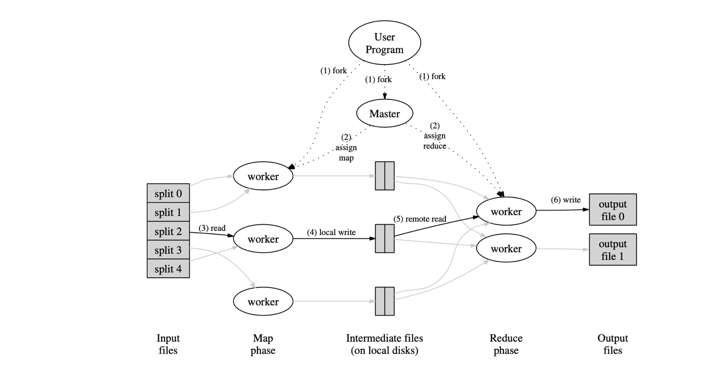
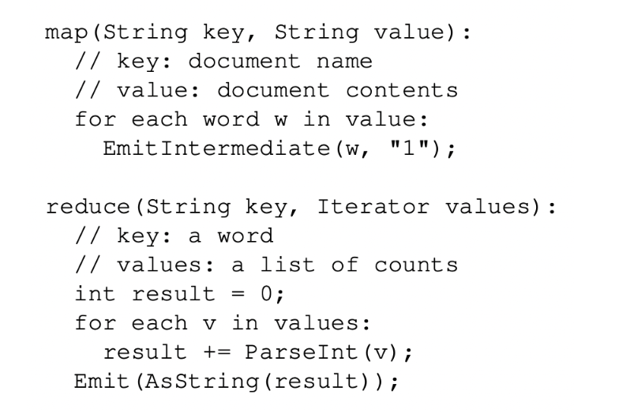

# 分布式学习笔记

（MIT6.284）

## Lec1

分布式系统的特点/议题：并行、容错failure tolerance、安全性、隔离性

难点/挑战：并发问题、局部错误partial failure、充分发现性能

三大内容：存储、网络(通信)、计算

### MapReduce编程模型

- 背景/需求

    mapreduce是谷歌公司在2004年的一篇论文上正式提出的分布式系统的编程模型。当时谷歌需要处理非常大范围的分布式存储的数据，而又没法让员工都精通分布式编程。

    mapreduce的目的就是设计一种分布式编程的统一抽象编程模型，让用户只需要会写模型中跟分布式架构关系不大、跟业务需求相关的函数模块，就能实现分布式编程解决问题。谷歌则需要为模型中与分布式系统相关的部分编写库。这样可以实现业务逻辑和分布式系统细节的分离，为编程者简化问题。

    要想设计这样的模型，主要有三个问题：怎样设计抽象的编程模型使得其能表示大多数分布式架构下的问题需求？怎样设计分布式相关部分的库使得其能处理分布式架构下如容错、并行、通信的多种问题挑战？用户需要面对哪些接口、如何编程解决具体问题？

- 模型

    - 整体

        

        分布式系统的特点是存在若干个主机组成的集群，有着各自独立的存储和处理器。用户程序在编程时可以不知道这些细节，但运行时需要按某种规则分配给不同主机特定的任务，完成最终计算。这些可以参与工作的主机称为worker，worker里面有一个特殊的主机称为master，负责给普通worker分配任务、进行一些全局管理工作，worker则是具体执行任务的主机。存储输入数据的磁盘也是分布式的，它们可以是附属在主机上、一对一的，也可以是独立的、由系统负责分配输入。

        worker分为两类，一类负责map，一类负责reduce。输入数据先由map主机进行map函数处理生存中间产物，中间产物再作为reduce主机的reduce函数生成结果文件。map和reduce是该系统提供给用户的编程接口，需要由用户实现。

        千万注意一般情况下worker的map任务和reduce任务是动态分配的，并不是一个worker只负责一种任务。

        

        - Map：接受一个输入对(比如<文件名，文件内容>)，生成一个key-value的列表。
        - Reduce：接受一个<key，value列表>的输入，进行类似统计的工作，生成一个value列表(比如统计单词总数，那么列表就是一个值，该key的总数)。Reduce函数处理的<key，value列表>是根据map生成的中间产物集统计生成的，value列表中是所有中间产物中该key所对应的value，可以来自不同主机。

        理论上来讲Reduce任务的工作有整体统计的性质，因此需要所有Map任务全部做完、生成完所有中间结果后才能进行，也就是整个系统整体也会分为Map和Reduce两个阶段。实际中可能有优化方法使得能同时进行？

        

        如图，是给定若干个文件，统计各个单词出现的次数，是最简单的mapreduce样例。

    - 流程

        当服务器调用MapReduce函数处理某个问题时，处理流程如下，七个步骤：

        1. 将输入文件分配到各个存储磁盘上。如果本身就是分布存储的，这一步可以忽略。然后给自身程序fork到多个分布式系统的主机上。
        2. 给各个主机分配任务：一个master主机，其他的时worker主机，worker主机分为M个map任务的主机、R个reduce任务的主机。被分配任务的主机需要是空闲(idle)的。
        3. map任务主机读取输入文件、按照用户编写的map函数生成中间产物key-pair对，存在内存buffer中。
        4. 定时进行写回：每过一段时间，buffer中的中间产物写回磁盘，这个磁盘通常就是map任务主机自己的本地磁盘。这些本地磁盘被划分函数(partitioning function)分为R个区域，中间产物在本地磁盘中的位置被传回master，用于将这些位置信息告知reduce任务主机。
        5. 当空闲的reduce主机被master告知有新的中间产物产出时，根据中间产物的位置，使用远程进程调用，读取map任务主机本地磁盘对应中间产物的数据到reduce主机本地。读取完毕后，对中间产物的这些<key, value>pair按key进行排序。
        6. 排序完成后，reduce主机用迭代器访问按顺序访问每一个pair，将相同key的pair组成<key, list< value >>，作为用户编写的reduce函数输入，生成结果，结果直接写入该reduce主机的输出文件上。
        7. 当所有负责map/reduce的worker都完成任务后，master表示MapReduce函数执行完毕，回到用户程序。当执行完毕时，最终的输出是R个输出文件，此时不需要手动将其合并。当然如果需要最终结果可以合并，如果不需要，那很可能是把它再作为另一个MapReduce系统的输入。

    - 用户实现/系统实现的部分对比

        - 用户负责的部分：将问题抽象成MapReduce模型能解决的问题；Map、Reduce函数的编写；理解输入文件和输出文件。
        - MapReduce系统库实现的部分：除了用户负责部分的其他几乎全部，如整体流程控制、各主机任务的分配、存储文件向map主机的分配、reduce主机通过远程调用获取map主机的中间产物、reduc主机对pair的排序以及迭代生成<key, list< value >>表等等。这些可能涉及到分布式架构下的诸多问题，比如通信问题、数据一致性问题、并行并发问题、容错问题，这些是MapReduce系统库自己解决的部分，对用户隐藏。

    - 任务粒度

        即M和R的大小控制，到底将任务分配给多少主机合适。

        - 任务主机数多：每台主机任务轻、处理速度快。但是管理任务主机也需要开销，分布式问题如一致性、通信、容错等问题更容易暴露，有性能瓶颈。
        - 任务主机数少：每台主机任务重、处理速度慢。管理任务主机开销变小、管理容易，分布式问题减轻。

        实际中要权衡考虑，比如一般认为M要让平均每台map主机处理约16～64MB的输入数据。

        另外M和R的比例也要控制好，因为两者在任务上有顺序关系，如果一方太多另一方太少，多的那一方会常在空闲状态，少的那一方则会成为性能瓶颈。

    - 主机级别容错

        - worker异常

            master会定时ping一下worker主机，如果多次ping不到，则认为worker出现异常，所有该主机进行的任务，无论是否完成，一律抛弃，回到原始状态。此时要么尝试重启该worker，如果不行，它负责的任务要交给别的空闲worker重做。实际工程上可能涉及到更多细节。

        - master异常

            master只有一个，出错概率较低。如果为了恢复性，可以在master主机中维护日志，并设置检查点checkpoint存当前状态备份，如果发生master崩溃，回溯到该时刻继续执行。

    - 掉队任务-备份任务

        在分布式系统中并不是每个主机时刻忙碌、等进度地完成自己的任务，由于网络、主机自身性能、任务量等诸多因素，很可能出现同样是map/reduce任务的主机，一个是idle状态，另一个却在很慢地执行着自己的任务，此时必须等待这种“掉队”任务执行完才能继续。“备份任务法“可以用来解决：对于idle状态的主机，不让他闲着，而是拷贝一个进度较慢的主机的相关内容进入该空闲主机，作为备份，两者同时执行任务，如果原主机先完成，那么这个备份可以抛弃。如果备份任务先完成，那么抛弃原主机的任务，将备份任务的输出作为结果。这种方法可以较大程度提升执行速度。当然，也一定程度上增大了工作量。

- 改进

    存在着多种改进MapReduce系统性能的方法：

    Partitioning function, ordering guarantees, combiner function, input and output types, side-effects, skipping bad records, local execution。具体先略。

## Lec2

为什么分布式系统中需要多线程

1. I/O并发
2. 提高并行性、CPU利用率（分布式服务器负载可能很大）
3. 后台工作：运行后台线程进行周期性工作，而不需要将这部分工作嵌入到主程序中。

## Lec3

### GFS

