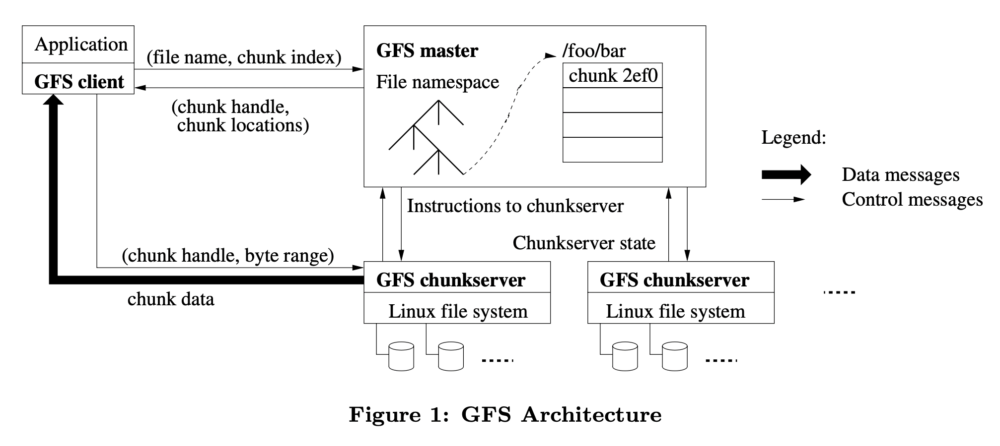
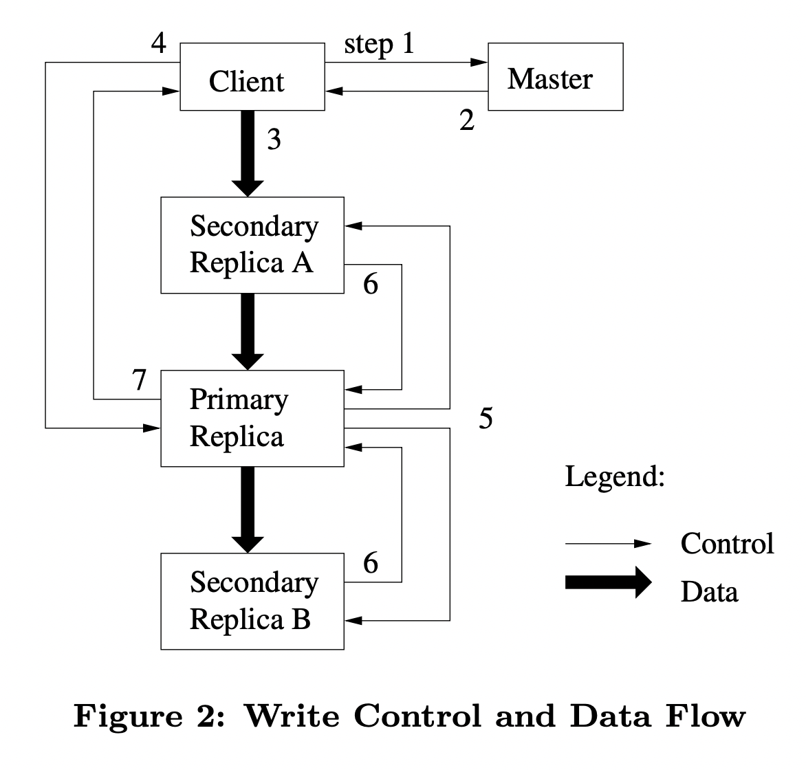
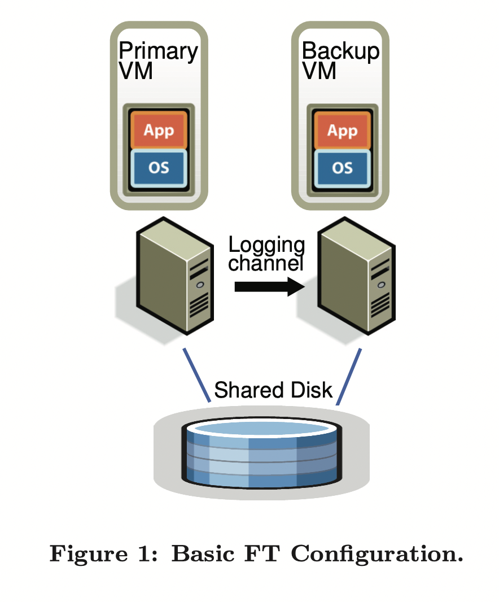
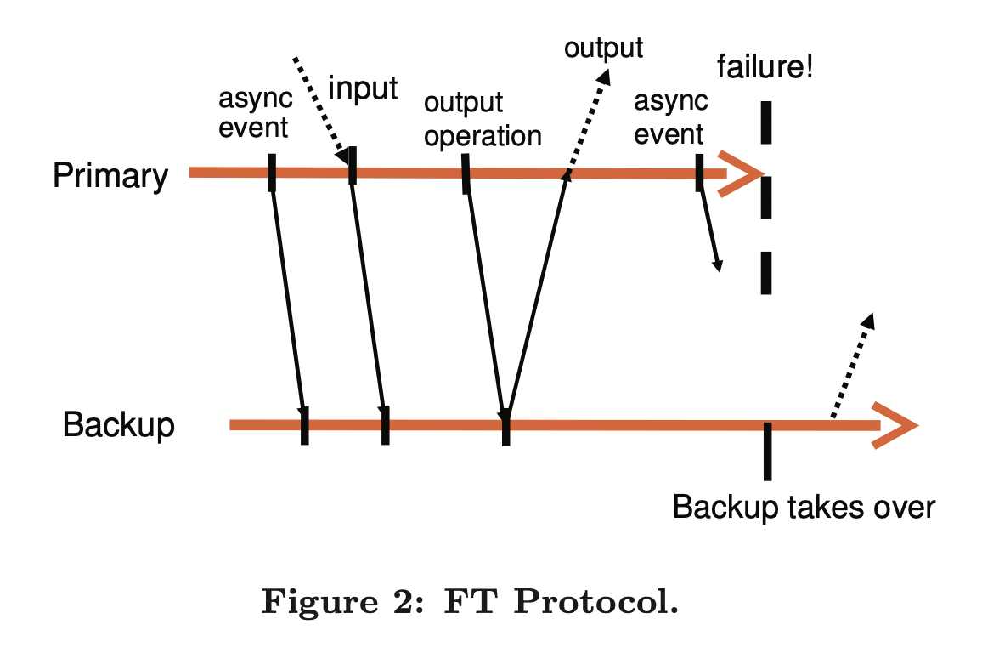

# 分布式系统笔记

此笔记基于MIT-6.284。

## Introduction

分布式系统的特点/议题：并行、容错failure tolerance、安全性、隔离性

难点/挑战：并发问题、局部错误partial failure、充分发现性能

三大内容：存储、网络(通信)、计算

## MapReduce

mapreduce是一种分布式系统下的**编程模型**。[paper link](http://nil.csail.mit.edu/6.824/2020/papers/mapreduce.pdf)

- 背景/需求

    mapreduce是谷歌公司在2004年的一篇论文上正式提出的分布式系统的**编程模型**。当时谷歌需要处理非常大范围的分布式存储的数据，而又没法让员工都精通分布式编程。

    mapreduce的目的就是设计一种分布式编程的统一抽象编程模型，让用户只需要会写模型中跟分布式架构关系不大、跟业务需求相关的函数模块，就能实现分布式编程解决问题。谷歌则需要为模型中与分布式系统相关的部分编写库。这样可以实现业务逻辑和分布式系统细节的分离，为编程者简化问题。

    要想设计这样的模型，主要有三个问题：怎样设计抽象的编程模型使得其能表示大多数分布式架构下的问题需求？怎样设计分布式相关部分的库使得其能处理分布式架构下如容错、并行、通信的多种问题挑战？用户需要面对哪些接口、如何编程解决具体问题？

- 模型

    - 整体

        

        分布式系统的特点是存在若干个主机组成的集群，有着各自独立的存储和处理器。用户程序在编程时可以不知道这些细节，但运行时需要按某种规则分配给不同主机特定的任务，完成最终计算。这些可以参与工作的主机称为worker，worker里面有一个特殊的主机称为master，负责给普通worker分配任务、进行一些全局管理工作，worker则是具体执行任务的主机。存储输入数据的磁盘也是分布式的，它们可以是附属在主机上、一对一的，也可以是独立的、由系统负责分配输入。

        worker分为两类，一类负责map，一类负责reduce。输入数据先由map主机进行map函数处理生存中间产物，中间产物再作为reduce主机的reduce函数生成结果文件。map和reduce是该系统提供给用户的编程接口，需要由用户实现。

        千万注意一般情况下worker的map任务和reduce任务是动态分配的，并不是一个worker只负责一种任务。

        

        - Map：接受一个输入对(比如<文件名，文件内容>)，生成一个key-value的列表。
        - Reduce：接受一个<key，value列表>的输入，进行类似统计的工作，生成一个value列表(比如统计单词总数，那么列表就是一个值，该key的总数)。Reduce函数处理的<key，value列表>是根据map生成的中间产物集统计生成的，value列表中是所有中间产物中该key所对应的value，可以来自不同主机。

        理论上来讲Reduce任务的工作有整体统计的性质，因此需要所有Map任务全部做完、生成完所有中间结果后才能进行，也就是整个系统整体也会分为Map和Reduce两个阶段。实际中可能有优化方法使得能同时进行？

        

        如图，是给定若干个文件，统计各个单词出现的次数，是最简单的mapreduce样例。

    - 流程

        当服务器调用MapReduce函数处理某个问题时，处理流程如下，七个步骤：

        1. 将输入文件分配到各个存储磁盘上。如果本身就是分布存储的，这一步可以忽略。然后给自身程序fork到多个分布式系统的主机上。
        2. 给各个主机分配任务：一个master主机，其他的时worker主机，worker主机分为M个map任务的主机、R个reduce任务的主机。被分配任务的主机需要是空闲(idle)的。
        3. map任务主机读取输入文件、按照用户编写的map函数生成中间产物key-pair对，存在内存buffer中。
        4. 定时进行写回：每过一段时间，buffer中的中间产物写回磁盘，这个磁盘通常就是map任务主机自己的本地磁盘。这些本地磁盘被划分函数(partitioning function)分为R个区域，中间产物在本地磁盘中的位置被传回master，用于将这些位置信息告知reduce任务主机。
        5. 当空闲的reduce主机被master告知有新的中间产物产出时，根据中间产物的位置，使用远程进程调用，读取map任务主机本地磁盘对应中间产物的数据到reduce主机本地。读取完毕后，对中间产物的这些<key, value>pair按key进行排序。
        6. 排序完成后，reduce主机用迭代器访问按顺序访问每一个pair，将相同key的pair组成<key, list< value >>，作为用户编写的reduce函数输入，生成结果，结果直接写入该reduce主机的输出文件上。
        7. 当所有负责map/reduce的worker都完成任务后，master表示MapReduce函数执行完毕，回到用户程序。当执行完毕时，最终的输出是R个输出文件，此时不需要手动将其合并。当然如果需要最终结果可以合并，如果不需要，那很可能是把它再作为另一个MapReduce系统的输入。

    - 用户实现/系统实现的部分对比

        - 用户负责的部分：将问题抽象成MapReduce模型能解决的问题；Map、Reduce函数的编写；理解输入文件和输出文件。
        - MapReduce系统库实现的部分：除了用户负责部分的其他几乎全部，如整体流程控制、各主机任务的分配、存储文件向map主机的分配、reduce主机通过远程调用获取map主机的中间产物、reduc主机对pair的排序以及迭代生成<key, list< value >>表等等。这些可能涉及到分布式架构下的诸多问题，比如通信问题、数据一致性问题、并行并发问题、容错问题，这些是MapReduce系统库自己解决的部分，对用户隐藏。

    - 任务粒度

        即M和R的大小控制，到底将任务分配给多少主机合适。

        - 任务主机数多：每台主机任务轻、处理速度快。但是管理任务主机也需要开销，分布式问题如一致性、通信、容错等问题更容易暴露，有性能瓶颈。
        - 任务主机数少：每台主机任务重、处理速度慢。管理任务主机开销变小、管理容易，分布式问题减轻。

        实际中要权衡考虑，比如一般认为M要让平均每台map主机处理约16～64MB的输入数据。

        另外M和R的比例也要控制好，因为两者在任务上有顺序关系，如果一方太多另一方太少，多的那一方会常在空闲状态，少的那一方则会成为性能瓶颈。

    - 主机级别容错

        - worker异常

            master会定时ping一下worker主机，如果多次ping不到，则认为worker出现异常，所有该主机进行的任务，无论是否完成，一律抛弃，回到原始状态。此时要么尝试重启该worker，如果不行，它负责的任务要交给别的空闲worker重做。实际工程上可能涉及到更多细节。

        - master异常

            master只有一个，出错概率较低。如果为了恢复性，可以在master主机中维护日志，并设置检查点checkpoint存当前状态备份，如果发生master崩溃，回溯到该时刻继续执行。

    - 掉队任务-备份任务

        在分布式系统中并不是每个主机时刻忙碌、等进度地完成自己的任务，由于网络、主机自身性能、任务量等诸多因素，很可能出现同样是map/reduce任务的主机，一个是idle状态，另一个却在很慢地执行着自己的任务，此时必须等待这种“掉队”任务执行完才能继续。“备份任务法“可以用来解决：对于idle状态的主机，不让他闲着，而是拷贝一个进度较慢的主机的相关内容进入该空闲主机，作为备份，两者同时执行任务，如果原主机先完成，那么这个备份可以抛弃。如果备份任务先完成，那么抛弃原主机的任务，将备份任务的输出作为结果。这种方法可以较大程度提升执行速度。当然，也一定程度上增大了工作量。

- 改进

    存在着多种改进MapReduce系统性能的方法：

    Partitioning function, ordering guarantees, combiner function, input and output types, side-effects, skipping bad records, local execution。具体先略。
    
    

## GFS

Google File System是谷歌公司开发的**分布式文件系统**。[paper link](http://nil.csail.mit.edu/6.824/2020/papers/gfs.pdf)

- GFS的应用场景传统文件系统的不同、情景假设。

    1. 组件故障component failure是常态而不是异常情况。

        GFS往往涉及极多的存储节点，比如几百、上千甚至上万，每台机器都可能出现软件、硬件、网络上的问题，应该假设failure在系统中频繁出现，而不是当作特殊情况来处理。所以镜像、错误检测、容错、自动恢复等功能非常重要

    2. 文件数量可能非常多、单个文件大小可能非常大。

    3. 对文件的操作主要集中在**追加写入(appending)**。而不是重写覆盖、删除等操作。假设随机访问Random access非常少。文件如果读，通常是当作数据流顺序读。

        这意味着追加式访问是性能优化的重点，而不是用类似设置block cache加快随机访问之类的方法。这与数据库文件的访问模式大大不同。

    4. 同时设计文件系统的API和应用程序有助于提高灵活性。

- GFS的具体场景假设有哪些？

    - 系统由多个易故障的节点组成。必须频繁检查、容错、恢复。

    - 文件系统存有大量文件，百万级别甚至更多，单个文件也可以很大，通常是100MB，GB级文件也很常见。

    - 文件的读操作通常可以认为只有两种：

        - large streaming reads：一次性读取文件中的大块连续数据。
        - small random reads. ：多次随机读取的量一般较少。

    - 文件的写操作有三个假设：

        - 写操作主要是large sequential write，并且是追加appending模式
        - 文件一但被写(初始化)，很少会被再次修改
        - 随机写入不是没有，但是可以认为很少、不需要太efficient，并且随机写的数据量通常非常小。

    - 高持续的带宽，要比低延迟更重要。大多数应用都要求高速批量处理数据，但对单个读写的响应时间要求不高。

        简单来说就是 并行数量大 > 响应速度快

    - 允许一致性较弱的情况发生，可以不总得到完全正确的数据。

    可以看到，这套文件系统跟数据库系统有明显的场景区别。

- GFS的接口有哪些？

    作为一个文件系统，上层的应用程序只关心接口不关心系统实现。

    GFS支持普通文件系统的大部分接口，比如reate, delete, open, close, read, write。

    此外，GFS还额外提供snapshot, record append接口。

    - snapshot：以低成本创建一个文件或者目录树的副本。

    - record append：允许多个客户端同时将数据追加于同一文件，同时保证每个客户端追加操作的原子性。它适用于实现多路合并结果和生产者-消费者队列，许多客户端可以同时追加而无需额外锁定。并发追加，是GFS非常有用的接口。

        

- GFS架构介绍？

    

    - GFS的节点包括一个master、多个chunkserver、多个client。每一个节点都通常可以看作是一个运行用户级服务进程的Linux主机(其实client和chunkserver也可以在同一主机上)。

        - 文件：一个**文件(file)会被分成若干个文件块(chunk)**，每个chunk有唯一的不变标识符chunk handle(chunk间独立，不同文件的chunk的handle也不可能相等)。同一个chunk为了可靠性可能会被复制成几份(GFS默认3份)，这些chunk的handle是相等的，逻辑上都是一个chunk。

            不同chunk(包括同一逻辑chunk的不同备份)可能会被分配到不同的存储节点中存储。

        - chunkserver：是负责存储数据的节点，负责存储chunk。单节点中chunk的储存，底层由Linux文件系统实现。所以也可以看出GFS是分布式、高层次的文件系统，不是单机层次的，需要配合单机文件系统使用。

        - client：用户进程，调用系统API。API经过简化后抽象出文件块的访问请求(这个过程需要应用调用GFS的库，计算chunk index等)：file name + chunk index + byte range。

            其中file name + chunk index会发送给master，master返回chunk handle，也就是chunk逻辑号，以及物理位置上位于哪个存储节点chunk location。client会根据chunk location，直接访问对应的chunkserver，根据chunk handle确定chunk，然后读写byte range内的内容。client会对映射信息进行一段时间内的caching。

            另外，master返回的其实是所有该逻辑chunk的备份(replicas)，client选择其中一个物理chunk备份。需要注意的是，这些chunk的备份replicas可能不完全相同！应用应该允许读到少数不一致的数据。

        - GFS master：负责管理系统元信息，接收client请求，完成file name + chunk index -> chunk handle + chunk locations的映射。具体来说，master至少需要管理如下的信息：

            - 文件的命名空间、数据访问信息
            - file name + chunk index -> chunk handle + chunk locations的映射信息
            - 管理文件区块的分配、回收、迁移。master会周期性向chunkserver发送指令获取其状态信息。

    - GFS的分布式实现思想有如下几个特点、思想。

        - 文件需要**分块**。注意这跟文件在磁盘中分页的思想类似，但是不是一回事、一个层次。一个chunk通常是很多磁盘页。
        - 文件(的块)可以分散到不同存储节点中，而不是只能在一个存储节点中。这有利于可靠性，同时可以让文件大小甚至大于磁盘大小。这种**同一文件分节点分块存储模式又称Sharding(分片)**。
        - 文件的块需要**备份**，以防止某个存储节点崩溃后无法得到那个chunk。这跟分散性是结合的。
        - 存在中央的元信息管理节点master，并且简化情况下是唯一一个master。某种程度上GFS是一个**中心化**的系统，元信息并未分布式存储。master通过周期性与chunkserver通信获取状态信息。
        - 对于client的请求，master只负责告知client想要的chunk在哪个节点上的什么位置，而不负责传输数据。client需要单独与对应的节点交换数据。master的作用是“通报员”而不是“中转站”。master一般只有一个，可以看到master不参与任何实际数据的传输(否则承受不了负载)。数据传输只在client和chunkserver之间进行。
        - 无论是client还是chunkserver都不需要特意对文件数据进行caching。

- GFS中，chunk的具体意义和大小选择是怎样的？

    chunk是文件分块的结构，每个chunk大小是若干个磁盘页，大小比如64MB。每个chunk replica都是某个chunkserver上的一个普通Linux文件。

    大chunk的优劣势如下(反过来就是小chunk的劣优势)：

    - 优势：可以一次获得较多文件数据，可以减少client与master之间的通信，减少master负载、网络负载。同时也可以减少I/O。

    - 劣势：大chunk意味着很多数据集中到一起，所以可能很多client读写数据时，访问的都是同一chunk中的内容，特别是访问小文件时。那么此时该大chunk所在的chunkserver会变成“热点(hot spot)”，负载较高。

        热点问题是GFS需要解决的问题，常用的方法是多备份、client借用等。

- GFS具体需要哪些数据结构维护什么样的元信息？

    GFS的元信息主要是为了file name + chunk index -> chunk handle + chunk locations这个映射服务的，具体主要有三种。

    1. file和chunk的命名空间。
    2. **file name -> all chunk (handles)**的映射信息。
    3. **chunk handle -> all chunk (replica) locations**的映射信息。这里的locations可以认为是chunkserver的list，该chunk的replica在某个chunkserver上具体在什么位置，由chunkserver根据chunk handle自己获取。

    这些元信息全都是in-memory的，但1～2是需要持久化的，方法是磁盘上存operation log。

    其中3是不在master上持久化存储的，而是在系统启动或chunkserver加入系统时，从chunkserver本地直接获取、加载到内存的。在系统运行时，会定时地与chunkserver通信、更新chunk location的信息。之所以这么做，除了空间节省外，还有利于维持master和chunkserver信息的一致性。

    

- GFS的并发模型是怎样的？

- GFS如何维护不同版本chunk replica的一致性？

    

    如果只有读操作，sharding模式固然简单。然而文件分chunk、chunk多备份分散到不同主机这种sharding模式，最大的问题和挑战就在于涉及到写操作(mutation)时，如何同一个逻辑chunk(拥有同一个chunk handle)的不同物理备份replica的内容一致性。

    GFS采用**租赁(lease)**的方式来维护写操作中replica的一致性。对于每个chunk(以下chunk均指逻辑chunk，replica是chunk的物理备份)，当需要时，master会指定(租出)它的其中一个replica为primary，也就是主备份，主备份上的写可以按顺序串行。全局的写顺序是：master租赁primary的顺序 + primary内的写顺序。

    比如master先指定replica A为primary，依次写a, b两条record；然后指定replica B为primary，依次写c, d两条record。那么全局的逻辑写顺序就是a, b, c, d。为了记录先后信息，需要给每个mutation一个序列号serial number。

    primary的租赁在client请求chunk时发生，不同client看到的primary是相同的。如果当时已经有primay，那么会就用这个primary，并把primary的有效时间延长。primary超过有效时间，比如60s，就会被收回，下一次请求时可能选择另一个replica作为primary。

    具体而言，client请求写chunk时会进行如下步骤：

    1. client向master表明自己需要的chunk index，master计算出chunk handle，master告诉client该chunk handle对应的所有replica locations，并告诉哪个是primary。如果当时没有primary，master会分配一个为primary。
    2. client对master返回的<primary location, other replica location>信息进行caching，下一次就可以直接读取这个信息，直到primary失效。
    3. client将要写的数据写入所有replicas(包括primary和other)。顺序随意。
    4. 所有replicas都确认收到写的数据后，client再向primary发送一个写请求，给primary内未标号的mutation赋予序列号。
    5. pirmary将自身写请求forward给其它replica(secondary relicas)。每个replica会按照primary内相同的序列号给mutation进行标号。
    6. secondary relicas告诉primary完成了标号。
    7. primary回复client，表示写完成。如果任何步骤出了错，比如某个replica没有完成写，那么会给client包错。client认为请求失败。这可能导致replica内容不一致(其实包括步骤4的确认失败也会导致这种情况)。

    为什么client写数据同时向所有replica写，但却需要一个特殊的primary？事实上primary的作用是整合mutation的顺序、版本序列。注意“client同时向所有replica写”这个句话底层有两点需要注意：

    - 同一client可能需要传递多条写数据信息。
    - 不同client可能并发地写同一chunk的replicas。
    - 无论是同一client内还是不同client间，不同replica都不是同时、瞬时写好的，由于网络延迟等原因，真正的写顺序很可能跟client的写请求发起顺序不同。

    而primary的作用就是采取这个primary replica的写顺序作为真正的写顺序，把顺序(序列号列表和mutation号的映射)广播给其它replica，纠正、统一写顺序。另外，如果因为一些意外情况出现replicas的版本不一致，那么可以以primary为标准进行统一。

    primary需要收回，收回时逻辑**chunk的版本号**(replica里也有记录)会增加，并且只在此时增加。

    GFS的一致性是弱一致性/宽松一致性。在写时，如果向replica的数据传输部分失败或者控制信息(序列号分配信息)传输部分失败，那么会导致我不同replica内内容不同。
    
    

## FTVM

FTVM(Fault-Tolerant Virtual Machines)是基于备份的**分布式可容错虚拟机处理系统**。[paper link](http://nil.csail.mit.edu/6.824/2020/papers/vm-ft.pdf)

- ftvm面向的是什么场景需求？

    ftvm是基于备份的容错性虚拟机处理系统。如果说mapreduce介绍的是分布式的编程模型，GFS是分布式的文件系统(负责分布式存储)，那么ftvm可以认为是分布式的计算主机(负责分布式计算)。

- ftvm的基本思想是什么？

    - 计算主机抽象成**虚拟机**(这有利于看作有限状态机)。

    - 虚拟机通过**单备份**进行容错，分为primary和backup server。
    - backup通过**状态转移**的方式与primary同步，减少网络中的同步信息传输量。
    - 应用程序只与primary VM直接交互，primary把输入通过logging channel转发给backup，backup与primary执行相同的操作，但输出被管理程序(hypervisor)丢弃。
    
- ftvm的维护主从一致性的协议是怎样的？

    

    首先，维护一致性的基本方式是determinisitic replay，也就是primary把自己的操作以log entry的形式发给backup，backup通过执行即可同步状态。log entry通过logging channel直接发送，而不是通过共享磁盘等。
    
    观察协议图可以发现，对于同步事件，**要求primary必须在确认backup收到input对应的log entry后(channel中收到ACK)，才可以向client返回输出**。这又被称为Output Rule。这么做是防止primary输出到一半、且未将input完全同步给backup时，出现failure，否则这种情况下backup无法继续产生primary本该生成的输出。注意output意味着client认为请求成功、将要收到返回数据，这个过程必须能让backup接管primary。这也称为Output Requirement：如果backup接管了出现failure的primary，那么backup将以与主虚拟机发送到外部世界的所有输出完全一致的方式继续执行(the backup will continue executing in a way that is entirely consistent with all outputs that the primary VM has sent to external world)。
    
- ftvm系统中怎样检测failure？检测到后具体怎样切换primary？

    (以下介绍存在简化，可能不完全准确)

    FTVM采用**heartbeat + logging channel detection**的方法检测failure。前者是定时ping另外一个主机；后者则是管理程序检测logging channel中是否还有entry流，如果没有，大概率存在failure。
    
    如果检测到primary或者backup有failure，那么另一个正常运行的主机会go live，也就是脱离recoding mode，独立运行。
    
    - primary failure：backup会先replay所有没有同步完的log entry，然后成为primary。hypervisor停止丢弃backup的output，作为新输出源。为了可靠性需要在另一个主机上生成一个新的backup同步。
    - backup failure：primary正常工作，在新主机上生成新的backup。
    
- 脑裂问题split brain problem是什么意思？怎么解决？

    脑裂其实是分布式一致性问题中比较常见的问题：两个备份(primary和backup)各自没有发生failure，都可以与client通信，但彼此间的(网络)通信出现了问题，导致双方都认为对方发生了failure，从而各自独立、都成为primary去服务client，即出现diverging的现象。GFS的chunk主从一致性维护也会有类似问题。

    脑裂是原因可以认为是缺少中心统一管理程序。FTVM中，维护一个Test-And-Set的中心服务进程，任何一个VM，如果想成为primary，需要向中心TAS进程发起请求，**TAS会原子性地修改标识位**，表示改VM成为primary。到底允许哪个VM成为primary还有类似投票之类的机制。TAS的作用是“集权”，保证系统中最多有一个primary。
    
- ftvm有哪些实现细节？

    事实上完全按照状态转移的方式进行主从同步是非常具有挑战性的，比如如何处理结果有随机/环境性影响的指令、如何处理中断等。其它方面也有大量细节，比较复杂。

    待补充。具体见论文。
    
    

## Raft

Raft(Reliable, Replicated, Redundant, And Fault-Tolerant)是一种**分布式一致性算法**。[paper link](http://nil.csail.mit.edu/6.824/2020/papers/raft-extended.pdf)

