# Java笔记

## Java环境

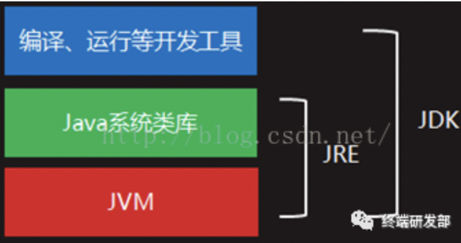

Java先将代码视为字节码，交给JVM进行编译。

Java和c++的区别：

- java隐藏了指针的概念，所有对象本质上都是引用。java没有多继承。java没有虚继承。java没有模版的概念。java不支持自定义运算符重载。java没有宏定义。java没有const关键字（类中的final代替）。java没有全局变量、全局函数。java没有声明、头文件的概念。
- java是完全的OOP，除了原始类型，一切均为类，有以Object类为根的树形类继承结构。java支持接口（重要）。java项目有模块、包的概念，权限多了default。java的对象都开辟在堆区，数组也必须new创建。java拥有一套内存的自动管理、垃圾回收机制。java对象传参默认传的是引用（而不是c++里形参那套）。java没有析构函数，可重写finalize函数，此函数在系统自动析构时被调用。java中有内部类的概念，存在匿名类语法。java可以通过super调用父类函数。

## Java项目结构

项目project > 模块module > 包package > 类class

类是最小编译单元，编译形成.class文件。

## Java类

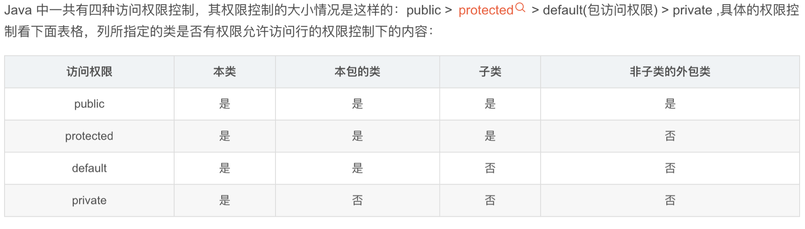

在C++中没有包的概念，Java中同一个包中的类相关性往往较强，default权限可以允许本包类访问。

类构建流程：

静态成员构建与初始化 --> 非静态成员变量初始化 --> 构造函数执行

final关键字：

修饰成员变量：变量不可改变，即常量，常跟static搭配，类似c++的宏定义。

修饰成员方法：不能被子类override，自身必须有函数体。

修饰类：不能被继承的，功能完整的类。

static关键字（共享，只有一份数据）：

修饰成员变量：表示该变量被所有对象共享。

修饰成员方法：不依赖具体对象调用，无法访问非静态成员变量

- java中的 == 运算符判断规则，equals方法

    对于原始类型，== 就是简单的数值判断，简单。对于对象间的比较，“==”比较的是对象背后的地址是否相等，即是否是一个对象。

    equals是Object的成员方法，根据具体的函数内容判断是否。

    但需要注意的是，判断两个对象是不是一个对象需要注意，有如下原则：

    用显示new创建的对象一定获得的是自己的新建地址。两个new出来的对象地址不可能相等。

    对于Integer、Float这种，每个字面量都对应了一个默认的类对象，如果不用new创建（事实上这种原生类型的衍生类的new创建已经被弃用），那么==比较仍是值相等即相等（因为每个值背后都有唯一的对象映射）

    对于String对象，如果采用=进行初始化，会根据字面量的值分配空间，但如果后续进行修改（如拼接），就相当于new创建的独立空间，不再跟其它创建的String相等。

    

## 接口Interface

抽象：

Java没有virtual关键字，大多数情况下默认函数均为virtual（动态绑定，除非不可能被重写的情况是静态绑定）

c++用virtual = 0表示一个函数是纯虚函数，必须被子类重写，且类为抽象类，不能制造对象，必须有将纯虚函数全部重写完毕的子类。

Java中abstract关键字可以实现上述的纯虚功能。

abstract修饰类，表示抽象类，抽象类中可以定义抽象函数，也用abstract修饰，无函数体，必须被子类重写，切不能private。

一般的抽象类也可以有正常的非抽象函数，子类可以选择是否重写。

接口（完全抽象类):

接口也是一种类，内部所有成员函数均为抽象函数，没有实现。

具体性质是：

- 所有成员方法都是抽象的，且是public的
- 所有成员变量，如果有，则都是**public static final**的（常量）

有单独的关键字interface替代abstract class

public interface InterfaceName extends BaseInterfaces

接口也可以继承。

注意，如果有**子类想要实现接口**

用关键字implements

class ClassName implements interfaces

虽然Java不允许多继承，但是允许一个类同时实现多个接口。

接口和抽象类的区别：

接口不能有非常量的成员变量，如果有成员变量，必须是**public static final**的（常量）

接口允许多继承（一个类可以实现多个接口，一个接口也可以继承多个接口），抽象类不行。

从功能上来讲，接口用来**抽象功能**，抽象类用来抽象类别。

## 内部类

内部类即定义在类（外部类）里面的类，分为两类四种

- 定义在外部类的局部位置上

    - 局部内部类（有类名）

        没有权限标识（类内可访问），但可以用final。与外部类重名时就近原则。

        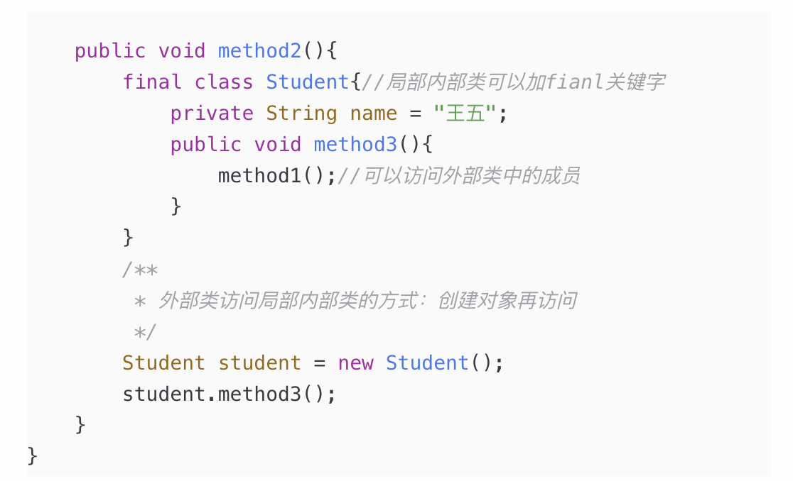

    - 匿名内部类

        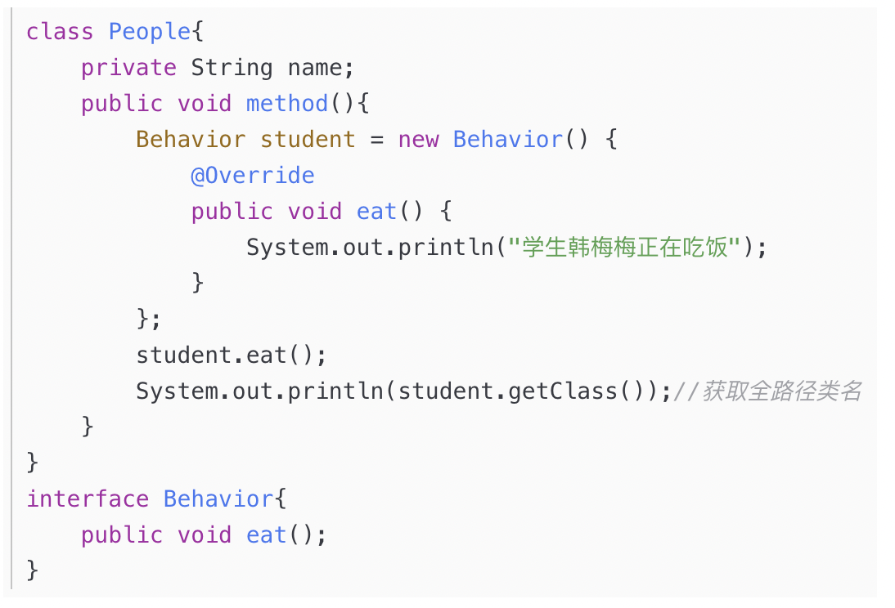

        如图，不显示创建子类，而是直接以new父类（）{重写函数} 的形式创建匿名子类。由于实际中可能经常需要临时生成各种接口/抽象类的实例，这种匿名写法较为简单，在传参时也比较好用，可以较少代码量。匿名内部类一般都是接口/匿名类的子类。

         

- 定义在外部类的成员位置上

    - 成员内部类（非static）

        与局部内部类的区别在于定义在成员变量的位置上而非成员方法中，有权限标识。

        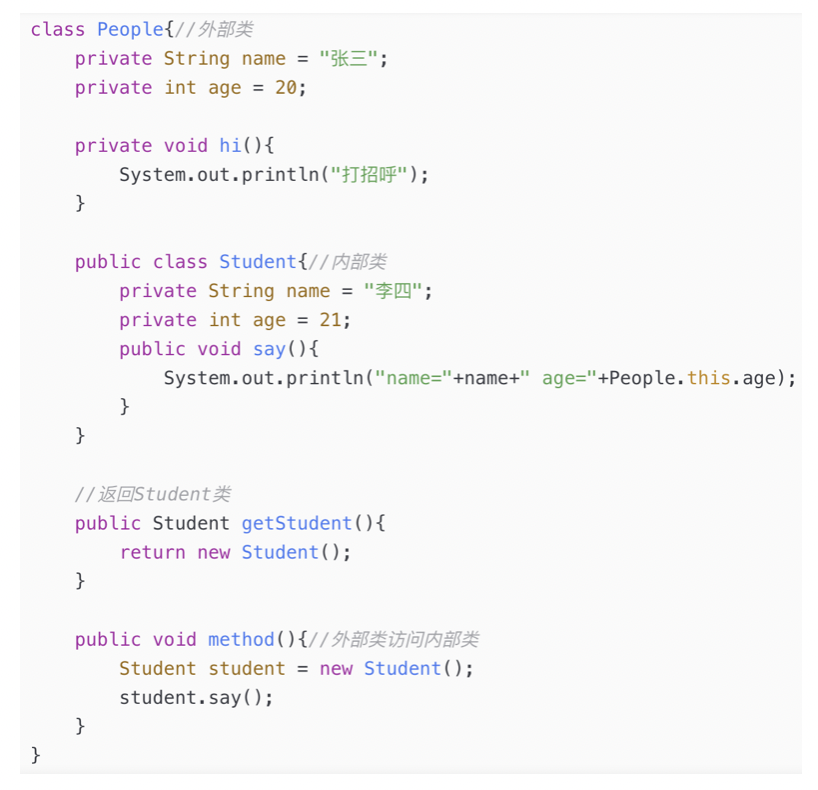

    - 静态内部类（加static）

        不能访问外部类的非静态成员。

## 泛型容器

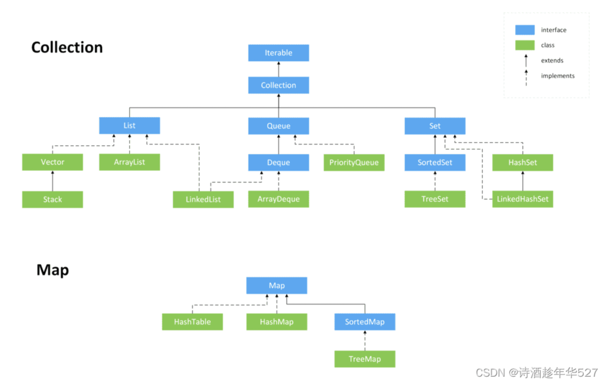

容器继承关系图如上，蓝色的都是接口。注意Map的独立性，Map不是Collection，也不能迭代。

注意子类的容器不是容器的子类：

即Collection< Child >不是Collection< Father >的子类，不存在多态关系。

因此，如果要在函数参数里表示接受某个父类的子类的容器，应该用通配符Collection< ? extends Father >

Set没有重复元素（重复添加会覆盖），不能索引。

## Java枚举

Java可以定义枚举，枚举的权限与类类似。

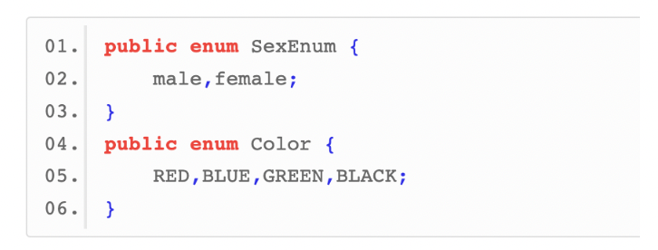

C++中枚举并不是类。

但在Java中，**每一个枚举都是一个类，并且都继承自枚举类（java.lang.Enum），而每一个枚举类型成员都是Enum类的实例**。默认是public、final、static的。(注意枚举本身是一个Enum的子类，其成员是Enum类的实例)

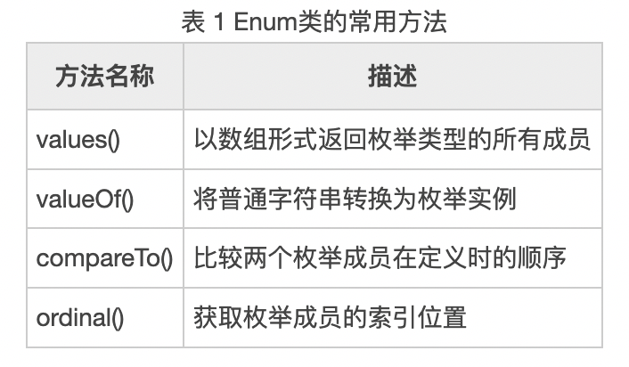

并且有这些常用方法。

## 异常

跟C++一样，Java也提供了异常捕捉处理机制。但是Java的异常都是类对象，形式更规范一些。

java通过throw抛出异常，catch进行捕捉，异常本身是一个实现了Throwable接口的类。

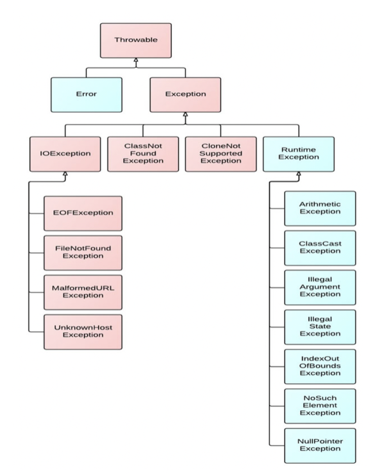

Java自身实现了一些异常类。用户可以自定义异常类。其中蓝色的部分，如果可能抛出这部分异常/错误，可以不做提示说明。否则需要用throws进行说明。

try{}catch(){}catch(){}finally{}是常用的结构，finally可以忽略。

其中catch按顺序依次捕捉并且只会进入一次，**因此子类的捕捉必须在父类之前**。finnaly是一定会执行的部分，如果捕捉到了一次，catch段执行完进入finally段，finally段一般负责资源的释放。

catch中可以直接用throw继续抛出异常递归处理。

## 线程Thread

Java中运行线程的步骤：

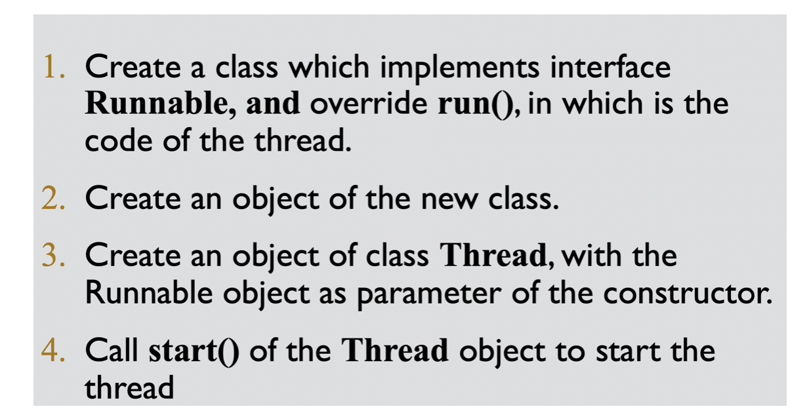

注意Thread类和Runnable接口的关系：Thread类的构造需要传入一个实现了Runnable接口的类的对象，这个对象可以是匿名的。重写的Runnable接口的run函数就是线程执行的部分，而Thread的start函数可以将线程放入准备队列。

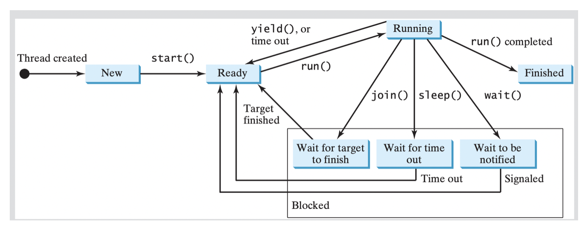

这个图非常关键，是线程的状态转化图。多处理器可能有多个线程同时在run，否则一般是轮流执行。

start：将线程放进就绪队列

run：线程的执行，无法显示调用，操作系统负责调度

sleep：线程等待一段时间再进入就绪队列。注意**sleep是Thread类的静态函数，让当前在run的线程休眠，而不是调用sleep函数的线程。**

wait：等待信号量

join：等待调用join方法的线程执行完毕再进入就绪队列

注意这三个等待类型的方法，等待完毕后都是进入就绪队列，不能保证直接马上继续执行。

线程在自己的时间片结束后会重新进入就绪队列排队，静态方法yield可以让当前运行的线程提前进行这个过程。

线程的数据保护（同步）：

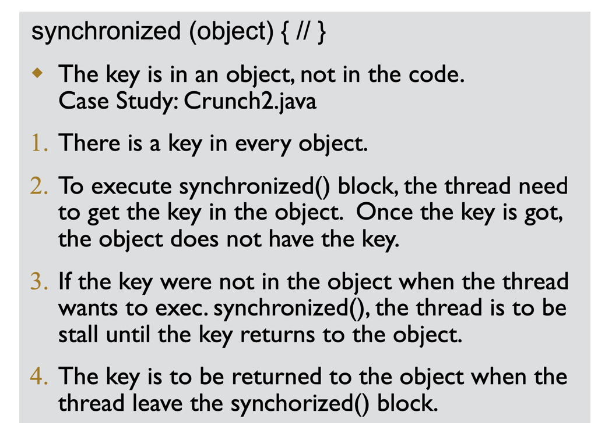

每个object内部都有一个key，线程synchronized的代码段在进入时要求获得这个key（独占），执行完毕释放。其它线程进入时发现没有key则需要stall，等待key释放。这个语法不是为了保护数据，而是为了保证任何时间点最多一个线程在访问这个数据。

类的成员方法可以设定为synchronized，含义是方法代码段整个在synchronized(this)内，称为同步方法。

synchronized本质上是JVM实现的一种内部锁。除此外还有部的显示锁，可以自定义。

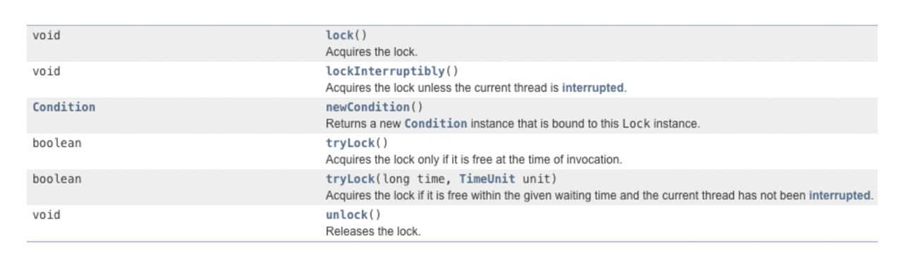

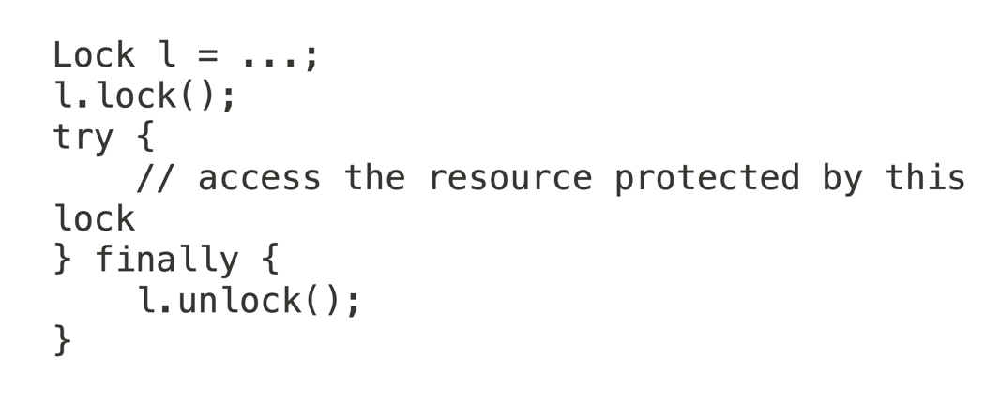

显示锁的优点是：可以跨越函数/代码段、有公平性唤醒、对多重锁支持更好、有tryLock和带超时的锁、支持**读写分离的锁**。

而内部锁则较为简单易写。

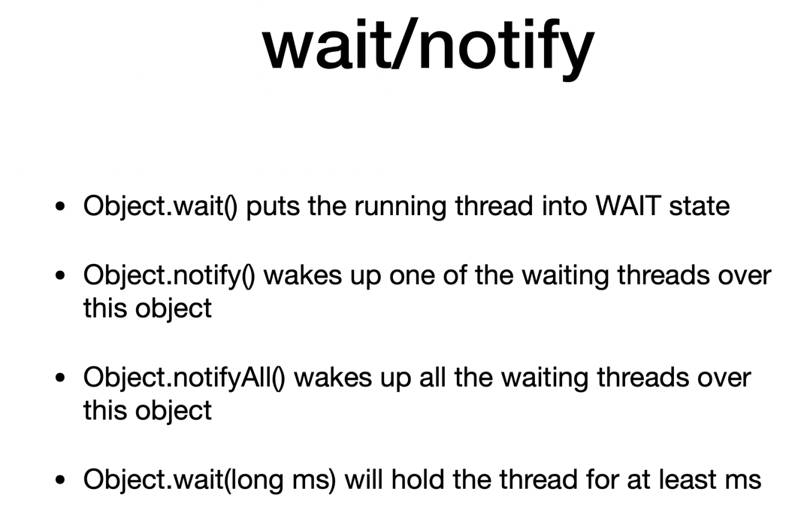

## Socket

## Lamda表达式

