# CPU Schedule (处理器调度)

进程执行过程中，并不是时时刻刻都需要连续使用cpu进行运算的，而是中间会有等待存在（最典型比如进行IO操作，读写磁盘）

所以需要决定每时每刻cpu在运行什么进程，提高CPU利用率。

每个进程又PCB表示，ready queue中用链表连接着若干个PCB。

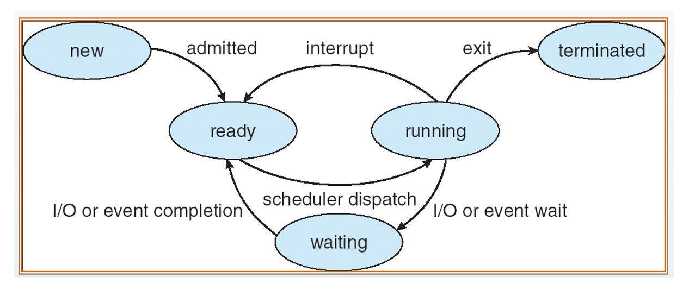

- 指标

​		调度有若干种评判指标

​		CPU utiliation CPU利用率：CPU运算时间占总时间的百分比（减少纯等待IO的时间）

​		throughput吞吐量：单位时间内完成执行的进程数量

​		turnaround time周转时间：执行特定进程的时间（包括运行和等待的时间）

​		waiting time等待时间：进程在ready queue中等待时间

​		response time响应时间：从进程提交请求到响应的时间

- 调度策略

    - preemptive or not：是否抢占，是调度的宏观思路，指是否允许其他进程抢占正在运行的进程，夺取cpu。如果不允许，进程表现为依次顺序执行（但是并不一定按arrival time，而是看当前执行进程结束时的情况）

    - FCFS（First-Come, First-Served ）：先来的进程先执行，可以利用FIFO的队列实现，对长进程有利，适用于CPU繁忙型。

    - SJF（Shortest-Job-First）：剩余执行所需时间最少的进程优先，可以最小化进程平均等待时间。SJF比较理想化，因为实际中难以知道，只能估计进程的剩余执行时间。

    - HRN（Highest response Ratio Next）：定义响应比 HRN = （W+T）/  T，W是等待时间，T是要求的服务时间，响应比越高优先级越高。这是一种兼顾长短进程的调度算法。

    - Round Robin(RR轮转法): RR调度算法每个作业给予一个运行**时间片**，若一个作业在规定的时间片内未运行完，则挂起该作业并调度另一作业(继续)运行（原来未运行完的进程放在就绪队列末尾）。当所有的作业都运行完分配的一个时间片后，第一个作业才再次得到运行的机会。RR 算法性能依赖于时间片的大小，时间片过大则退化为 FCFS算法，时间片过小时则称为“处理机共享” 。该算法是抢占性算法。 RR调度算法是专门为分时系统设计的。它类似于FCFS调度，但是增加了抢占以切换进程。定义了一个较小时间单元，称为时间片（time quantum,or time slice）。时间片通常为10-100ms。将就绪队列作为循环队列。CPU调度程序循环就绪队列，为每个进程分配一个时间片的CPU。RR调度下，每个进程的等待时间有上线(n-1)q, n是进程总数，q是时间片。

    - 多级队列调度

        

    

- 

 

# 进程同步

critical section（临界区）: 进程的关键代码段，代码中表现为人工上锁的部分，可能访问mem等冲突的资源。在多进程问题中，涉及到进程调度，不能有多个进程同时处于cs中。对于未占用CPU的进程，“处于”意味着上次离开进程代码段段位置。

有三个基本要求

- Mutal exclusion(mutex): 最多有一个进程处于临界区中

- Progress：比较难理解的一个要求，有两点

    1. 任何不在临界区的进程都无法阻止其他进程进入临界区
    2. 处于临界区的进程最终一定会离开临界区
    
    另一种表述方式为：如果没有进程在临界区，且某些进程想要申请进入临界区，则
    
    1. 只有未处在remainder section执行阶段的进程才有资格申请临界区
    2. 筛选进入临界区的进程这个过程不能被无限期推迟

- Bounded waiting 有限等待：当一个进程申请进入临界区后，它不能无限期等待，这里无限期不是指时间，而是指不能有无限个其他进程在这之后进入自己的临界区（而忽视这个早早提出了请求的进程），类似于不允许starvation。

算法：

通用模型：

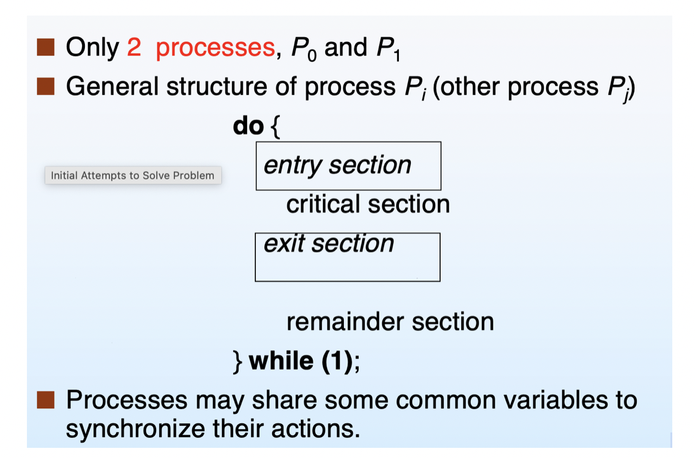

注意critical section和remainder section是程序本来就有的部分，人工划分而成，而entry section和exit section则是为了实现进程同步加入的控制代码段。实际一个进程可能有多个临界区，这只是简化模型。entry section和exit section，也就临界区进入前后的控制代码段的不同决定了进程同步算法。为了简化我们考虑两个进程Pi和Pj的调度。

## 软件方法

软件方法：

- Spinlock算法

    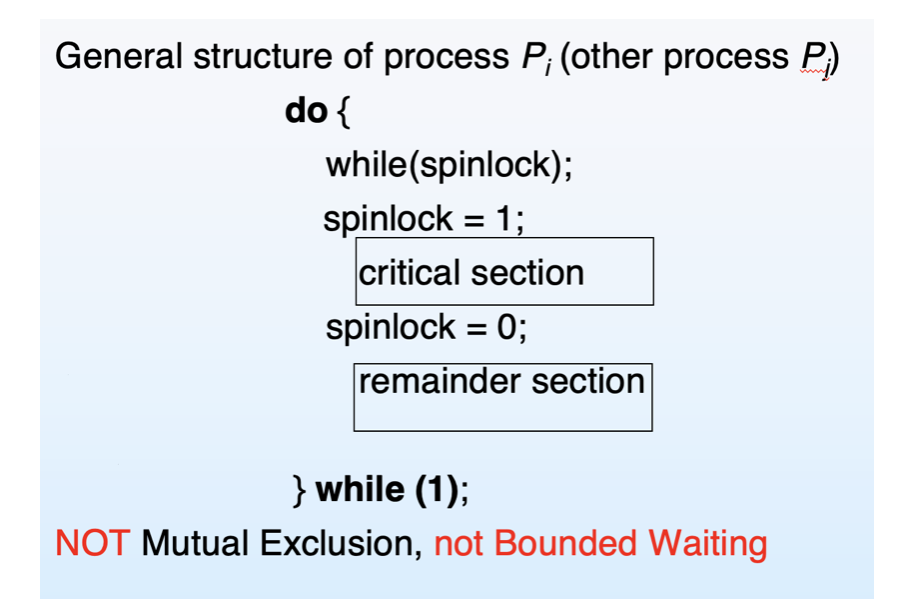

    旋转锁spinlock是一个全局变量，初始为0。思想是进程在临界区中将旋转锁设成1，其他部分设为0，这样就可以互斥。

    不符合互斥的漏洞在于：如果Pi在while(spinlock)；刚跳出循环，准备执行spinlock = 1的时候，调度到另一个进程Pj，此时锁是0，进行Pi、Pj同时处于临界区。

    另外也不满足有限等待：假如Pi每次获取时间片都是在Pj刚做完spinlock = 1的时候，Pi可能会无限次等待，而Pj每次都能进入临界区。

    也不满足Progress：

- Algorithm 1

    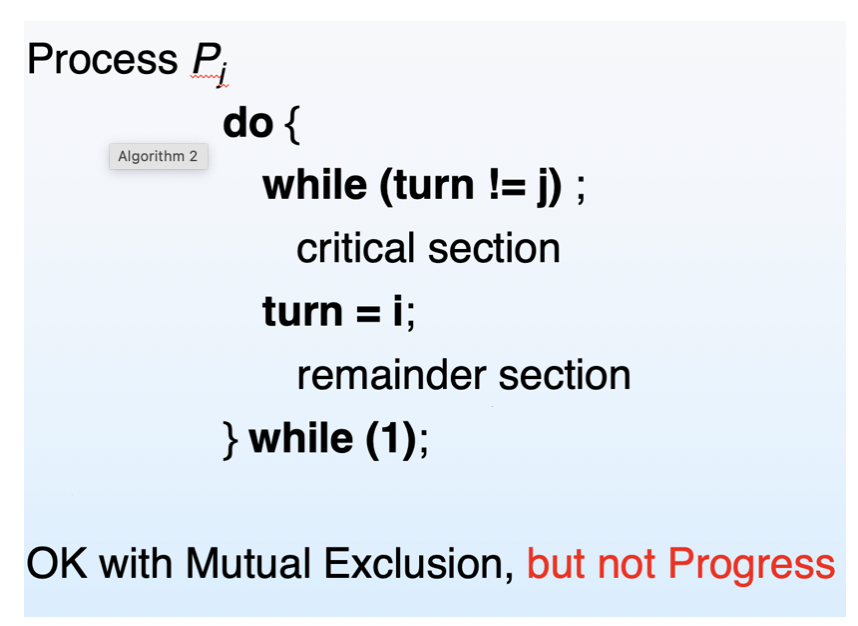

    相比于设置控制临界区访问的全局锁，算法1设置了turn全局变量，表示当前可以占用临界区的进程号，当离开临界区时，将turn赋成另一个进程号。此时可以保证互斥。

    此算法的问题在于：turn只表示了该轮到谁进入临界区，而不管那个进程是否准备好。因此不满足Progress：考虑如下场景：Pj长时间处于remainder阶段，turn = i，Pi执行完critical section、remainder section之后，再次进入while头部，此时turn已经被设为j，但是Pj长时间处于remainder，理论上不应该参与竞争，却阻塞了Pi的执行。算法本质问题是turn是强制赋予的令牌，单方面授予，不管被授予者是否真的需要进入临界区。

- Algorithm 2

    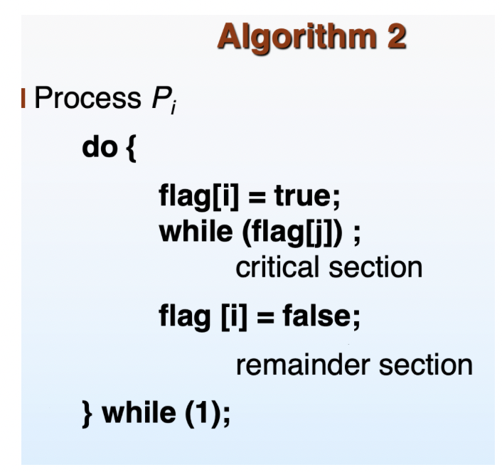

    相比于只用一个全局变量turn表示占用临界区的进程号，此算开辟了进程个数个布尔变量flag[]，flag[i]表示进程Pi是否准备好进入临界区。相比于算法1，算法2在进程内只有权限设置自己的属性值flag，无权干涉其他进程的标志属性值。

    此算法的问题在于：这是一种“绅士风度”的算法，总是优先考虑他人是否有旗帜，如果有自己则等待，这就意味着如果Pi每次都在flag[i] = true 和 flag[i] = false之间被调度到Pj的等待语句，那么Pj看到的flag[i]一直是true，自己一直等待Pi，Pi可以无限多次进入临界区，Pj的竞争被无限期推迟，不满足Posgress和有限等待。

- Peterson‘s solution

    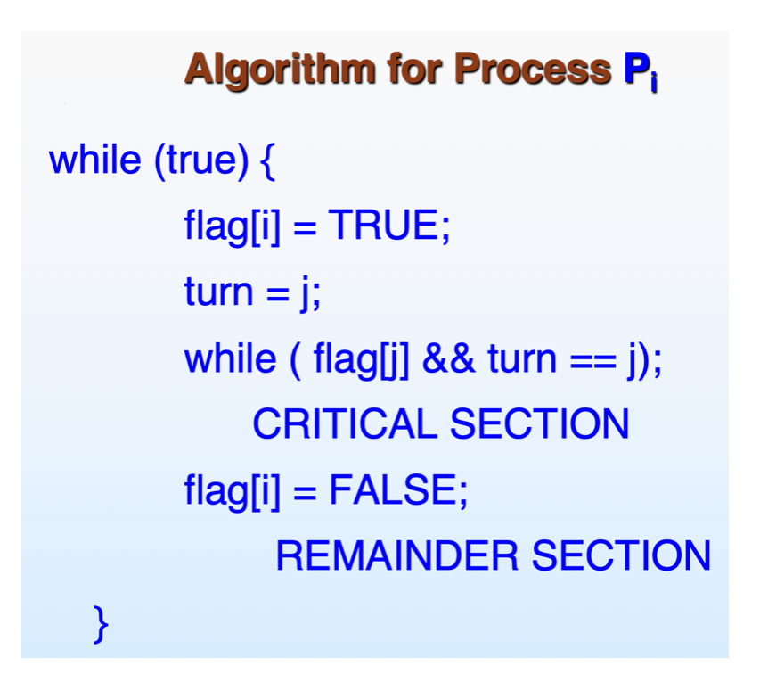

    设置双重保证：turn = i表示该轮到进程i进入临界区，flag[i] = true表示进程已准备好进入临界区。相当于时算法1、2的结合。

    注意这种方法turn= j的位置和算法1不一样。单从Pi形式上看，turn好像是多余的，但其实turn只是为了一种情况：Pi在while等待过程中，cpu调度到了Pj。考虑所说的算法2的bad case，如果还是Pi每次都在两次设flag中被调度到Pj等待部分（一般就是while等待部分），那由于Pi虽然将自己flag设为true，但也将turn设为了j，调度到Pj时while条件不满足，Pj可以进入临界区。

- Lamport’s Bakery Algorithm

    注意算法1、2和Peterson都是两个进程的简单调度模型，Bakery是Peterson推广到n个进程的通用形式，又称面包房算法。

    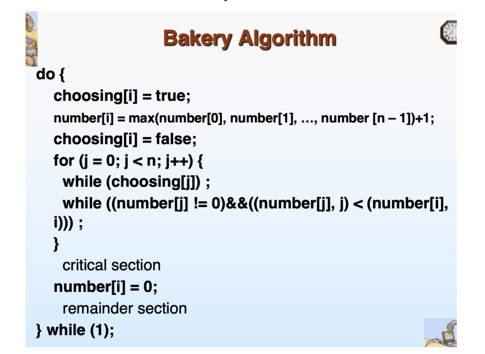

    每个进程在初始进入循环时会获得一个number（递增，但由于多线程调度的存在，可能重复，0视为无效不参与竞争），这个number和进程号的大小构成的偏序关系决定了进程的优先级。

## 硬件层次方法：

软件层次方法实现起来较为复杂、容易出问题且开销较大，考虑硬件上能否实现。

可以看到进程同步的关键一点是锁的控制要具有原子性，才不容易出问题。因此如果能在硬件层面保证指令原子性执行就好了。注意屏蔽所有中断（从而避免进程调度）不是好方法，（尤其在多处理器架构中）严重影响性能。

## 锁方法 lock

lock的基本模型是

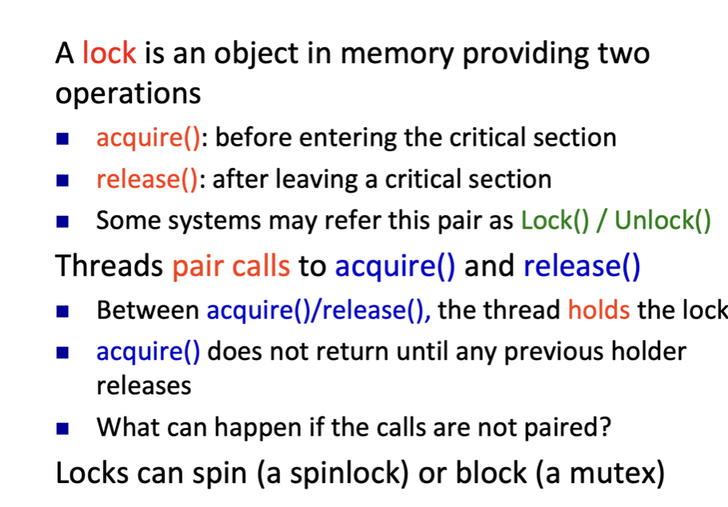

在锁的acquire和release之间执行临界区代码。

两种实现方法及缺点

Spinlock：acuquire过程中如果无法获得锁将一直等待，或者说循环执行nop。缺点是霸占CPU开销大, 尤其不适于单处理器架构。

Disable interrupt：锁住状态屏蔽所有中断，如果长时间这样做会有风险，无法响应时钟、输入中断，且不适用于多处理器架构

- TestAndSet指令，可以将目标指针内容设为true，返回原来target的值。

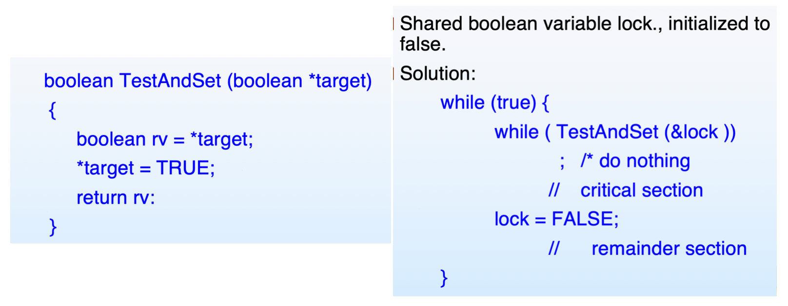

- Swap指令

    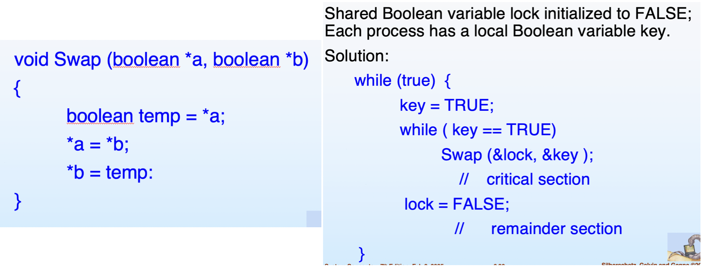

    Swap交换两个布尔量的值。key是每个进程自己的标志，lock是共享的、初值为false的全局变量。

## 信号量方法 Semaphore

信号量方法目的是实现不需屏蔽中断且高效（不需要让CPU在等待进程上耗费时间）的进程同步。信号量与锁的一个重要区别是，如果信号量方法中看到某个进程无法进入临界区需要等待，不会在原地等待调度给别的进程，而是主动block自身，转而执行别的进程，从而减少了CPU无用的等待时间。

一个信号量代表了一种资源的可用（能被共享的线程的）数目。

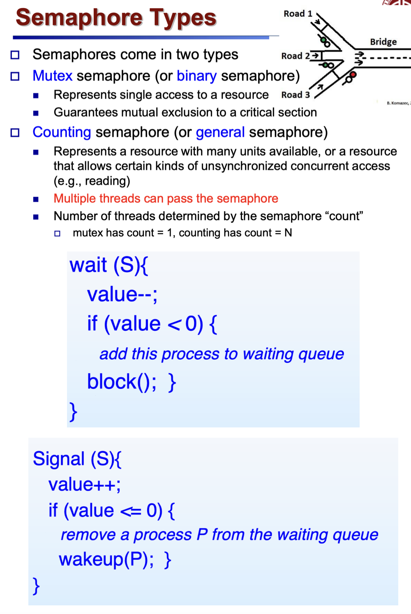

wait和signal都是原子操作，分别对信号量递减、递增，并根据value的值决定将进程放到或移出等待队列。

信号量需要初始化，初始化的值可以表示临界区资源的最多共享进程数，如果设为1，则表示严格互斥资源。

当有进程要求使用共享资源时，需要执行以下操作：

1.系统首先要检测该资源的信号量；

2.若该资源的信号量值大于0，则进程可以使用该资源，此时，进程将该资源的信号量值减1；

3.若该资源的信号量值为0，则进程进入休眠状态，直到信号量值大于0时进程被唤醒，访问该资源；

当进程不再使用由一个信号量控制的共享资源时，该信号量值增加1，如果此时有进程处于休眠状态等待此信号量，则该进程会被唤醒。

其中信号量的加减通过signal和wait实现，进程的休眠和唤醒通过block和wakeup实现，都在硬件层面实现。

## 监视器方法 Monitior

## 死锁 Deadlock
### 死锁的概念和根源

死锁产生的根源：不同进程**互相(循环)等待**对方持有的互斥资源

严谨描述：对于两个进程，如果进程1持有A资源等待B资源，而进程2持有B资源等待A资源，就会发生死锁。推广到一般则是“环状结构”：**资源分配图**有环可能导致死锁。

资源分配图：

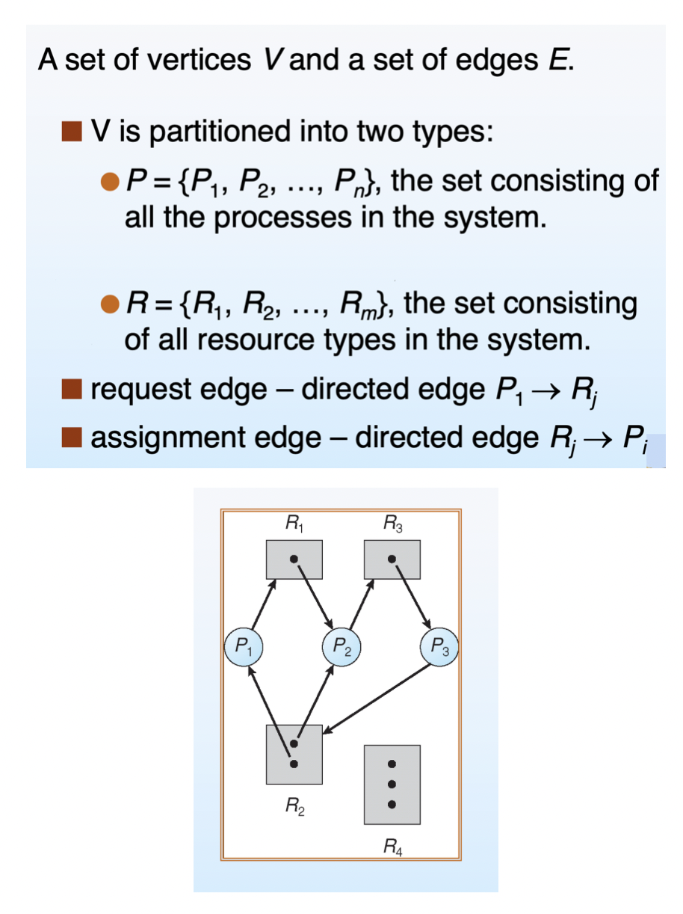

其中圆圈表示进程，方块表示资源，方块里面的圆点表示相同的资源个数。如果图中有环，则可能发生死锁，否则无死锁。

有环并非一定会导致死锁，还要看资源数量是否充沛，如果资源都只有一个显然会发生死锁，否则无法直接判断，但是可以引入安全模式的概念。

宏观上看，死锁有四个条件：

**互斥资源、持有等待、非抢占、循环等待**。其中循环等待是最本质的特征。不止在操作系统中，其他模型（如数据库）中满足这四个条件也常发生死锁。注意非抢占的含义是持有资源的进程只能自己结束、释放资源，不能被其他进程强制中止并放弃资源。

### 死锁的应对方法
- Prevention预防

    从系统层面上确保死锁不会发生。难以实现，因为死锁的循环等待根源是一个逻辑上的难题。

- Avoidence阻断

    提前预测是否可能发生死锁，如果可能发生，采取措施避免进入到死锁状态。

    **安全模式safe state**：

    一个state是进程组、资源组、每个进程申请每种资源的最大量和已获得量、每种资源总数的集合。等价于资源图。

    安全模式下，不可能发生死锁（不代表不安全模式下一定会发生死锁，安全模式是无死锁的加强）

    安全模式定义如下

    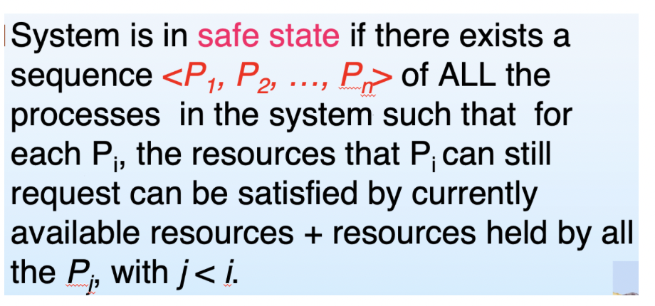

    含义是存在进程序列，使后面的进程需要的任何一种资源，其request量（总需求量-已分配量）都小于当前该资源可用量 + 前面的进程对该资源占有量的总和。其含义是：当前state下至少可以保证P1～Pn依次**顺序执行（等价含义）**，从而一定不会发生死锁。

    如果系统处于不安全模式，那么才可能发生死锁，所以要想办法保证系统永远不会进入不安全模式，也就是说，任何一次资源分配完成后，资源分配图都必须是安全的。

    安全模式的验证算法：可以看出，有贪婪的意思，找所需资源小于可用资源的进程优先完整，完成后归还其分配的资源。

    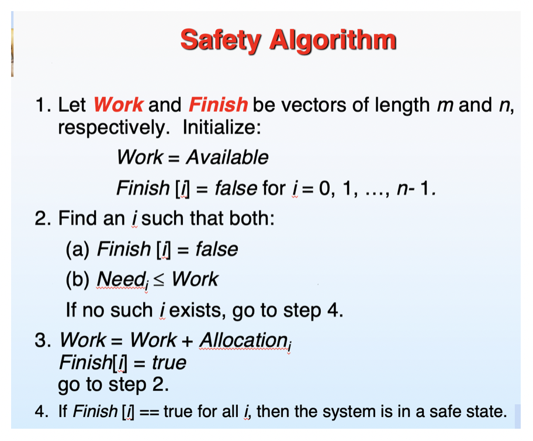

    

    **银行家算法**：

    算法目的：在每次进程发出资源请求时，审视资源分配情况，并做出动作（等到/分配），使系统保持在安全模式。

    具体方法就是，**模拟**资源分配后的情况，如果不安全，就放弃这次分配。

    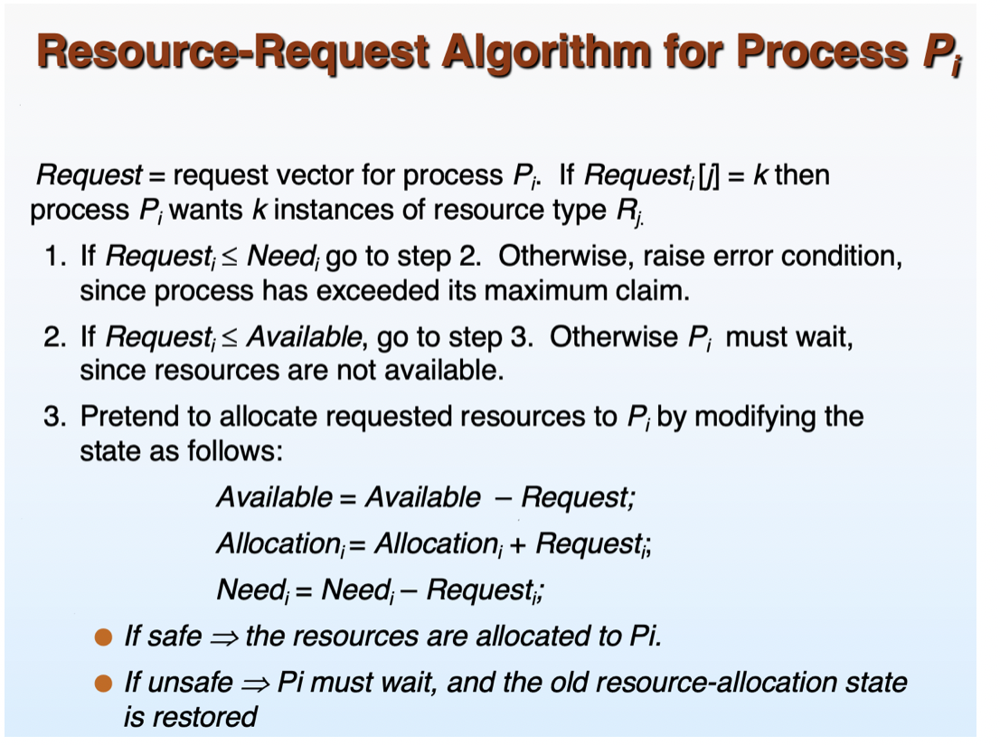

    具体分为三步：

    （1）   首先Request[i] < Need[i]，没有超过最大请求。其中Need[i]= Max[i] - Allocate[i]表示进程还需要分配的资源数

    （2）   其次Request[i] < Available，没有超过可用资源数。

    （3）   假设分配，验证是否仍然处于安全模式

    注：Avoidence中，所谓安全模式、银行家算法，实际中大多数是**不可行**的，因为难以事先知晓大多数进程对资源的总需求量（Max字段），所以整个算法都是理论上的。

    

- Detection检测

    允许死锁出现，但能检测系统中是否出现死锁并且发现是哪里死锁。如果有，进行recovery。

    - 算法检测
    - 超时判定
    
- Recovery恢复

    对于出现死锁的进程，强制采取措施脱离死锁状态，避免CPU一直无法正常工作。

    - 终止所有死锁进程

        缺点：浪费大量时间

    - 终止死锁循环上的某一个进程

        难点：筛选victim进程最小化效率损失，同时避免饥饿（starvation）

    - 什么都不做

        Unix操作系统的措施？

# 文件系统

## 文件系统接口

## 文件系统实现

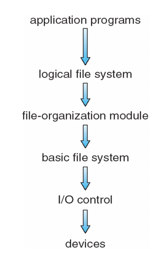

- FCB(File Control Block)文件控制块

    文件相关信息的存储块，包括文件权限、日期、拥有者、大小信息，以及真正的数据信息。注意数据信息可以没有，而是一个指向其他数据块的指针，可以用其实现某种文件存储模式。
    
- 文件访问原理

  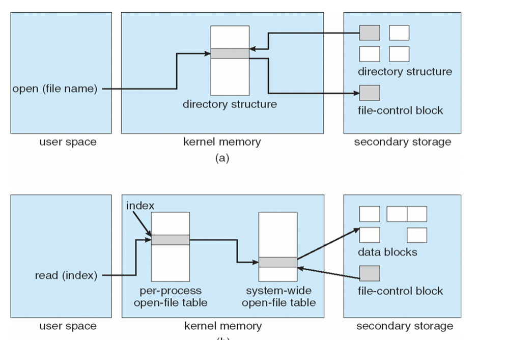
  
  其中目录用于根据文件名定位文件位置(disk中的FCB)，目录可以用链表或者哈希表来实现。另外每个打开的文件在内存中会维护一个表，用于将文件中数据的逻辑index转化到disk中的FCB中进行查找。
  
- 文件存储分配 Allocation
  
  - 连续分配
  
      文件占用disk中的连续地址段，目录需要记录文件的起始和长度。具有浪费空间、文件大小难以扩展的缺点。
  
  - 链表分配
  
      disk中的block需要额外记录一个指针，指向下一个block，直至为NULL。不通block物理上可以不连续，目录记录head block。这种方法不支持随机访问。
  
  - 索引分配
  
      每个文件有一个index block索引块，里面按序记录了这个文件数据块的指针(指针数组)，根据这个数组可以获得文件全部数据信息。需要先将这个block载入内存，转化为数据结构FAT。
  
      还可以使用多级索引：当文件较大，一个block无法记录完所有block的块号，可以使用多级索引。
  
- 空闲空间管理

    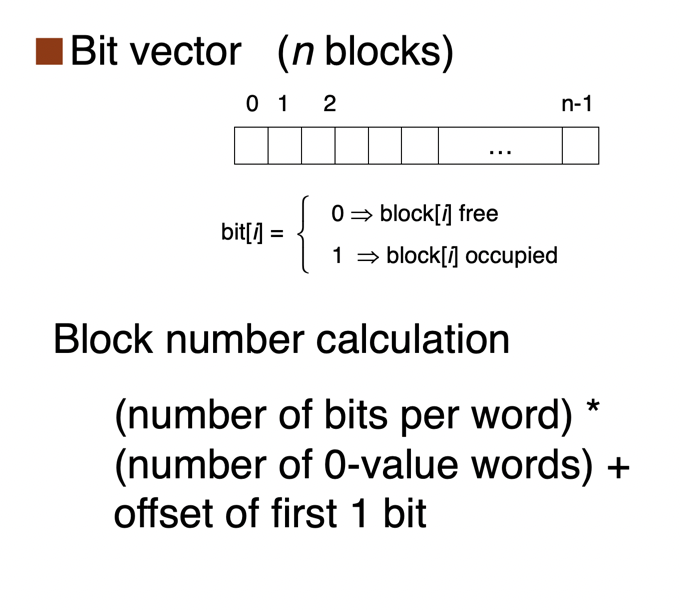

    

    

