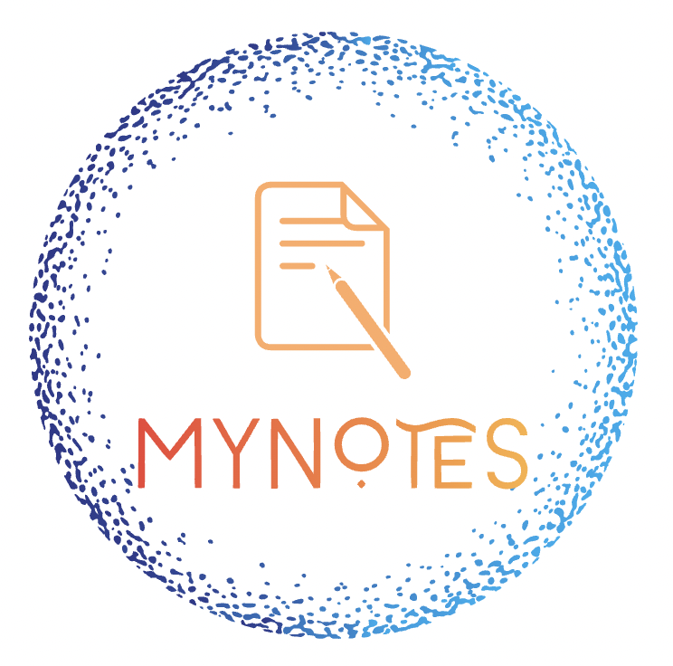

# MyNotes

Partial personal understanding, some content may not be completely correct.

## DBMS

Completed, v2.

Based on CMU-15-445, CMU 15-721, and ZJU DB.

## Distributed

Based on MIT-6.824

## DBKernel

Not started yet.

## Cloud

## OS

## FDS

Fundamental data structure. PDF.

## ADS

Advanced data structure. PDF.

## Arch

## AI

## Compiler

## C++

Basic usage, STL, C++11 standard, multi-thread.

## Java

## Golang
